# EOCC Full Product Information

**Enterprise Operations Command Center (EOCC)**

---

## Document Information

| Attribute | Value |
|---|---|
| **Document title** | EOCC Full Product Information |
| **Document series** | 1 of 3 — Master Specification (PRD + TDD combined) |
| **Product** | Enterprise Operations Command Center (EOCC) |
| **Organization** | Lilly |
| **Version** | 2.0 |
| **Status** | Active — Master Reference |
| **Classification** | Lilly Internal |
| **Effective date** | June 2026 |
| **Document owner** | EOCC Product & Architecture Team |
| **Approver** | Tech Team Lead *(pending)* |

## Related Documents

| # | Document | Role |
|---|---|---|
| 2 | [EOCC_PRD.md](EOCC_PRD.md) | Product requirements, NFRs, personas, and acceptance criteria |
| 3 | [EOCC_Technical_Design_Document.md](EOCC_Technical_Design_Document.md) | Technical architecture, schema, APIs, security, and operations design |

## Revision History

| Version | Date | Author | Summary of changes |
|---|---|---|---|
| 1.0 | June 2026 | EOCC Product & Architecture Team | Initial master document derived from design plan |
| 2.0 | June 2026 | EOCC Product & Architecture Team | Enterprise document control; Mermaid architecture visuals; header aligned with PRD and TDD |

## Document Scope

This file is the **single consolidated reference** for EOCC Phase 1 design. Use it when you need product intent, data model, agent architecture, use-case flows, and technical system design in one place.

| Area | Sections | Contents |
|---|---|---|
| Product & phases | §1–§2c | Purpose, phased roadmap, complete feature catalog (57 features) |
| Data & use cases | §3–§3f | Aurora schema, 20 UC fulfillment matrix, parallel agents, flows, business examples |
| Technical system | §4 | ECS Fargate topology, Cortex AI, integrations, security, deployment |
| Delivery artifacts | §5–§11 | PRD outline, messaging, demo walkthrough, open items, Q&A, execution trigger |

For stakeholder review or implementation handoff, prefer the focused companions: **PRD** for requirements sign-off and **TDD** for engineering build-out.

## Intended Audience

| Audience | Purpose of review |
|---|---|
| Tech team lead | End-to-end validation before pilot and client exposure |
| Product & program management | Scope, phasing, feature completeness, demo narrative |
| Engineering & architecture | Unified view of requirements and technical design |
| Security & compliance | Data boundaries, connector scope, Phase 1 read-only posture |
| Executive sponsors | Business context, phased value, and approval path |

## Approval Path

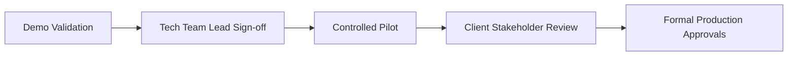

## Confidentiality Notice

This document contains Lilly internal product and technical information. Distribution is limited to authorized personnel with a legitimate business need. Do not share outside Lilly without appropriate approval.

---

## Table of Contents

| Section | Title |
|---|---|
| [1](#1-purpose-and-audience) | Purpose and Audience |
| [2](#2-product-phases-locked-design) | Product Phases |
| [2b](#2b-complete-phased-feature-catalog-all-features--prd-must-list-every-row) | Complete Phased Feature Catalog |
| [2c](#2c-enterprise-coordination-features--cross-reference-to-catalog) | Enterprise Coordination Features |
| [3](#3-data-architecture-locked-design) | Data Architecture |
| [3b](#3b-aurora-postgresql--enterprise-schema-design) | Aurora PostgreSQL Schema Design |
| [3c](#3c-original-20-use-cases--architecture-fulfillment-matrix) | 20 Use Cases — Fulfillment Matrix |
| [3c-bis](#3c-bis-phase-1-product-ucs--original-20-uc-mapping) | Phase 1 UC Mapping |
| [3d](#3d-parallel-agents--simple-design-accuracy-first) | Parallel Agents Design |
| [3e](#3e-all-20-use-case-working-flows-prd-section-1112--locked) | All 20 Use Case Flows |
| [3f](#3f-business-examples--all-20-use-cases-onsite-storytelling) | Business Examples |
| [4](#4-technical-system-architecture-best-plan--locked) | Technical System Architecture |
| [5](#5-prd-document-structure-15-sections) | PRD Document Structure |
| [6](#6-messaging-rules-for-team-lead) | Messaging Rules |
| [7](#7-demo-walkthrough-embed-in-prd) | Demo Walkthrough |
| [8](#8-open-design-items) | Open Design Items |
| [9](#9-anticipated-qa-embed-in-prd--for-onsite-lead) | Anticipated Q&A |
| [10](#10-continuation-checkpoint) | Continuation Checkpoint |
| [11](#11-execution-trigger) | Execution Trigger |

---

## 1. Purpose and Audience

| Item | Decision |
|---|---|
| Document type | Lilly internal volunteer AI use case — technical design review + demo brief |
| Primary audience | Onsite tech team lead, **12+ years** enterprise solutions experience |
| Stance | Peer-level architecture review — not vendor pitch, not procurement |
| Approval path | Demo → her validation → pilot → **client approval** → formal approvals |
| Ask today | Architecture feedback, data model, pilot scope — **not** budget, FTE, or timeline |

**Core message:**
> Operations intelligence layer on Jira, Splunk, AWS, Confluence, GitHub — structured truth in Aurora config tables, unstructured knowledge via Cortex AI RAG. Phase 1: five use cases (read-only). Seeking her technical review before client exposure.

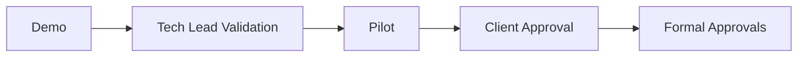

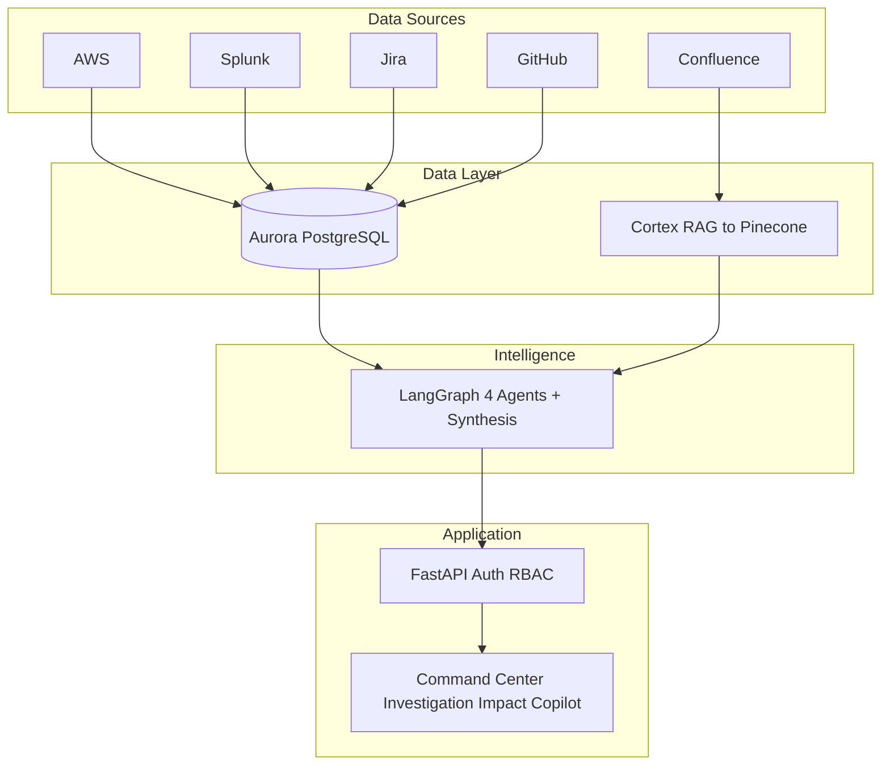

**Long-term positioning (Phases 2–4, mention only if she asks):**
> EOCC evolves from **AI chatbot** to **AI Operations Coordinator** — intelligent escalation, skill-based routing, severity, war rooms, and stakeholder updates. Most enterprises have monitoring; few have intelligent operational **decision-making**. Phase 1 proves intelligence; later phases prove coordination.

---

## 2. Product Phases (locked design)

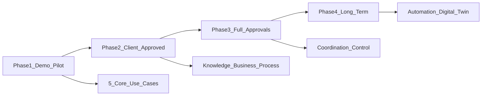

### Phase 1 — Demo and Pilot (NOW)

| # | Use Case | Business question |
|---|---|---|
| 1 | Operational Health and Risk Monitoring | What is happening? How serious? |
| 2 | Automated Investigation | Why is it happening? |
| 3 | Impact Analysis | What is the business impact? |
| 4 | Intelligent Ownership and Coordination | Who owns it? Who responds? |
| 5 | AI Operations Copilot | What should we do next? |

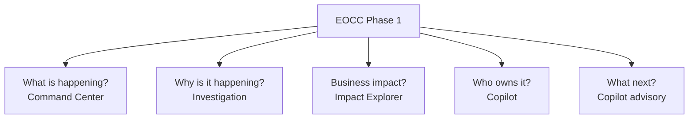

- **Mode:** Read-only / advisory intelligence
- **Modules:** Command Center, Investigation Workspace, Impact Explorer, Copilot
- **Goal:** Team lead confirms — *"this helps my team; we can show the client"*
- **Excluded:** Production writes, automation, staff reduction narrative, senior approver workflow

### Phase 2 — After client approval (intelligence depth)

Knowledge search, historical incidents, business process monitoring, governance insights, **Expert Finder**, **Incident Similarity Search** (enhanced), **Automated Stakeholder Updates** (technical + business tiers), **Automated RCA** draft.

### Phase 3 — After full approvals (AI Operations Coordinator)

**Intelligent Escalation Engine**, **Knowledge-Based Assignment**, **Shift-Aware / OOO Routing**, **Dynamic Risk-Based Notifications**, **AI War Room** (requires Teams), **Action Recommendation + controlled execution**, senior approval model (2–6 leaders). This is where the product becomes coordinator, not just advisor.

### Phase 4 — Long-term

Executive briefings at scale, operational digital twin, tiered autonomous operations, full organizational knowledge graph traversal.

---

## 2b. COMPLETE Phased Feature Catalog (all features — PRD must list every row)

**Rule for PRD:** Section 5 = Phase 1 features in **full detail**. Section 6 = **entire catalog below** as master phased table (nothing omitted). Section 15 = Phase 2–4 highlights with complexity and business value.

### Phase 1 — Demo and Pilot (read-only intelligence)

| ID | Feature | Category | Business value | Mode |
|---|---|---|---|---|
| P1-UC01 | Operational Health and Risk Monitoring | Core use case | Real-time health ranked by business risk | Read |
| P1-UC02 | Automated Investigation | Core use case | Auto-gather evidence; reduce manual correlation | Read |
| P1-UC03 | Impact Analysis | Core use case | Business capability impact, not just infra alerts | Read |
| P1-UC04 | Intelligent Ownership and Coordination | Core use case | Owner, team, lead, escalation path | Read |
| P1-UC05 | AI Operations Copilot | Core use case | NL Q&A with cited evidence | Read |
| P1-F01 | Enterprise Operations Command Center | Module | Unified view — apps, health, risks, incidents | Read |
| P1-F02 | Investigation Workspace | Module | AI investigations, timelines, recommendations | Read |
| P1-F03 | Dependency and Impact Explorer | Module | Interactive blast-radius (read-only) | Read |
| P1-F04 | Smart Severity Calculation | Coordination | Business-weighted Sev1–4 (payments vs internal) | Read |
| P1-F05 | Service Dependency Intelligence | Intelligence | Upstream/downstream if resource fails | Read |
| P1-F06 | Ownership Discovery | Intelligence | Primary/secondary owner, team, manager | Read |
| P1-F07 | Incident Timeline Generator | Investigation | Correlated timeline for RCA | Read |
| P1-F08 | Incident Similarity Search (basic) | Investigation | Match to prior incidents from Jira/history | Read |
| P1-F09 | Action Recommendation Engine | Intelligence | Suggested fixes with confidence — no execute | Advisory |
| P1-F10 | Organizational Knowledge Graph (foundation) | Platform | App → AWS → team → business process in Aurora | Read |
| P1-F11 | Enterprise Ownership Intelligence | Top-20 UC | Instant ownership and escalation | Read |
| P1-F12 | Enterprise Dependency Intelligence (basic) | Top-20 UC | Impact propagation across apps | Read |
| P1-F13 | AI Incident Investigation | Top-20 UC | Automated failure investigation reports | Read |

**Phase 1 count: 18 features** (5 core UC + 3 modules + 10 capabilities)

**Phase 1 data sources:** AWS, Splunk, Jira, Confluence, GitHub, Aurora, Cortex AI RAG

---

### Phase 2 — After client approval (deeper intelligence and governance)

| ID | Feature | Category | Business value | Mode |
|---|---|---|---|---|
| P2-F01 | Enterprise Knowledge Search | Top-20 UC | Unified search across Confluence, Jira, runbooks | Read |
| P2-F02 | Historical Incident Intelligence | Top-20 UC | Prior resolutions; prevent repeat investigations | Read |
| P2-F03 | Business Process Monitoring | Top-20 UC | Monitor onboarding, payments — not just CPU | Read |
| P2-F04 | Enterprise Dependency Intelligence (enhanced) | Top-20 UC | Cross-app and cross-team impact | Read |
| P2-F05 | Architecture Intelligence | Top-20 UC | On-demand architecture for troubleshooting | Read |
| P2-F06 | Operational Risk Detection | Top-20 UC | Proactive risk before outages | Read |
| P2-F07 | Ownership Gap Detection | Governance | Services/apps without clear owner | Read |
| P2-F08 | Runbook Coverage Analysis | Governance | Critical services missing recovery procedures | Read |
| P2-F09 | Documentation Governance | Governance | Outdated or missing documentation flagged | Read |
| P2-F10 | Organizational Dependency Analysis | Intelligence | Cross-team dependency visibility | Read |
| P2-F11 | Expert Finder / Critical Expert Detection | Coordination | Who solved most Aurora incidents; key-person risk | Read |
| P2-F12 | Enterprise Operational Search | Top-20 UC | Single search across enterprise systems | Read |
| P2-F13 | Incident Similarity Search (enhanced) | Coordination | % similarity + suggested fix from history | Read |
| P2-F14 | Automated Stakeholder Updates | Coordination | Technical update vs business update tiers | Draft |
| P2-F15 | Automated RCA Generation | Investigation | Draft post-incident report from timeline | Draft |
| P2-F16 | Business Process Dashboard | Module | Capability health view for leadership | Read |
| P2-F17 | Governance Center | Module | Ownership, doc, runbook coverage dashboards | Read |

**Phase 2 count: 17 features**

**New data:** Enhanced Jira/GitHub skill aggregates in Aurora; optional ServiceNow read-only

---

### Phase 3 — After full approvals (AI Operations Coordinator)

| ID | Feature | Category | Business value | Mode |
|---|---|---|---|---|
| P3-F01 | Intelligent Escalation Engine | Coordination | POC → lead → manager — not email everyone | Notify |
| P3-F02 | Knowledge-Based Assignment | Coordination | Route to engineer with most relevant incident history | Assign |
| P3-F03 | Availability and OOO-Aware Routing | Coordination | Respect leave, holidays, working hours | Route |
| P3-F04 | Shift-Aware Assignment | Coordination | Timezone and onshore/offshore active engineers | Route |
| P3-F05 | Skill-Based Routing | Coordination | Match issue domain to engineer experience | Route |
| P3-F06 | Dynamic Risk-Based Notification Strategy | Coordination | 20% → team; 95% → war room stakeholders | Notify |
| P3-F07 | AI War Room Creation | Coordination | Auto Teams channel, invites, summary, actions | Execute |
| P3-F08 | Autonomous Incident Coordination | Top-20 UC | Auto Jira ticket, notify owners, share runbooks | Execute |
| P3-F09 | Controlled Operational Execution | Top-20 UC | Restart ECS, scale, rollback — approved only | Execute |
| P3-F10 | Change Risk Intelligence | Top-20 UC | Pre-deployment impact assessment | Read |
| P3-F11 | Action Recommendation Engine (execute) | Intelligence | Run approved recovery workflows | Execute |
| P3-F12 | Operations Control Center | Module | Approval queue and controlled actions UI | Execute |
| P3-F13 | Senior Approval Workflow | Governance | 2–6 leaders approve production actions | Approve |
| P3-F14 | AI Incident Commander | Coordination | End-to-end incident loop coordination | Coordinate |

**Phase 3 count: 14 features**

**New integration:** Microsoft Teams; Jira/ServiceNow write actions; AWS control plane

---

### Phase 4 — Long-term (strategic and governed autonomy)

| ID | Feature | Category | Business value | Mode |
|---|---|---|---|---|
| P4-F01 | AI Executive Briefings | Top-20 UC | Leadership-ready business impact summaries | Read |
| P4-F02 | Operational Digital Twin | Top-20 UC | Live enterprise operational model | Read |
| P4-F03 | Service Consumption Intelligence | Top-20 UC | AWS consumer and governance visibility | Read |
| P4-F04 | Organizational Knowledge Graph (full traversal) | Platform | Multi-hop why analysis across all entities | Read |
| P4-F05 | Tiered Autonomous Operations | Autonomy | Green auto-fix; red requires senior approval | Autonomous |
| P4-F06 | Executive Dashboard | Module | Business risk, maturity, organizational risk | Read |
| P4-F07 | Predictive Operational Risk Analytics | Advanced | Outage prevention from patterns | Read |
| P4-F08 | Governed Near-Full Automation | Autonomy | Platform runs routine incidents; thin senior layer | Autonomous |

**Phase 4 count: 8 features**

**Optional tech:** Neo4j if graph traversal exceeds Aurora relational limits

---

### Master summary

| Phase | Feature count | Product mode | Approval gate |
|---|---|---|---|
| Phase 1 | 18 | Intelligence advisor | Volunteer demo → tech lead |
| Phase 2 | 17 | Institutional memory + governance | Client approval |
| Phase 3 | 14 | AI Operations Coordinator | Full formal approvals |
| Phase 4 | 8 | Governed autonomy | Strategic rollout |
| **Total** | **57** | Full EOCC vision | Phased |

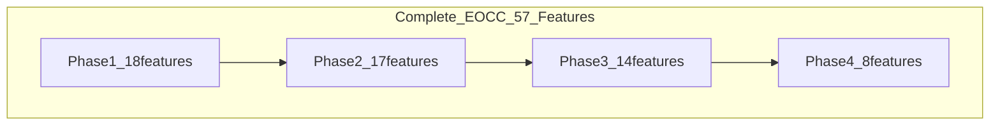

---

## 2c. Enterprise Coordination Features — cross-reference to catalog

Positioning: these features reduce **MTTR**, **tribal knowledge dependency**, and make incident response **consistent**. Map to PRD Section 6 (Future Use Cases) and Section 15 (Advanced Improvements).

### Phase 1 — Demo/Pilot (advisory only, read-only)

Features that **support the 5 use cases** without automated notifications or war rooms:

| # | Feature | Maps to Phase 1 use case | Business value | Data / store |
|---|---|---|---|---|
| 3 | **Smart Severity Calculation** | UC1 Health, UC3 Impact | Correct prioritization; business-weighted severity | Aurora criticality + AWS/Splunk signals |
| 8 | **Incident Similarity Search** | UC2 Investigation | Faster resolution; avoid repeat work | Jira history + Cortex RAG |
| 10 | **Service Dependency Intelligence** | UC3 Impact | Blast radius; "what breaks if DB fails?" | Aurora dependency + AWS |
| 11 | **Ownership Discovery** | UC4 Ownership | #1 enterprise pain — who owns this Lambda? | Aurora ownership registry |
| 12 | **Action Recommendation Engine** | UC5 Copilot | Suggests fix with **confidence score** — no auto-execute | Cortex runbooks + Aurora context |
| 13 | **Incident Timeline Generator** | UC2 Investigation | RCA-ready timeline from correlated events | Splunk + Jira + AWS events |
| 14 | **Organizational Knowledge Graph** (foundation) | All UC | Difficult-to-replace asset; traverse app→service→team | Aurora config tables |

**Phase 1 demo highlights for leadership narrative:** Ownership Discovery (#11), Dependency Impact (#10), Smart Severity (#3), Timeline (#13) — all with **citations**, no auto-paging.

### Phase 2 — After client approval

| # | Feature | Business value | New data needs |
|---|---|---|---|
| 6 | **Expert Finder** | "Who knows Aurora replication?" — reduces key-person risk | Jira + GitHub commit/incident history |
| 8 | **Incident Similarity Search** (enhanced) | % match to prior incident + suggested fix | Historical incident corpus in Cortex |
| 9 | **Automated Stakeholder Updates** | Technical vs business update tiers — not one blob | Templates + impact from Aurora |
| — | **Automated RCA Generation** | Draft post-incident report | Timeline + investigation agent |

### Phase 3 — AI Operations Coordinator (post full approval)

| # | Feature | Business value | New integration |
|---|---|---|---|
| 1 | **Intelligent Escalation Engine** | Right person, not everyone — POC/lead/manager chain | Aurora ownership + availability |
| 2 | **Knowledge-Based Assignment** | Route to engineer who solved 25 Aurora incidents vs 2 | Jira/GitHub skill history |
| 1b | **Availability & OOO / shift routing** | 2 AM India — find onshore/active engineer | Calendar, shift, timezone (future HR/calendar source) |
| 4 | **Dynamic Notification Strategy** | Risk 20% → team only; 95% → war room stakeholders | Risk score from severity engine |
| 5 | **AI War Room Creation** | Auto Teams channel, invites, summary, action tracking | **Microsoft Teams** (new integration) |
| 12 | **Action Recommendation** (execute) | Restart ECS, scale, rollback — after senior approval | AWS control plane + approval workflow |

### Phase 4 — Strategic

Full graph traversal (Payment API → Aurora → change request → owner → similar incident), digital twin, tiered autonomy.

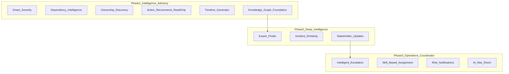

### Leadership "wow" list — when to show in demo

| Feature | Show in Phase 1 demo? | How |
|---|---|---|
| Ownership Discovery | **Yes** | "Who owns Glue CN3?" — Aurora answer with escalation |
| Dependency Impact | **Yes** | "If this DB fails, what breaks?" — graph from Aurora |
| Smart Severity | **Yes** | Internal reporting = Sev3; payments = Sev1 — business context |
| Incident Timeline | **Yes** | Auto-built timeline in Investigation Workspace |
| Action Recommend + confidence | **Yes** | Suggest restart; show score; **no execute** |
| Expert Finder | Tease / Phase 2 | "We can add Jira+GitHub skill ranking next" |
| Intelligent Escalation | **No** — Phase 3 | Mention as coordinator evolution if she asks |
| War Room / auto-notify | **No** — Phase 3 | Requires Teams + approval path |

### Aurora schema extensions for coordination features (future)

Add to plan for Phase 2–3 config tables:

| Table domain | Supports features |
|---|---|
| `engineer_skills` / incident history aggregates | Expert Finder, Knowledge-Based Assignment |
| `availability` / shift / OOO | Shift-aware routing, Escalation Engine |
| `escalation_policy` | Risk-tiered notification, Escalation Engine |
| `notification_rules` | Dynamic notification strategy |

Phase 1 Aurora stays lean: ownership, dependency, business_process, service_catalog, criticality, integration_sync.

### PRD narrative: Chatbot vs Coordinator

| Stage | Product mode | What changes |
|---|---|---|
| Phase 1 | **Intelligence advisor** | Answers questions, investigates, recommends — human acts |
| Phase 2 | **Institutional memory** | Experts, similarity, stakeholder comms |
| Phase 3 | **Operations coordinator** | Escalates, assigns, notifies, war room — human **approves** actions |
| Phase 4 | **Governed autonomy** | Routine loop automated; 2–6 seniors approve high-impact |

---

## 3. Data Architecture (locked design)

### Integrations (Phase 1 only)

| Source | Provides |
|---|---|
| AWS | CloudWatch, ECS, Lambda, Glue, Step Functions, RDS, DynamoDB, SQS, SNS, tags |
| Splunk | Logs, events, incident signals, historical ops data |
| Jira | Incidents, bugs, changes, ownership metadata |
| Confluence | Docs, SOPs, runbooks |
| GitHub | Repo metadata, deployments, ownership, engineering context |

**Out of scope Phase 1:** ServiceNow, Teams, other sources.

### Aurora PostgreSQL — enterprise schema (see Section 3b for full design)

**Hub table:** `service_catalog` — every AWS resource, app, and business process links here.

**Phase 1 tables (16):** org structure, graph core, ownership, dependency, criticality, external refs, integration sync.

**Phase 2–4 tables (18):** engineer expertise, incidents cache, governance, availability, escalation rules, notifications, approvals, audit.

### Cortex AI RAG (Lilly internal)

- Unstructured retrieval: runbooks, Confluence, Jira, architecture docs
- **Split:** Aurora = structured graph; Cortex = semantic search
- No new OpenSearch/pgvector build

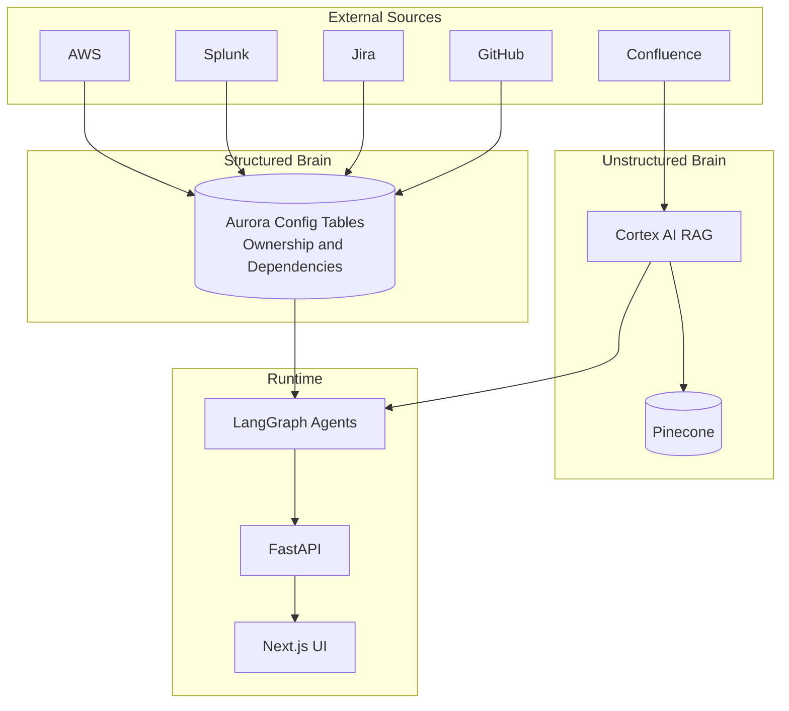

---

## 3b. Aurora PostgreSQL — Enterprise Schema Design

**Design principles**
- `service_catalog` is the canonical operational entity (glue for Jira, AWS, GitHub, Splunk).
- Polymorphic `external_reference` links each service to source-system IDs (no duplicate identity rows).
- `dependency` supports technical, business, and team relationship types for blast-radius and org analysis.
- Phase 1 = curated config; Phase 2+ = aggregates from Jira/GitHub and coordination tables.
- All tables: `id` UUID PK, `created_at`, `updated_at`, `created_by`, `is_active`; soft-delete via `is_active`.
- Naming: `snake_case`; enums as PostgreSQL `ENUM` or lookup tables.

### Entity relationship (core graph)

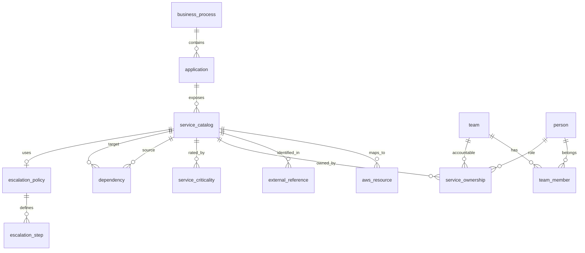

---

### Phase 1 — Demo/Pilot tables (implement first)

#### A. Organization and business layer

| Table | Purpose | Key columns | Features served |
|---|---|---|---|
| `business_domain` | Top-level business area (optional) | `code`, `name`, `description` | P1-UC03, P2-F03 |
| `business_process` | Business capability (Onboarding, Payments) | `domain_id` FK, `code`, `name`, `customer_facing`, `revenue_impact_tier` | P1-UC03, P2-F03, P1-F04 |
| `application` | Logical application | `business_process_id` FK, `code`, `name`, `lifecycle_status` | P1-F10, P2-F05 |
| `application_service` | App ↔ service many-to-many | `application_id`, `service_catalog_id`, `role` (primary/supporting) | P1-F05, P1-F10 |

#### B. Service catalog (hub)

| Table | Purpose | Key columns | Features served |
|---|---|---|---|
| `service_catalog` | **Canonical service** | `code`, `name`, `service_type` (aws_lambda, aws_glue, aws_rds, app, api, queue), `environment`, `status` | All P1 features |
| `aws_resource` | AWS physical/logical resource | `service_catalog_id` FK, `resource_arn`, `resource_type`, `region`, `account_id`, `tags_json` | P1-UC01, P1-F05 |
| `external_reference` | Source-system IDs | `service_catalog_id` FK, `source_system` (jira, github, splunk, confluence, aws), `external_id`, `external_url`, `last_seen_at` | Integrations, P1-F06 |

#### C. People and teams

| Table | Purpose | Key columns | Features served |
|---|---|---|---|
| `team` | Owning/support team | `code`, `name`, `manager_person_id` FK, `teams_channel_url`, `email_alias` | P1-UC04, P1-F06 |
| `person` | Engineer, lead, manager | `employee_id`, `display_name`, `email`, `timezone`, `role_title` | P1-UC04, P3-F01 |
| `team_member` | Team membership | `team_id`, `person_id`, `member_role` (engineer, lead, manager), `is_primary_contact` | P1-UC04 |

#### D. Ownership and escalation

| Table | Purpose | Key columns | Features served |
|---|---|---|---|
| `service_ownership` | Who owns what | `service_catalog_id`, `team_id`, `primary_person_id`, `secondary_person_id`, `business_owner_person_id`, `ownership_type` (primary, secondary, business) | P1-UC04, P1-F06, P1-F11 |
| `escalation_policy` | Named escalation chain | `code`, `name`, `description` | P1-UC04, P3-F01 |
| `escalation_step` | Ordered escalation levels | `escalation_policy_id`, `step_order`, `target_type` (team, person, role), `target_team_id`, `target_person_id`, `target_role`, `wait_minutes` | P1-UC04, P3-F01, P3-F06 |
| `service_escalation` | Service → policy link | `service_catalog_id`, `escalation_policy_id` | P1-UC04 |

#### E. Dependencies and impact

| Table | Purpose | Key columns | Features served |
|---|---|---|---|
| `dependency` | Graph edges | `source_service_id`, `target_service_id`, `dependency_type` (technical, data, business, team), `direction`, `criticality`, `description` | P1-F05, P1-F12, P2-F04, P2-F10 |
| `team_dependency` | Cross-team dependency | `upstream_team_id`, `downstream_team_id`, `dependency_reason` | P2-F10 |
| `service_criticality` | Business impact profile | `service_catalog_id`, `sla_tier`, `customer_facing`, `revenue_impact`, `max_downtime_minutes`, `default_severity_floor`, `default_severity_ceiling` | P1-F04, P1-UC03, P3-F06 |

#### F. Integration metadata

| Table | Purpose | Key columns | Features served |
|---|---|---|---|
| `integration_connector` | Connector registry | `source_system`, `status`, `config_ref`, `last_success_at`, `last_error` | Platform ops |
| `integration_sync_log` | Sync audit | `connector_id`, `sync_started_at`, `sync_ended_at`, `records_upserted`, `status`, `error_message` | NFR reliability |

**Phase 1 total: 16 tables**

---

### Phase 2 — Intelligence and governance tables

| Table | Purpose | Key columns | Features served |
|---|---|---|---|
| `incident_record` | Cached Jira incidents | `jira_key`, `summary`, `severity`, `status`, `resolved_at`, `root_cause`, `resolution_summary`, `service_catalog_id` | P1-F08, P2-F02, P2-F13 |
| `incident_service_link` | Incident ↔ multiple services | `incident_record_id`, `service_catalog_id`, `impact_role` | P2-F02, P2-F13 |
| `engineer_service_experience` | Skill/expertise aggregate | `person_id`, `service_catalog_id`, `incident_count`, `resolved_count`, `last_incident_at`, `expertise_score`, `source` (jira, github) | P2-F11, P3-F02, P3-F05 |
| `governance_finding` | Gap registry | `finding_type` (no_owner, no_runbook, stale_doc, no_escalation), `service_catalog_id`, `severity`, `status`, `detected_at`, `resolved_at` | P2-F07, P2-F08, P2-F09, P2-F17 |
| `runbook_registry` | Structured runbook pointer | `service_catalog_id`, `confluence_page_id`, `title`, `last_reviewed_at`, `is_missing` | P2-F08 |
| `architecture_component` | Architecture map | `application_id`, `component_name`, `component_type`, `service_catalog_id`, `parent_component_id` | P2-F05 |
| `stakeholder_update_template` | Comms templates | `audience` (technical, business, executive), `template_body`, `severity_min` | P2-F14 |
| `operational_risk_signal` | Proactive risk | `service_catalog_id`, `risk_type`, `risk_score`, `evidence_ref`, `detected_at` | P2-F06 |

**Phase 2 new tables: 8**

---

### Phase 3 — Operations coordinator tables

| Table | Purpose | Key columns | Features served |
|---|---|---|---|
| `person_availability` | OOO, leave, holidays | `person_id`, `status` (available, ooo, leave, holiday), `starts_at`, `ends_at`, `source` | P3-F03 |
| `shift_schedule` | Working hours / shifts | `team_id`, `person_id`, `shift_name`, `timezone`, `day_of_week`, `start_time`, `end_time`, `is_onshore` | P3-F04 |
| `on_call_rotation` | Current on-call | `team_id`, `person_id`, `rotation_start`, `rotation_end`, `escalation_level` | P3-F01, P3-F04 |
| `notification_rule` | Risk-tiered notify rules | `code`, `min_risk_pct`, `max_risk_pct`, `severity_min`, `channels` (email, teams, pager) | P3-F06 |
| `notification_rule_target` | Who gets notified | `notification_rule_id`, `target_type`, `team_id`, `person_id`, `role` | P3-F06 |
| `active_incident` | EOCC incident session | `incident_record_id`, `calculated_severity`, `risk_score_pct`, `status`, `war_room_url`, `assigned_person_id` | P3-F07, P3-F14 |
| `incident_timeline_event` | Persisted timeline | `active_incident_id`, `event_time`, `event_type`, `source_system`, `summary`, `external_ref` | P1-F07, P2-F15 |
| `action_recommendation` | AI suggested actions | `active_incident_id`, `action_type`, `target_service_id`, `confidence_score`, `rationale`, `status` (proposed, approved, rejected, executed) | P1-F09, P3-F11 |
| `approval_request` | Senior approval queue | `action_recommendation_id`, `requested_at`, `required_approver_count`, `status` | P3-F13 |
| `approval_decision` | Approver record | `approval_request_id`, `approver_person_id`, `decision`, `decided_at`, `comment` | P3-F13 |
| `action_execution_log` | Audit trail | `action_recommendation_id`, `executed_at`, `executed_by`, `result`, `aws_request_id` | P3-F09, P3-F11 |
| `war_room_session` | Teams war room | `active_incident_id`, `teams_channel_id`, `created_at`, `participants_json` | P3-F07 |

**Phase 3 new tables: 12**

---

### Phase 4 — Strategic tables

| Table | Purpose | Key columns | Features served |
|---|---|---|---|
| `change_request` | Deployment/change link | `external_id`, `service_catalog_id`, `change_type`, `scheduled_at`, `risk_score` | P3-F10, P4-F04 |
| `service_consumption` | AWS consumer map | `consumer_service_id`, `provider_service_id`, `consumption_type`, `usage_metric` | P4-F03 |
| `severity_rule` | Configurable severity logic | `condition_json`, `output_severity`, `priority` | P1-F04 advanced |
| `digital_twin_snapshot` | Point-in-time graph export | `snapshot_at`, `graph_json`, `health_summary_json` | P4-F02 |
| `autonomy_policy` | Tiered auto-action rules | `service_catalog_id`, `tier` (green, yellow, red, black), `allowed_actions_json`, `requires_approval` | P4-F05, P4-F08 |
| `executive_briefing` | Generated leadership brief | `active_incident_id`, `business_summary`, `impact_summary`, `generated_at` | P4-F01 |

**Phase 4 new tables: 6**

---

### Schema summary by phase

| Phase | New tables | Cumulative | Primary feature groups |
|---|---|---|---|
| Phase 1 | 16 | 16 | Ownership, dependency, impact, health, copilot context |
| Phase 2 | 8 | 24 | Expert finder, governance, incidents, architecture |
| Phase 3 | 12 | 36 | Escalation, assignment, notify, approve, execute |
| Phase 4 | 6 | 42 | Digital twin, consumption, autonomy, executive |

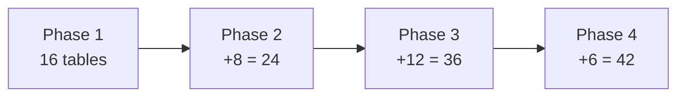

---

### Feature → table mapping (quick reference)

| Feature ID | Primary tables |
|---|---|
| P1-UC01 Health | `service_catalog`, `aws_resource`, `service_criticality`, `integration_sync_log` + Redis health rollup cache |
| P1-UC02 Investigation | `incident_record`, `incident_timeline_event`, `external_reference` + Cortex |
| P1-UC03 Impact | `business_process`, `application`, `dependency`, `service_criticality` |
| P1-UC04 Ownership | `service_ownership`, `team`, `person`, `escalation_policy`, `escalation_step` |
| P1-UC05 Copilot | All graph tables + Cortex RAG (agents query both) |
| P1-F04 Severity | `service_criticality`, `severity_rule` (P4) |
| P2-F11 Expert Finder | `engineer_service_experience`, `person`, `service_catalog` |
| P3-F01 Escalation | `escalation_policy`, `escalation_step`, `on_call_rotation`, `person_availability` |
| P3-F06 Notifications | `notification_rule`, `notification_rule_target`, `active_incident` |
| P3-F13 Senior approval | `approval_request`, `approval_decision`, `action_recommendation` |
| P4-F04 Graph traversal | `dependency`, `change_request`, `incident_record`, `service_ownership` (multi-hop SQL) |

---

### Key indexes (enterprise performance)

| Table | Index |
|---|---|
| `service_catalog` | `(code)`, `(service_type, environment)`, `(status)` |
| `aws_resource` | `(resource_arn)` UNIQUE, `(service_catalog_id)` |
| `external_reference` | `(source_system, external_id)` UNIQUE, `(service_catalog_id)` |
| `dependency` | `(source_service_id)`, `(target_service_id)`, `(dependency_type)` |
| `service_ownership` | `(service_catalog_id)`, `(primary_person_id)`, `(team_id)` |
| `engineer_service_experience` | `(person_id, service_catalog_id)` UNIQUE, `(expertise_score DESC)` |
| `incident_record` | `(jira_key)` UNIQUE, `(service_catalog_id, resolved_at DESC)` |
| `active_incident` | `(status, calculated_severity)` |

---

### Sample query patterns (for agents)

**Ownership Discovery (P1-F06):**
```sql
-- service_catalog.code = 'glue-job-cn3'
SELECT sc.name, t.name AS team, p.display_name AS primary_poc,
       m.display_name AS manager, t.teams_channel_url
FROM service_catalog sc
JOIN service_ownership so ON so.service_catalog_id = sc.id
JOIN team t ON t.id = so.team_id
JOIN person p ON p.id = so.primary_person_id
LEFT JOIN person m ON m.id = t.manager_person_id
WHERE sc.code = :service_code AND so.is_active = true;
```

**Blast radius (P1-F05):**
```sql
-- recursive CTE on dependency from failed service_id
WITH RECURSIVE downstream AS ( ... )
SELECT target_service_id, dependency_type FROM downstream;
```

**Expert Finder (P2-F11):**
```sql
SELECT p.display_name, ese.expertise_score, ese.incident_count
FROM engineer_service_experience ese
JOIN person p ON p.id = ese.person_id
JOIN service_catalog sc ON sc.id = ese.service_catalog_id
WHERE sc.service_type = 'aws_rds'
ORDER BY ese.expertise_score DESC LIMIT 5;
```

---

### PRD inclusion

- Section **11 Architecture** — ER diagram + phase table list + hub model explanation
- Section **9 Functional Requirements** — FR-P1-DB-* for config CRUD and graph query SLAs
- Appendix — optional full `CREATE TABLE` DDL when executing PRD (abbreviated columns in main doc)

**Cortex AI RAG remains separate** — stores document chunks; Aurora stores structured graph. Agents join both.

---

## 3c. Original 20 Use Cases — Architecture Fulfillment Matrix

**Honest status for submission:** All 20 are **phase-mapped**, have **data model coverage**, and have **realistic working flows** (Section 3e). Phase 1 Original UCs (1, 3, 4) are **demo-ready**; Phases 2–4 flows are architecturally defined — FRs and sequence diagrams at PRD/TDD generation.

**Legend**
- **Full** = data + agents + UI + flow defined; demo-ready in Phase 1
- **Planned** = flow defined in §3e; phase, tables, integrations assigned — FR + sequence diagram at PRD/TDD generation
- **Gap** = missing integration or component — must document before client submission

| # | Original use case | Phase | Plan ID | Aurora tables | Cortex RAG | Agents | Data sources | UI module | Arch status | Gap to close for submission |
|---|---|---|---|---|---|---|---|---|---|---|
| 1 | Enterprise Ownership Intelligence | 1 | P1-F11 | `service_ownership`, `team`, `person`, `escalation_*` | Optional context | Ownership | Jira, GitHub, Aurora | Command Center, Copilot | **Full** | None for Phase 1 demo |
| 2 | Business Process Monitoring | 2 | P2-F03 | `business_process`, `application`, `service_criticality` | — | Dependency + Incident | AWS, Splunk, Aurora | Business Process Dashboard | Planned | Health rollup logic + metric definitions |
| 3 | Enterprise Dependency Intelligence | 1–2 | P1-F12, P2-F04 | `dependency`, `team_dependency`, `service_catalog` | — | Dependency | AWS, Aurora | Impact Explorer | **Full** (basic) / Planned (enhanced) | Recursive blast-radius API spec |
| 4 | AI Incident Investigation | 1 | P1-F13, P1-UC02 | `external_reference` + investigation cache (Redis) | Runbooks, Jira | All 4 + Synthesis | Splunk, Jira, AWS, Cortex | Investigation Workspace | **Full** | None — flow in Section 3e |
| 5 | Enterprise Knowledge Search | 2 | P2-F01 | `external_reference`, `runbook_registry` | Primary | Knowledge | Confluence, Jira, Cortex | Copilot / Search | Planned | Cortex indexing scope document |
| 6 | Historical Incident Intelligence | 2 | P2-F02 | `incident_record`, `incident_service_link` | Incident corpus | Incident + Knowledge | Jira, Cortex | Investigation Workspace | Planned | Jira sync job + similarity scoring |
| 7 | Autonomous Incident Coordination | 3 | P3-F08 | `active_incident`, `action_recommendation` | Runbooks | Incident + Control | Jira write, Teams | Control Center | Planned | **Teams connector** + Jira write API |
| 8 | AI Executive Briefings | 4 | P4-F01 | `executive_briefing`, `service_criticality` | — | Incident | Aurora, active incident | Executive Dashboard | Planned | Briefing template + generation flow |
| 9 | Architecture Intelligence | 2 | P2-F05 | `architecture_component`, `application` | Arch docs | Knowledge | Confluence, GitHub, Cortex | Copilot | Planned | Architecture ingest + component map rules |
| 10 | Change Risk Intelligence | 3 | P3-F10 | `change_request`, `dependency` | — | Dependency | GitHub, Jira, Aurora | Control Center | Planned | GitHub deploy event → change_request sync |
| 11 | Operational Risk Detection | 2 | P2-F06 | `operational_risk_signal`, `governance_finding` | — | Governance | AWS, Splunk, Aurora | Governance Center | Planned | Risk detection rules catalog |
| 12 | Ownership Gap Detection | 2 | P2-F07 | `governance_finding` | — | Governance | Aurora | Governance Center | Planned | Scheduled gap scan job spec |
| 13 | Runbook Coverage Analysis | 2 | P2-F08 | `runbook_registry`, `governance_finding` | Confluence | Governance | Confluence, Aurora | Governance Center | Planned | Runbook ↔ service matching rules |
| 14 | Documentation Governance | 2 | P2-F09 | `governance_finding`, `external_reference` | Confluence | Governance | Confluence, Cortex | Governance Center | Planned | Stale-doc threshold + last_reviewed sync |
| 15 | Organizational Dependency Analysis | 2 | P2-F10 | `team_dependency`, `dependency` | — | Dependency | Aurora | Impact Explorer | Planned | Team-level graph views |
| 16 | Critical Expert Detection | 2 | P2-F11 | `engineer_service_experience` | — | Knowledge | Jira, GitHub, Aurora | Governance Center, Copilot | Planned | Aggregate job from Jira/GitHub |
| 17 | Service Consumption Intelligence | 4 | P4-F03 | `service_consumption` | — | Dependency | AWS, Aurora | Executive Dashboard | Planned | AWS tag/API consumer mapping logic |
| 18 | Enterprise Operational Search | 2 | P2-F12 | `external_reference` | Primary | Knowledge | All sources + Cortex | Copilot | Planned | Unified search API across Cortex + graph |
| 19 | Operational Digital Twin | 4 | P4-F02 | `digital_twin_snapshot` + full graph | — | All agents | All sources | Executive Dashboard | Planned | Snapshot refresh cadence + graph export |
| 20 | Controlled Operational Execution | 3 | P3-F09 | `action_recommendation`, `approval_*`, `action_execution_log` | Runbooks | Control | AWS API, Jira | Operations Control Center | Planned | **Approval workflow** + AWS action IAM model |
| — | Enterprise Operations Command Center | 1 | P1-F01 | All Phase 1 graph tables | — | All Phase 1 | All Phase 1 sources | Command Center | **Full** | Dashboard widget data contracts |

### Fulfillment summary

| Status | Count | Use cases |
|---|---|---|
| **Full architecture (Phase 1 demo)** | **8** | UC 1, 3 (basic), 4, Command Center; plus core UC 1–5 via P1-UC01–05 |
| **Flow defined (Phases 2–4)** | **12** | UC 2, 5–20 — flows in Section 3e; FRs at PRD/TDD generation |
| **Integration gaps** | **2** | UC 7 (Teams), UC 20 (AWS write + approval) — Phase 3 only |

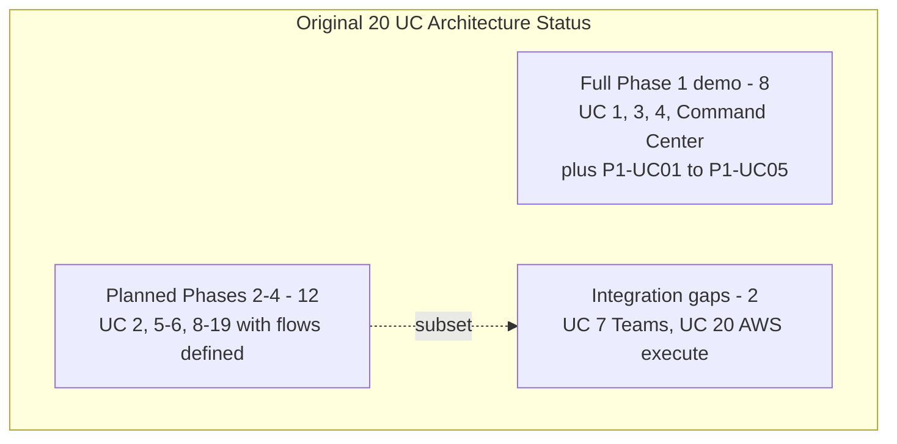

### 3c-bis. Phase 1 product UCs ↔ Original 20 UC mapping

Two numbering systems — do not conflate:

| P1-UC (product) | Business question | Original UC | Original name | Phase | Demo module |
|---|---|---|---|---|---|
| P1-UC01 | What is happening? How serious? | UC 2 (preview) | Business Process Monitoring | P1 preview / P2 full | Command Center (seeded health tiles) |
| P1-UC02 | Why is it happening? | **UC 4** | AI Incident Investigation | P1 | Investigation Workspace |
| P1-UC03 | What is the business impact? | **UC 3** | Enterprise Dependency Intelligence | P1 | Impact Explorer |
| P1-UC04 | Who owns it? Who responds? | **UC 1** | Enterprise Ownership Intelligence | P1 | Copilot, Command Center |
| P1-UC05 | What should we do next? | Cross-cutting | Copilot + Knowledge (UC 5 tease) | P1 | Copilot |

**Phase 1 demo data (locked):** hybrid — live AWS/Splunk/Jira for investigation chain; seeded Command Center business-process health for UC 2 preview.

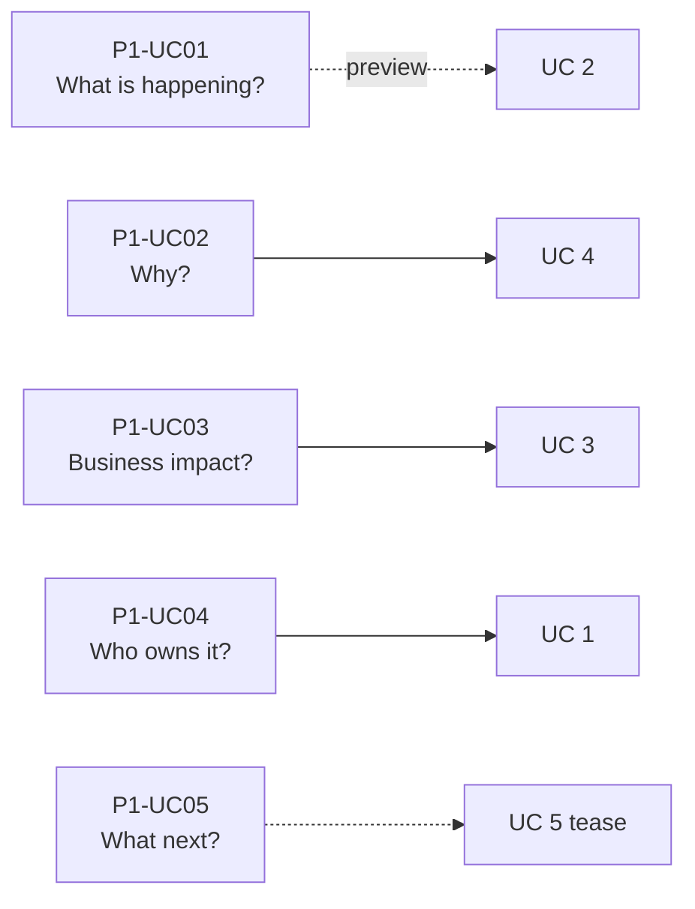

### What you CAN submit today (volunteer demo to tech lead)

| Submit as | Content |
|---|---|
| **Working architecture** | P1-UC01–05 + Original UC 1, 3, 4 + Command Center (P1-F01) — full stack diagram, Aurora Phase 1 schema, 4 agents, 5 connectors, Cortex RAG |
| **Roadmap architecture** | UC 2, 5–10, 12–19 — phase, tables, integration additions per phase |
| **Not yet** | OpenAPI, DDL scripts, IAM policies — add in PRD execution (20 UC flows done in Section 3e) |

## 3d. Parallel Agents — Simple Design (accuracy first)

**Design rule:** **4 agents in Phase 1** — not 10+. Parallelize **only** independent data gathering. **One synthesis step** after join for severity and recommendations (needs full context = better accuracy).

**Orchestrator** = thin LangGraph router (classify intent, fan-out, join) — **not** a separate LLM agent.

### Phase 1 — four agents

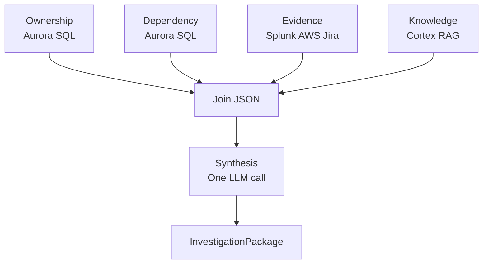

| Agent | Does | Accuracy rule | Source |
|---|---|---|---|
| **Ownership** | Owner, team, escalation | **Aurora SQL only** — no LLM guessing | Aurora |
| **Dependency** | Blast radius, business impact | **Aurora SQL/graph only** | Aurora |
| **Evidence** | Signals, timeline, similar Jira tickets | Facts + cited summary | AWS, Splunk, Jira |
| **Knowledge** | Runbooks, docs | **Cortex RAG chunks only** | Cortex AI RAG |

**After parallel join → Synthesis (one LLM step):** business severity, summary, recommendations. Not a separate agent — single call with all joined JSON.

### Phase 2–3 additions (minimal)

| Phase | Add | When |
|---|---|---|
| 2 | **Governance Agent** | Scheduled gap/risk scans only |
| 3 | **Coordination Agent** | After investigation + approval |
| 3 | **Control Agent** | Execute approved actions only |

**Removed from earlier draft:** Monitoring, Incident, Impact, Expert, Briefing as separate agents — merged into Evidence or Synthesis.

---

### When to parallelize (possibility check)

| Scenario | Parallel? | Agents |
|---|---|---|
| Full incident / alert | **Yes — max 4** | Ownership + Dependency + Evidence + Knowledge |
| "Who owns X?" | **No** | Ownership only |
| "What breaks if X fails?" | **No** | Dependency only |
| "Why failed / what to do?" | **Yes — 2–4** | Evidence + Knowledge (+ others if needed) |
| Dashboard health metrics | **No** | Direct queries — no agents |

**Rule:** One agent is enough when Aurora or Cortex alone can answer. Parallel only when **multiple independent sources** are required.

---

### Workflow (Phase 1)

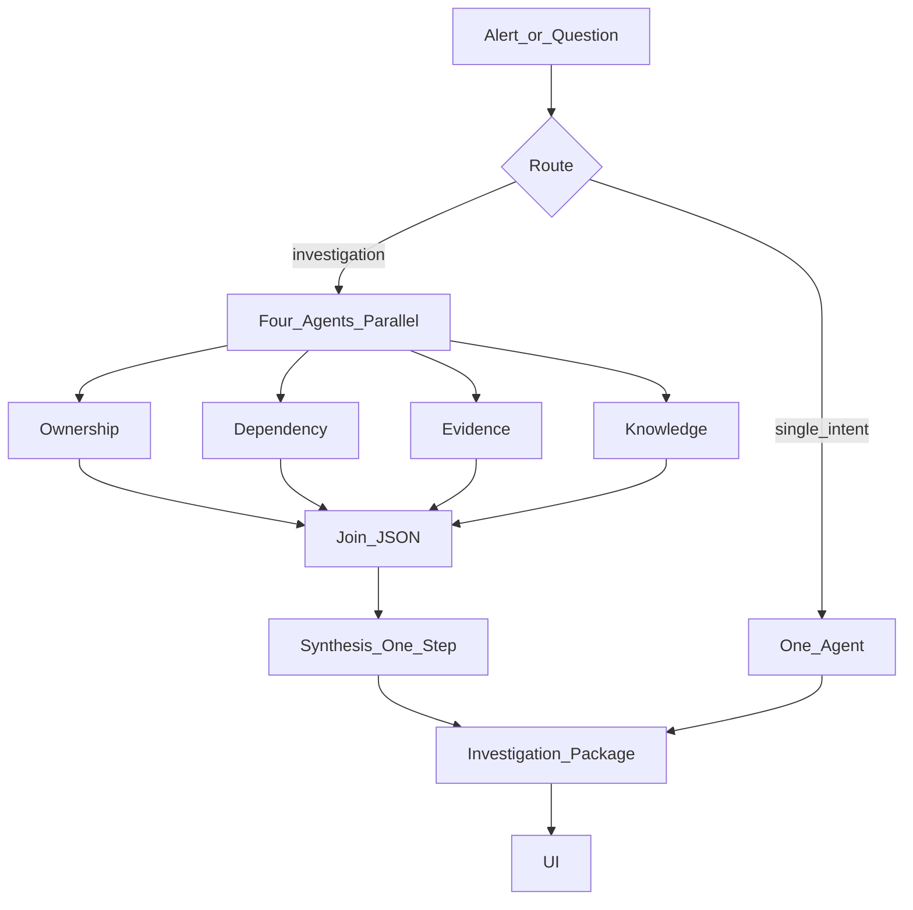

---

### Accuracy safeguards

| Layer | Rule |
|---|---|
| Ownership / Dependency | Return Aurora SQL results unchanged |
| Evidence / Knowledge | Citations required; no match = say "not found" |
| Synthesis | Uses joined JSON only; cannot invent owners |
| Failure | Partial package + `gaps[]` — never fill with guesses |
| Conflict | Prefer Aurora for ownership; show both if evidence disagrees |

---

### Standards

| Rule | Value |
|---|---|
| Max parallel agents | **4** |
| Per-agent timeout | 15s |
| FR IDs | `FR-P1-AG-001` cap 4 parallel; `FR-P1-AG-002` synthesis after join; `FR-P1-AG-003` partial failure; `FR-P1-AG-004` SQL-only ownership/dependency |

### InvestigationPackage (simplified)

```json
{
  "service_id": "uuid",
  "ownership": { "data": {}, "complete": true },
  "dependency": { "data": {}, "complete": true },
  "evidence": { "timeline": [], "sources": [] },
  "knowledge": { "runbooks": [], "sources": [] },
  "synthesis": { "severity": "", "business_summary": "", "recommendations": [], "confidence": 0.0 },
  "gaps": []
}
```

### PRD Section 11.13

Document this simplified model only — 4 agents, routing table, synthesis step, accuracy rules.

---

---

## 3e. All 20 Use Case Working Flows (PRD Section 11.12 — locked)

**Business storytelling (Problem / Example / Solution):** §3f — one narrative per use case for onsite and PRD.

**Common paths:**

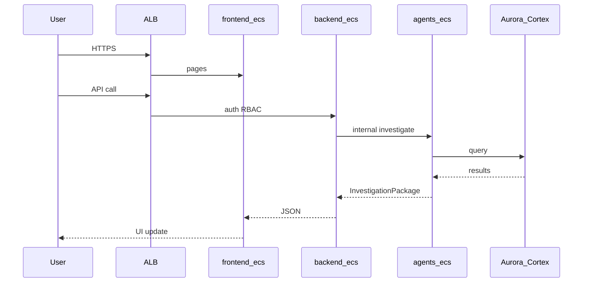

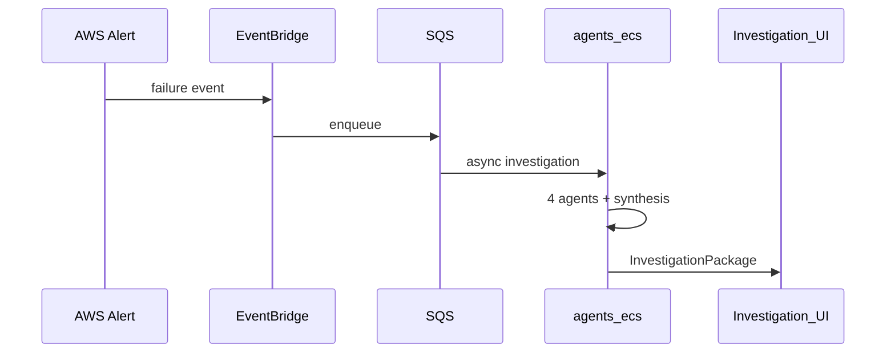

### Master flow table (all 20 use cases)

| UC | Use case | Phase | Trigger | Working flow (start → end) | Agents | Result |
|---|---|---|---|---|---|---|
| 1 | Enterprise Ownership Intelligence | 1 | Copilot or Command Center click | User → `/api/copilot/query` → Router `ownership_only` → Ownership agent → Aurora SQL (`service_ownership`, `team`, `escalation_*`) → JSON with citations → UI | Ownership | Ownership card: team, POC, escalation |
| 2 | Business Process Monitoring | 2 | 5-min EventBridge schedule | Cron → SQS → backend worker → rollup CloudWatch/Splunk per `business_process` → worst-child-wins → Redis/Aurora → Dashboard API | Metrics rollup | Process tiles green/amber/red |
| 3 | Enterprise Dependency Intelligence | 1–2 | Copilot or RDS alert | User/alert → Router `dependency_only` → Dependency agent → recursive Aurora `dependency` CTE → optional Synthesis → Impact Explorer | Dependency | Blast radius graph + business labels |
| 4 | AI Incident Investigation | 1 | Alert→SQS or Investigate click | SQS → backend → agents-ecs → 4 parallel agents → join → Synthesis → persist timeline → Investigation Workspace | All 4 + Synthesis | Full investigation package with citations |
| 5 | Enterprise Knowledge Search | 2 | Copilot search | Query → resolve service via `external_reference` → Knowledge → Cortex embed + Pinecone top-k → ranked docs | Knowledge | Runbook/doc results with links |
| 6 | Historical Incident Intelligence | 2 | During investigation | Evidence (current signals) + Knowledge (Pinecone + `incident_record`) → similarity score → Synthesis compare | Evidence + Knowledge | "87% match INC-4521" + resolution |
| 7 | Autonomous Incident Coordination | 3 | `risk_score ≥ 70%` post-investigation | `investigation.completed` → Coordination → Jira assign + OOO-aware routing + Teams notify + optional war room | Coordination | Ticket assigned, stakeholders notified |
| 8 | AI Executive Briefings | 4 | Sev1 or daily 08:00 cron | Load `active_incident` + business context → Synthesis exec template → `executive_briefing` + S3 PDF | Synthesis | 1-page leadership brief |
| 9 | Architecture Intelligence | 2 | Copilot architecture query | Aurora `architecture_component` tree + Knowledge RAG on Confluence → merge → optional narrative | Knowledge + Aurora | App→API→DB map with owners |
| 10 | Change Risk Intelligence | 3 | GitHub deploy webhook | `change_request` sync → Dependency blast radius → cross-check active risks → Synthesis risk score | Dependency + Synthesis | Deploy gate: proceed/delay recommendation |
| 11 | Operational Risk Detection | 2 | 15-min cron | Governance rules on AWS/Splunk → `operational_risk_signal` → Governance Center feed | Governance rules | Proactive risk cards |
| 12 | Ownership Gap Detection | 2 | Nightly 02:00 UTC | Scan `service_catalog` without owner/escalation → `governance_finding` | Governance SQL | Gap list for remediation |
| 13 | Runbook Coverage Analysis | 2 | Weekly post-Confluence sync | Build `runbook_registry` → match Tier-1/2 services → flag `no_runbook` | Governance | Coverage % + missing list |
| 14 | Documentation Governance | 2 | Weekly cron | Stale/missing Confluence docs → `governance_finding` stale_doc | Governance | Stale documentation report |
| 15 | Organizational Dependency Analysis | 2 | Team view / copilot | `team_dependency` + service deps rollup by team → team graph | Dependency | Cross-team dependency map |
| 16 | Critical Expert Detection | 2 | Copilot or governance report | `engineer_service_experience` ranked query → key-person risk flag | Aurora aggregate | Top experts + risk flag |
| 17 | Service Consumption Intelligence | 4 | Exec dashboard | AWS sync → `service_consumption` → reverse dependency query | Dependency | Who consumes Payment API map |
| 18 | Enterprise Operational Search | 2 | Unified search bar | Parallel Pinecone semantic + Aurora entity search → merge/dedupe | Knowledge + SQL | Grouped unified results |
| 19 | Operational Digital Twin | 4 | Hourly cron | Full connector sync → graph export → `digital_twin_snapshot` + S3 | Connector sync | Point-in-time operational twin |
| 20 | Controlled Operational Execution | 3 | Approve action from investigation | `approval_request` quorum → Control agent → AWS API → `action_execution_log` + Jira comment | Control | Executed action with audit trail |

### Phase 1 demo flows (full detail)

#### UC 1 — Enterprise Ownership Intelligence

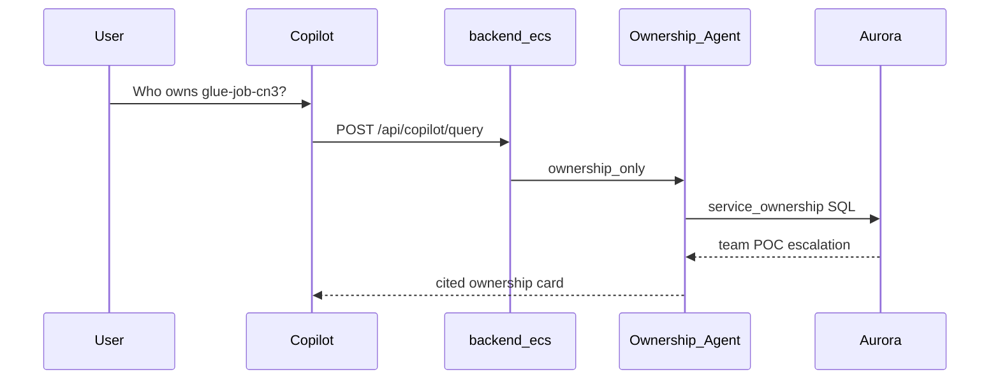

1. User: *"Who owns glue-job-cn3?"* → `POST /api/copilot/query`
2. Router: `ownership_only` → Ownership agent only
3. Aurora SQL: `service_catalog` → `service_ownership` → `team`, `person`, `escalation_step`
4. Result: `{ team, primary_poc, escalation[], sources[] }` → Ownership card in UI

#### UC 3 — Enterprise Dependency Intelligence

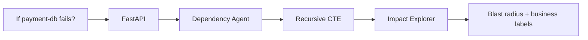

1. User: *"If payment-db fails, what breaks?"* → `GET /api/services/{id}/dependencies`
2. Router: `dependency_only` → Dependency agent
3. Aurora recursive CTE on `dependency` + `business_process` join
4. Result: blast radius — 12 services, 4 apps, Payments process at risk → Impact Explorer

#### UC 4 — AI Incident Investigation

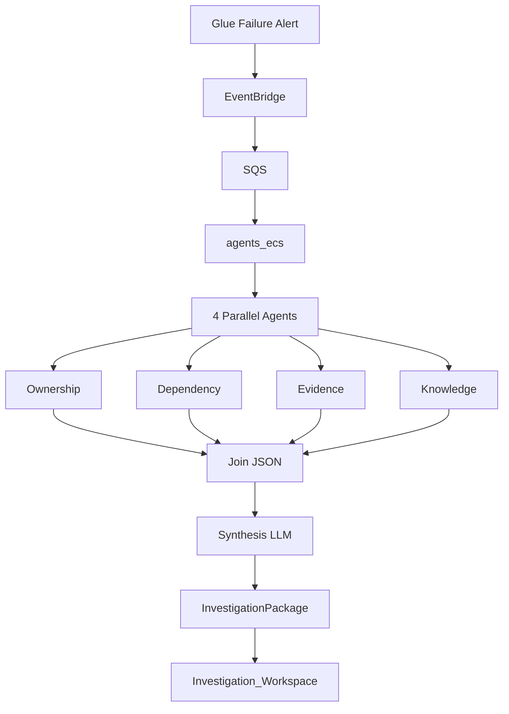

1. Glue failure → EventBridge → SQS `{ alert_id, service_arn }`
2. backend-ecs → agents-ecs `/investigate` → 4 parallel agents (15s timeout)
3. Ownership + Dependency + Evidence (Splunk/AWS/Jira) + Knowledge (Pinecone runbooks)
4. Join → Claude 3.5 Sonnet Synthesis → `InvestigationPackage` → Investigation Workspace
5. Result: Sev2, timeline, owner Jane Doe, similar INC-2241, runbook §3.2 recommendation

### Phase 1 demo chain (tech lead walkthrough)

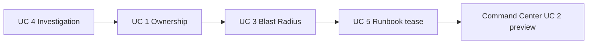

1. UC 4 — Glue alert → full investigation  
2. UC 1 — Ownership from same incident  
3. UC 3 — Dependency blast radius  
4. UC 5 (tease) — Runbook via Knowledge agent  
5. Command Center — UC 2 preview (seeded business-process health tiles; live alerts drive investigation chain)

**Phases 2–4:** UC 2, 5–20 summarized in master flow table above; step-by-step detail at PRD/TDD generation.

---

## 3f. Business Examples — All 20 Use Cases (onsite storytelling)

**Purpose:** Problem → concrete Lilly example → how EOCC solves it. Use for onsite tech lead, ops leads, and PRD Section 2 (pain) + Section 5 (demo scenarios).

**Elevator line:** *"Monitoring tells you something broke. EOCC tells you who owns it, what business capability is at risk, why it happened, and what to do next — with citations, not guesses."*

```mermaid
flowchart LR
    subgraph before [Before EOCC]
        M[Monitoring Alert]
        M --> Q1[Who owns it?]
        M --> Q2[Business impact?]
        M --> Q3[Why? What next?]
    end

    subgraph after [With EOCC]
        E[Single Investigation]
        E --> A1[Ownership cited]
        E --> A2[Blast radius]
        E --> A3[Timeline + runbook]
        E --> A4[Recommendation]
    end

    M -.->|MTTR reduction| E
```

### Phase 1 — Demo today

#### UC 1 — Enterprise Ownership Intelligence (Phase 1)

| | |
|---|---|
| **Problem** | During an outage, engineers waste 20–40 minutes in Slack and Jira asking *"Who owns this Glue job / Lambda / RDS?"* Tribal knowledge wins; escalation paths are unclear. |
| **Example** | A **clinical trial data ingestion Glue job** (`glue-job-cn3`) fails at 2 AM. The on-call engineer does not know the owning team. |
| **How EOCC solves it** | User asks in Copilot: *"Who owns glue-job-cn3?"* EOCC queries the **Aurora ownership graph** (not AI guesswork) and returns: **Payments Data Platform team**, primary POC, manager, and escalation chain — with source citations. MTTR drops before anyone runs a single kubectl command. |

#### UC 3 — Enterprise Dependency Intelligence (Phase 1)

| | |
|---|---|
| **Problem** | Infra alerts do not speak business language. Leadership asks *"Does this affect patients or revenue?"* while engineers only see *"RDS CPU high."* |
| **Example** | Alert on **`payment-db`** (Aurora PostgreSQL backing **Patient Reimbursement**). Team needs blast radius before failover. |
| **How EOCC solves it** | EOCC runs a **dependency graph** from Aurora: 12 downstream services, 4 applications, **Payments business process** flagged at risk. Impact Explorer shows business-labeled blast radius. Severity is tied to business capability, not just CPU. |

#### UC 4 — AI Incident Investigation (Phase 1)

| | |
|---|---|
| **Problem** | Root-cause analysis requires manually correlating Splunk logs, CloudWatch, Jira tickets, and Confluence runbooks — slow, inconsistent, and depends on senior engineers. |
| **Example** | **Glue ETL failure** for batch submission to regulatory reporting. Alert fires via EventBridge → SQS. |
| **How EOCC solves it** | Four agents run in parallel (15s): Ownership + Dependency + Evidence (Splunk/AWS/Jira) + Knowledge (runbooks via Cortex RAG). One synthesis step produces an **Investigation Package**: Sev2, timeline, owner, similar past incident, runbook §3.2 — all cited. Junior on-call gets senior-level context in one screen. |

#### Command Center — Enterprise Operations Command Center (Phase 1 module)

| | |
|---|---|
| **Problem** | Ops leaders lack a single view ranked by **business risk** — they see tool silos (AWS, Splunk, Jira) instead of *"what matters most right now."* |
| **Example** | Monday standup: 47 open alerts across AWS. Leadership wants *"What should we worry about first?"* |
| **How EOCC solves it** | Command Center rolls up health by **application and business process** — Payments red, internal reporting amber, dev sandbox green. Smart severity weights customer-facing vs internal. Hybrid demo: live alerts drive investigations; business-process tiles seeded for reliable storytelling. |

### Phase 2 — Intelligence depth (after client approval)

#### UC 2 — Business Process Monitoring (Phase 2)

| | |
|---|---|
| **Problem** | Teams monitor servers, not **business capabilities**. *"Is onboarding healthy?"* requires manual checks across a dozen services. |
| **Example** | **Clinical Study Onboarding** spans 8 AWS services. One Lambda degradation should turn the whole capability amber — not hide inside a CloudWatch dashboard. |
| **How EOCC solves it** | Scheduled rollup every 5 minutes: worst-child-wins per `business_process`. Command Center shows **Onboarding: AMBER** with drill-down to failing child service. Business health, not infra health. |

#### UC 5 — Enterprise Knowledge Search (Phase 2)

| | |
|---|---|
| **Problem** | Runbooks live in Confluence, procedures in Jira, tribal knowledge in Slack. Engineers search 4 systems during an incident. |
| **Example** | *"How do we restart the GxP-validated ECS service after memory leak?"* |
| **How EOCC solves it** | Unified semantic search via **Cortex RAG + Pinecone** across Confluence, Jira, GitHub READMEs. Ranked results with links and service context from Aurora. One search bar, cited answers. |

#### UC 6 — Historical Incident Intelligence (Phase 2)

| | |
|---|---|
| **Problem** | Teams repeat investigations for the same failure pattern because past resolutions are buried in closed Jira tickets. |
| **Example** | Current Glue failure looks like **INC-4521** from six months ago — same error signature, same root cause (IAM role drift). |
| **How EOCC solves it** | During investigation, Evidence + Knowledge agents match against **historical incident corpus**: *"87% similar to INC-4521 — resolved by updating IAM trust policy."* Institutional memory at point of need. |

#### UC 9 — Architecture Intelligence (Phase 2)

| | |
|---|---|
| **Problem** | Architecture diagrams in Confluence are stale. Troubleshooting requires asking architects who designed the system years ago. |
| **Example** | *"Show me the architecture for Patient Portal API — what sits in front of Aurora?"* |
| **How EOCC solves it** | Merges **Aurora architecture_component tree** with live Confluence/GitHub docs via RAG. Returns App → API Gateway → ECS → RDS map **with current owners**. Living architecture for troubleshooting. |

#### UC 11 — Operational Risk Detection (Phase 2)

| | |
|---|---|
| **Problem** | Teams are reactive — they learn about risk only when something is already down. |
| **Example** | Splunk shows rising error rate on **SQS dead-letter queue** for a **revenue-critical** service — not yet paging, but trend is bad. |
| **How EOCC solves it** | Governance rules run every 15 minutes on AWS + Splunk signals → `operational_risk_signal` cards in Governance Center. Proactive risk before outage. |

#### UC 12 — Ownership Gap Detection (Phase 2)

| | |
|---|---|
| **Problem** | Hundreds of AWS resources accumulate without owners after reorganizations — orphan resources become incident black holes. |
| **Example** | Nightly scan finds **34 Lambda functions** with no `service_ownership` row and no escalation policy. |
| **How EOCC solves it** | Automated governance scan → remediation list for platform team. Closes the #1 enterprise ops gap: nobody owns it. |

#### UC 13 — Runbook Coverage Analysis (Phase 2)

| | |
|---|---|
| **Problem** | Tier-1 services lack recovery procedures. Teams improvise during Sev1 incidents. |
| **Example** | Weekly analysis: **Payments API** is Tier-1 SLA but has **no linked Confluence runbook**. |
| **How EOCC solves it** | Matches `service_catalog` to `runbook_registry` after Confluence sync. Reports coverage % and missing list for SRE leads. Compliance and recovery readiness. |

#### UC 14 — Documentation Governance (Phase 2)

| | |
|---|---|
| **Problem** | Confluence pages for critical systems are years out of date. Engineers follow wrong procedures. |
| **Example** | Runbook for **batch submission pipeline** last reviewed 18 months ago; architecture changed twice since. |
| **How EOCC solves it** | Flags stale/missing docs as `governance_finding`. Governance Center report for doc owners. GxP-relevant: documentation drift is operational risk. |

#### UC 15 — Organizational Dependency Analysis (Phase 2)

| | |
|---|---|
| **Problem** | Technical dependency maps exist, but **cross-team** dependencies are invisible — blame ping-pong during incidents. |
| **Example** | Data Engineering depends on Security team's KMS rotation schedule; when keys rotate, pipelines fail and teams argue ownership. |
| **How EOCC solves it** | `team_dependency` graph shows **upstream/downstream teams**, not just services. Impact Explorer team view. Ends cross-team finger-pointing. |

#### UC 16 — Critical Expert Detection (Phase 2)

| | |
|---|---|
| **Problem** | One engineer solved 25 Aurora incidents; if they leave, the organization loses critical expertise (key-person risk). |
| **Example** | *"Who actually knows Aurora replication for the clinical data store?"* |
| **How EOCC solves it** | Ranks `engineer_service_experience` from Jira + GitHub history. Surfaces top experts and flags key-person concentration. Succession planning and faster routing. |

#### UC 18 — Enterprise Operational Search (Phase 2)

| | |
|---|---|
| **Problem** | Search is fragmented — Confluence search misses Jira; Jira search misses Splunk-linked context. |
| **Example** | Engineer searches *"Aurora failover procedure payments"* — needs docs, tickets, and service metadata in one result set. |
| **How EOCC solves it** | Parallel **semantic search (Pinecone)** + **structured entity search (Aurora)** → merged, deduped, grouped results. Google for your operations estate. |

### Phase 3 — AI Operations Coordinator (full approvals)

#### UC 7 — Autonomous Incident Coordination (Phase 3)

| | |
|---|---|
| **Problem** | After diagnosis, someone still manually creates Jira tickets, finds who's on-call, and notifies stakeholders — slow and inconsistent. |
| **Example** | Investigation completes with **risk score 85%** on a **patient-facing API** degradation. |
| **How EOCC solves it** | Coordination agent auto-assigns Jira ticket to the right engineer (skill + availability), notifies team via Teams, optionally opens war room. Human approves; system coordinates. *(Requires Teams + Jira write.)* |

#### UC 10 — Change Risk Intelligence (Phase 3)

| | |
|---|---|
| **Problem** | Deployments go out without understanding blast radius on active incidents or dependent business processes. |
| **Example** | GitHub deploy webhook fires for **Payment API v2.3** while **payment-db** is already amber from a memory issue. |
| **How EOCC solves it** | Change request synced → dependency blast radius + active risk cross-check → synthesis recommends **DELAY deploy** with cited rationale. Prevents making a bad situation worse. |

#### UC 20 — Controlled Operational Execution (Phase 3)

| | |
|---|---|
| **Problem** | Recovery actions (restart ECS, scale service, rollback) are manual, untracked, and risky without approval. |
| **Example** | Investigation recommends **restart ECS service** for memory-leaking API. Engineer wants one-click execute with audit trail. |
| **How EOCC solves it** | Action enters **approval queue** (2–6 senior approvers for production). On quorum, Control agent runs AWS API, logs to `action_execution_log`, comments on Jira. Speed with governance — not cowboy ops. |

### Phase 4 — Strategic

#### UC 8 — AI Executive Briefings (Phase 4)

| | |
|---|---|
| **Problem** | Leadership gets either too-technical war-room updates or vague *"we're working on it"* — no business-impact summary. |
| **Example** | Sev1 on **clinical data submission** during business hours. VP needs a 1-page brief in 10 minutes. |
| **How EOCC solves it** | Synthesis generates executive brief from `active_incident` + `service_criticality` + business process context → PDF in S3. Technical truth translated to business language. |

#### UC 17 — Service Consumption Intelligence (Phase 4)

| | |
|---|---|
| **Problem** | Platform teams do not know who consumes their APIs — chargeback, governance, and blast-radius planning suffer. |
| **Example** | *"Who calls Payment API — and which teams would break if we deprecate v1?"* |
| **How EOCC solves it** | AWS sync builds `service_consumption` map. Executive dashboard shows consumers and reverse dependencies. Platform economics and retirement planning. |

#### UC 19 — Operational Digital Twin (Phase 4)

| | |
|---|---|
| **Problem** | No single point-in-time picture of the entire operational estate for audits, drills, or post-incident review. |
| **Example** | Quarterly **operational resilience review** needs a snapshot of all services, dependencies, health, and open risks as-of Friday 5 PM. |
| **How EOCC solves it** | Hourly full connector sync → `digital_twin_snapshot` exported to S3. Auditable operational model of the enterprise. |

### Onsite quick reference

| Show today (Phase 1) | Mention as roadmap |
|---|---|
| UC 1 Ownership | UC 12 Ownership gaps |
| UC 3 Impact / blast radius | UC 2 Business process monitoring |
| UC 4 Investigation | UC 5–6 Knowledge + history |
| Command Center | UC 7 Coordination, UC 20 Execute |
| Copilot (UC 5 tease) | UC 8–11, 13–19 governance & exec |

### 5-minute onsite story (Phase 1 chain)

```mermaid
flowchart LR
    D1[Glue fails UC4] --> D2[Who owns UC1]
    D2 --> D3[What breaks UC3]
    D3 --> D4[Command Center]
    D4 --> D5[Copilot advisory]
```

1. **Glue job fails** (UC 4) → auto investigation with timeline + runbook
2. **Who owns it?** (UC 1) → Payments Data Platform, Jane Doe, escalation chain
3. **What breaks?** (UC 3) → Patient Reimbursement process at risk
4. **Command Center** → Payments red, ranked above internal tools
5. **Copilot** → *"What should we do next?"* → cited recommendation, no auto-execute

**PRD mapping:** Section 2 = Problem column; Section 5 = Example + How EOCC solves it per P1-UC01–05 and roadmap UCs.

---

## 4. Technical System Architecture (best plan — locked)

**Pitch to tech lead:** *"No new AI infrastructure. We reuse Cortex AI + Pinecone (enterprise-approved), Aurora for the knowledge graph, and build an Operations Intelligence layer on top."*

### System diagram

```mermaid
flowchart TB
    subgraph ui [Presentation]
        NextJS[Next_js_TypeScript]
    end

    subgraph api [API_Layer]
        FastAPI[FastAPI_RBAC_REST]
    end

    subgraph brain [Agent_Orchestration]
        Router[Thin_Router]
        LG[LangGraph]
        Router --> LG
        LG --> A1[Ownership]
        LG --> A2[Dependency]
        LG --> A3[Evidence]
        LG --> A4[Knowledge]
        LG --> Synth[Synthesis_via_Cortex_LLM]
    end

    subgraph data [Data_Layer]
        Aurora[Aurora_PostgreSQL_Knowledge_Graph]
        Redis[Redis_State_Cache]
    end

    subgraph ai [Enterprise_AI_Existing]
        CortexLLM[Cortex_AI_LLM_Gateway]
        CortexRAG[Cortex_AI_RAG]
        Pinecone[Pinecone_Vectors]
        CortexRAG --> Pinecone
    end

    subgraph events [Event_Processing]
        EB[EventBridge]
        SQS[SQS]
    end

    subgraph workers [Integration_Workers_ECS]
        W1[AWS_Splunk_Jira_Confluence_GitHub]
    end

  NextJS --> FastAPI
    FastAPI --> Router
    A1 --> Aurora
    A2 --> Aurora
    A3 --> W1
    A4 --> CortexRAG
    Synth --> CortexLLM
    LG --> Redis
    W1 --> EB
    EB --> SQS
    SQS --> LG
    FastAPI --> Aurora
```

---

### Layer-by-layer (10 components)

| # | Layer | Technology | Phase 1 role |
|---|---|---|---|
| 1 | **Frontend** | Next.js + TypeScript | Chat/Copilot, Incident Dashboard, Command Center, Ownership Explorer |
| 2 | **API** | FastAPI | Auth, RBAC, REST, agent invoke, graph CRUD |
| 3 | **Agents** | LangGraph | 4 gather agents + synthesis; thin router |
| 4 | **Knowledge graph** | Aurora PostgreSQL | Ownership, dependency, teams, incidents, audit — **not replaced by Pinecone** |
| 5 | **Cache / state** | Redis | LangGraph state, session, agent result TTL, rate limits |
| 6 | **RAG** | Cortex AI RAG → Pinecone | Runbooks, Confluence, Jira text, RCA docs, similar incidents |
| 7 | **LLM** | Cortex AI gateway + **LLM Router** | Task-based model selection — synthesis, summaries, reasoning |
| 8 | **Events** | EventBridge + SQS | Alerts, connector events, async agent triggers |
| 9 | **Connectors** | backend-ecs (sync workers) | Sync + fetch; optional workers-ecs Phase 2+ |
| 10 | **Object storage** | S3 | Investigation exports, audit attachments (optional P1) |

**Eliminated:** pgvector, Weaviate, self-hosted vectors, direct OpenAI/Anthropic APIs.

---

### Service selection rationale — architect pillars

Every infrastructure choice is evaluated on **five pillars**: **Scalable · Secure · Accurate · Fast · Reliable**.

Use this table in PRD Section 11 when the tech lead asks *"why this service for this job?"*

#### Frontend → Next.js on **frontend-ecs** (ECS Fargate)

| Pillar | Why this choice |
|---|---|
| **Scalable** | Dedicated ECS service — add tasks for UI traffic without scaling API or agents |
| **Secure** | Zero secrets in browser; all data via authenticated backend APIs only |
| **Accurate** | Server-rendered dashboards show consistent investigation state from backend truth |
| **Fast** | SSR/ISR for Command Center — first meaningful paint before heavy client hydration |
| **Reliable** | ALB health checks + rolling deploys; bad tasks drain without user-visible outage |

#### Backend API → **FastAPI** on **backend-ecs** (ECS Fargate)

| Pillar | Why this choice |
|---|---|
| **Scalable** | Stateless horizontal scale behind ALB; connector sync colocated until workers-ecs needed |
| **Secure** | Single auth/RBAC/audit gate; Cortex keys and agent endpoints never exposed to clients |
| **Accurate** | Validates and normalizes inputs before agent invoke; persists canonical investigation records to Aurora |
| **Fast** | Async I/O fans out parallel connector calls (AWS, Splunk, Jira) without blocking threads |
| **Reliable** | Stateless tasks — failure of one container does not corrupt state; Aurora + SQS hold durability |

#### AI agents → **LangGraph** on **agents-ecs** (ECS Fargate)

| Pillar | Why this choice |
|---|---|
| **Scalable** | Independent ECS service scales on SQS queue depth and investigation concurrency |
| **Secure** | Private subnet only — not on public ALB; reachable only from backend-ecs |
| **Accurate** | Deterministic gather agents (Aurora/Splunk) first; **one** Cortex synthesis after join; every claim cites source |
| **Fast** | Parallel fan-out (max 4 agents) with 15s timeout — wall-clock = slowest agent, not sum of all |
| **Reliable** | Redis checkpointing resumes workflows; partial results + `gaps[]` on agent failure — no silent empty answers |

#### Knowledge graph → **Aurora PostgreSQL**

| Pillar | Why this choice |
|---|---|
| **Scalable** | Vertical scale + read replicas when ownership/dependency query load grows |
| **Secure** | VPC-private, IAM database auth, encryption at rest, full audit log tables |
| **Accurate** | ACID + deterministic SQL — ownership and dependency answers never hallucinate |
| **Fast** | Indexed relational joins beat vector search for "who owns X" and "what depends on Y" |
| **Reliable** | Multi-AZ failover, automated backups, point-in-time recovery for operational truth |

#### Cache / agent state → **Redis** (ElastiCache)

| Pillar | Why this choice |
|---|---|
| **Scalable** | ElastiCache cluster mode when investigation cache volume exceeds single node |
| **Secure** | VPC-only, AUTH token, TTL expiry — no long-lived sensitive data in cache |
| **Accurate** | Cache-aside with invalidation on connector sync; Aurora remains source of truth |
| **Fast** | Sub-millisecond hits for repeat copilot queries and LangGraph step transitions |
| **Reliable** | Replication option for HA; ephemeral by design — rebuild from Aurora on cache miss |

#### Semantic search → **Cortex AI RAG → Pinecone**

| Pillar | Why this choice |
|---|---|
| **Scalable** | Managed Pinecone index scales with document corpus — no self-hosted vector ops |
| **Secure** | Enterprise-approved data path; docs indexed through governed Cortex ingest |
| **Accurate** | Returns cited chunks only — used for runbooks/RCAs, never for ownership facts |
| **Fast** | Approximate nearest-neighbor search across millions of tokens vs full-text scan |
| **Reliable** | Managed SLA; scheduled re-index on connector sync keeps knowledge current |

#### LLM reasoning → **Cortex AI** (gateway)

| Pillar | Why this choice |
|---|---|
| **Scalable** | Gateway handles model routing and provider load — app does not manage LLM infra |
| **Secure** | Central audit of prompts/responses; no API keys in application code |
| **Accurate** | Task-based model selection — reasoning models for RCA, fast models for summaries |
| **Fast** | Haiku/mini for evidence compression; Sonnet/GPT-4o only when complexity warrants |
| **Reliable** | Per-task fallback chain across Cortex catalog; gateway failover between providers |

#### Events → **EventBridge + SQS**

| Pillar | Why this choice |
|---|---|
| **Scalable** | Queue absorbs alert storms; agents-ecs consumer count scales with backlog |
| **Secure** | IAM-scoped producers/consumers; no direct webhook-to-agent exposure |
| **Accurate** | Idempotency keys prevent duplicate investigations from retried events |
| **Fast** | API returns immediately; heavy agent work runs asynchronously off the request path |
| **Reliable** | At-least-once delivery, exponential retry, DLQ for poison messages |

#### Load balancing → **ALB**

| Pillar | Why this choice |
|---|---|
| **Scalable** | Distributes traffic across N ECS tasks per service with automatic target registration |
| **Secure** | TLS termination; path routing keeps agents-ecs off public surface; WAF-ready |
| **Accurate** | Sticky sessions optional; health checks route only to tasks passing `/health` |
| **Fast** | Persistent connections to warm backend containers; low add-on latency |
| **Reliable** | Automatic unhealthy target removal; supports zero-downtime rolling deployments |

#### Object storage → **S3**

| Pillar | Why this choice |
|---|---|
| **Scalable** | Unlimited storage for investigation exports and connector staging blobs |
| **Secure** | IAM per-service policies, SSE encryption, no public buckets |
| **Accurate** | Immutable export snapshots — point-in-time evidence package for audit |
| **Fast** | Offloads large attachments from Aurora and API response payloads |
| **Reliable** | 11-nines durability; versioning for investigation artifact retention |

#### ECS Fargate — shared rationale (all three compute services)

| Pillar | Why Fargate |
|---|---|
| **Scalable** | Per-service task count and CPU/memory — frontend, backend, agents scale independently |
| **Secure** | Task IAM roles, private subnets, no SSH/EC2 attack surface |
| **Accurate** | Immutable container images — same artifact from POC to production |
| **Fast** | No cold-start penalty like Lambda; warm containers serve steady investigation load |
| **Reliable** | ECS rolling updates, circuit breaker, CloudWatch integration |

**Not chosen (architect view):**

| Alternative | Weak pillar |
|---|---|
| Lambda for agents | **Reliable/Fast** — timeouts, cold starts break parallel LangGraph |
| EKS | **Scalable** yes, but **Reliable** ops burden on volunteer team |
| EC2 | **Secure/Reliable** — patching and AMI drift |
| pgvector | **Accurate/Secure** — duplicates governed Pinecone; new data boundary |
| LLM at every agent step | **Accurate/Fast** — use task-based model selector, not open-ended LLM per gather agent |

---

### Multi-LLM selector — Cortex model routing (locked)

Cortex provides centrally managed access to LLMs and **embedding models** from multiple providers (OpenAI, Anthropic, Google Vertex, Amazon Bedrock, Meta, specialized). Model availability is governed via **Cortex Landing Zone** — our app never calls providers directly.

**Design principle:** One **LLM Router** in `agents-ecs` selects the best Cortex model **per task type**, not per agent instance. Gather agents (Ownership, Dependency) stay **SQL-only**. LLM is invoked only where language reasoning adds value — with the **right model for that job**.

```mermaid
flowchart LR
    Task[Task_Request]
    Router[LLM_Router]
    Cortex[Cortex_AI_Gateway]
    Task --> Router
    Router -->|fast_summarize| Mini[GPT4o_mini_Haiku]
    Router -->|rca_synthesis| Sonnet[Claude35_Sonnet_GPT4o]
    Router -->|deep_reasoning| Reason[o_series_DeepSeek]
    Router -->|life_sciences| Bio[BioMistral]
    Mini --> Cortex
    Sonnet --> Cortex
    Reason --> Cortex
    Bio --> Cortex
```

#### Cortex model catalog (reference — verify in Landing Zone)

| Provider | Models (examples) | Typical EOCC use |
|---|---|---|
| OpenAI | GPT-4o, GPT-4o mini, GPT-4 Turbo, o-series | Synthesis, summarization, deep reasoning |
| Anthropic | Claude 3.5 Sonnet, Claude 3 Sonnet, Claude 3 Haiku | RCA synthesis, fast summaries |
| Google Vertex | Gemini 2 Pro, Gemini variants | Alternative synthesis fallback |
| Amazon Bedrock | Amazon Nova, Amazon Titan | Enterprise fallback / cost tier |
| Meta | Llama 3.2, Llama 3 | On-premise-style fallback if enabled |
| Specialized | BioMistral, DeepSeek, Mistral 7B, Falcon 7B | Life-sciences docs, reasoning, edge cases |

**Embeddings:** See **Embedding Model Selector** below — separate from LLM routing; configured at Cortex RAG ingest time.

#### Embedding Model Selector — Cortex catalog (locked)

Company policy: **Cortex AI usage is free and encouraged** → select **highest-quality** models, not cost-optimized tiers.

**Rule:** One embedding model per Pinecone index. Ingest and query **must use the same model** (dimension mismatch breaks retrieval).

##### Available models (Cortex)

| Model | Provider | Dimensions | Tier |
|---|---|---|---|
| text-embedding-3-large | Azure/OpenAI | **3072** | **Best accuracy** |
| text-embedding-3-small | Azure/OpenAI | 1536 | Cost-effective (skip — free usage) |
| text-embedding-ada-002 | Azure/OpenAI | 1536 | Legacy (skip) |
| cohere.embed-english-v3 | Bedrock | 1024 | English-optimized |
| cohere.embed-multilingual-v3 | Bedrock | 1024 | Multilingual |
| text-embedding-004 | Vertex | 768 | Google ecosystem |
| amazon.titan-embed-text-v1 | Bedrock | 1536 | AWS ecosystem |

##### Selected models for EOCC

| Role | Model | Why (architect pillars) |
|---|---|---|
| **Primary — all Phase 1 RAG** | **text-embedding-3-large** | **Accurate:** highest retrieval precision for runbooks, RCAs, Jira/Confluence; **Fast:** better recall = fewer missed docs = less LLM rework; **Reliable:** current OpenAI embedding generation |
| **Fallback index** | **cohere.embed-english-v3** | **Reliable:** Bedrock path if OpenAI embedding unavailable in Landing Zone; **Accurate:** English-optimized for ops docs; **Secure:** stays in AWS Bedrock ecosystem |
| **Phase 2+ — multilingual index** | **cohere.embed-multilingual-v3** | **Accurate:** non-English Confluence/SharePoint spaces; separate Pinecone namespace — do not mix with primary index |

**Not selected:**

| Model | Why not |
|---|---|
| text-embedding-3-small | Cost tier — unnecessary when Cortex is free; 3-large is strictly better for retrieval |
| text-embedding-ada-002 | Superseded by embedding-3 family |
| text-embedding-004 | 768 dims — lower fidelity than 3-large for ops doc similarity |
| amazon.titan-embed-text-v1 | Acceptable AWS fallback but lower benchmark than 3-large; use only if Bedrock-only policy blocks OpenAI embeddings |

##### Content → index mapping

| Content source | Index | Embedding model |
|---|---|---|
| Confluence runbooks | `eocc-primary` | text-embedding-3-large |
| Jira incident descriptions + comments | `eocc-primary` | text-embedding-3-large |
| RCA documents | `eocc-primary` | text-embedding-3-large |
| GitHub README / runbooks | `eocc-primary` | text-embedding-3-large |
| Historical incident exports | `eocc-primary` | text-embedding-3-large |
| Non-English docs (Phase 2) | `eocc-multilingual` | cohere.embed-multilingual-v3 |

##### Knowledge agent behavior

- Query embedding: **text-embedding-3-large** (same as ingest)
- Top-k retrieval from Pinecone → cited chunks to synthesis
- Re-index trigger: connector sync job after Confluence/Jira delta sync
- Chunk strategy: 512–1024 tokens, metadata = `source`, `service_id`, `doc_type`, `updated_at`

##### Five pillars — embedding choice

| Pillar | text-embedding-3-large |
|---|---|
| **Scalable** | Pinecone handles 3072-dim vectors at enterprise scale; namespace per doc type if needed |
| **Secure** | Embeddings generated via Cortex — no local API keys; vectors contain no raw credentials |
| **Accurate** | Best benchmark in Cortex catalog for semantic similarity on technical prose |
| **Fast** | Higher recall reduces false "no runbook found" and avoids expensive re-query loops |
| **Reliable** | cohere.embed-english-v3 standby index; re-index job idempotent on sync failure |

**Tech lead line:** *"We index all ops knowledge with text-embedding-3-large through Cortex RAG into Pinecone — best retrieval accuracy in the catalog. English fallback index on Cohere Bedrock. Multilingual index in Phase 2 if needed."*

#### Task → model routing table (Phase 1+)

| Task type | When | Primary model | Fallback | Pillar emphasis |
|---|---|---|---|---|
| `evidence_summarize` | Evidence agent compresses Splunk/CloudWatch logs | **GPT-4o** or **Claude 3.5 Sonnet** | Claude Haiku | **Accurate** (Cortex free — prefer quality over mini) |
| `copilot_simple` | Short FAQ, single-source answer already in context | **GPT-4o** | Claude 3 Haiku | **Fast**, Accurate |
| `investigation_synthesis` | RCA + business severity after 4-agent join | **Claude 3.5 Sonnet** | GPT-4o | **Accurate** |
| `deep_rca` | Multi-service blast radius, ambiguous root cause | **o-series** or **DeepSeek** | Claude 3.5 Sonnet | **Accurate** |
| `copilot_complex` | Multi-hop question needing joined context | **Claude 3.5 Sonnet** | GPT-4 Turbo | **Accurate**, Fast |
| `life_sciences_rag` | Biomedical runbooks, GxP procedures (Lilly context) | **BioMistral** | Claude 3.5 Sonnet | **Accurate** |
| `governance_rank` | Phase 2 expert-finder scoring | **GPT-4o mini** | Claude Haiku | **Fast** |
| `escalation_draft` | Phase 3 notification/escalation message | **Claude 3 Haiku** | GPT-4o mini | **Fast**, Reliable |
| `none` | Ownership, Dependency agents | **No LLM** | — | **Accurate** |

#### LLM Router logic (in agents-ecs)

```mermaid
flowchart TB
    IN[Input<br/>task_type, complexity, domain, latency_budget] --> CFG[Config<br/>llm_routing_config or Landing Zone]
    CFG --> RT[LLM Router]
    RT --> OUT[Output<br/>cortex_model_id, temperature, max_tokens]
    RT -->|failure| FB[Fallback chain<br/>next model in tier]
    FB -->|all fail| GAP[gaps array in package]
    OUT --> CORTEX[Cortex AI Gateway]
```

**Complexity score** (auto-derived):
- 1–2: single service, known owner → fast model
- 3: standard investigation synthesis → Sonnet / GPT-4o
- 4–5: multi-service, no clear RCA, large evidence payload → o-series / DeepSeek

**Still one synthesis LLM call per investigation** — router picks **which** model, not **how many** chained calls.

#### Five pillars — Multi-LLM selector

| Pillar | How router delivers |
|---|---|
| **Scalable** | Config-driven routing; new Cortex models enabled in Landing Zone without code deploy |
| **Secure** | All models via Cortex gateway — audited, no provider API keys in app |
| **Accurate** | Right model for task — reasoning models for RCA, fast models for summaries; SQL agents unchanged |
| **Fast** | Haiku/mini for log summarization; heavy models only when complexity_score ≥ 3 |
| **Reliable** | Per-task fallback chain; degrade to simpler model before failing investigation |

#### What we do NOT do

- Do **not** run a different LLM inside each of the 4 gather agents (Ownership/Dependency stay SQL)
- Do **not** hardcode OpenAI/Anthropic URLs — Cortex model IDs only
- Do **not** let the LLM pick its own model — router is deterministic from task metadata
- Do **not** bypass citations — synthesis prompt requires source refs from agent JSON regardless of model

#### PRD / demo note for tech lead

> "We use Cortex's multi-provider catalog through a task-based LLM Router — fast models for evidence compression, Claude 3.5 Sonnet or GPT-4o for investigation synthesis, reasoning models for complex RCA, BioMistral when life-sciences docs are in scope. One gateway, zero new AI vendors, best model per job."

---

### Agent map — your names vs our simplified phased model

| Your agent name | Our design | Phase | LLM? |
|---|---|---|---|
| Ownership Agent | **Ownership** — Aurora SQL | 1 | No |
| — | **Dependency** — Aurora SQL | 1 | No |
| Incident Agent | **Evidence** — AWS/Splunk/Jira | 1 | Summarize only |
| RCA Agent | **Synthesis** step via Cortex LLM | 1 | Yes — after join |
| — | **Knowledge** — Cortex RAG/Pinecone | 1 | Retrieval only |
| Expert Finder Agent | Part of **Governance** + `engineer_service_experience` | 2 | Optional rank |
| Escalation Agent | **Coordination** agent | 3 | Rules + LLM for messages |
| Notification Agent | **Coordination** agent (notify tier) | 3 | Templates |

**Phase 1 brain = 4 parallel gather + 1 synthesis.** Do not deploy 6 separate LLM agents in POC — accuracy and simplicity.

---

### Cortex AI + Pinecone vs Aurora (critical split)

| Question type | System | Example |
|---|---|---|
| Who owns Payment API? | **Aurora** | SQL → John, Payments Team |
| What breaks if Aurora fails? | **Aurora** | Dependency graph query |
| How did we fix this before? | **Cortex RAG / Pinecone** | Similar incident chunks |
| What does the runbook say? | **Cortex RAG / Pinecone** | Confluence/runbook retrieval |
| What is business severity? | **Cortex LLM synthesis** | Joined JSON from all four agents |

```mermaid
flowchart TB
    subgraph unstructured [Unstructured Brain]
        Docs[Confluence, Jira, Runbooks, RCA]
        RAG[Cortex AI RAG]
        PIN[(Pinecone<br/>semantic, similar, docs)]
        Docs --> RAG --> PIN
    end

    subgraph structured [Structured Brain]
        AUR[(Aurora PostgreSQL<br/>ownership, dependencies)]
    end

    subgraph runtime [Runtime]
        FA[FastAPI + LangGraph Agents]
        LLM[Cortex AI LLM<br/>LLM Router per task]
    end

    PIN -->|cited chunks| FA
    AUR -->|SQL facts| FA
    FA --> LLM
```

---

### Integration layer — phased (do not over-build V1)

| Source | Phase 1 | Phase 2 | Phase 3 |
|---|---|---|---|
| AWS | Yes | Yes | Yes + write actions |
| **Splunk** | **Yes** | Yes | Yes |
| Jira | Read | Read + history | Write tickets |
| Confluence | Read → RAG index | Yes | Yes |
| GitHub | Read | Yes | Yes |
| SharePoint | — | RAG index | Yes |
| ServiceNow | — | Read optional | Write optional |
| Teams | — | — | Notify + war room |

**Splunk is mandatory** for Evidence agent — keep in all phases.

```mermaid
flowchart TB
    subgraph p1 [Phase 1 Read Only]
        AWS1[AWS]
        SPL1[Splunk]
        JIRA1[Jira read]
        CONF1[Confluence to RAG]
        GH1[GitHub read]
    end

    subgraph p2 [Phase 2]
        JIRA2[Jira history]
        SNOW2[ServiceNow optional]
        SP2[SharePoint RAG]
    end

    subgraph p3 [Phase 3 Write]
        JIRA3[Jira write]
        AWS3[AWS actions]
        TEAMS[Teams war room]
    end

    subgraph eocc [EOCC]
        SYNC[Connector Sync]
        AUR[(Aurora)]
        PIN[(Pinecone)]
    end

    AWS1 --> SYNC
    SPL1 --> SYNC
    JIRA1 --> SYNC
    CONF1 --> SYNC
    GH1 --> SYNC
    JIRA2 --> SYNC
    SNOW2 --> SYNC
    SP2 --> SYNC
    JIRA3 --> SYNC
    AWS3 --> SYNC
    TEAMS --> SYNC
    SYNC --> AUR
    SYNC --> PIN
```

**Scheduled sync jobs (ECS/cron):** ownership → Aurora; team → Aurora; incident → Aurora + RAG re-index; documentation → Cortex RAG ingest.

---

### FastAPI responsibilities

| Module | Endpoints (conceptual) |
|---|---|
| Auth | SSO integration, session, RBAC |
| Graph | `/services`, `/ownership`, `/dependencies`, `/business-processes` |
| Incidents | `/investigations`, `/investigation-package/{id}` |
| Agents | `POST /agents/investigate`, `POST /copilot/query` |
| Admin | Config table CRUD, connector status |
| Health | `/health`, integration sync status |

Next.js **never** calls LangGraph or Cortex directly — always through FastAPI.

```mermaid
flowchart LR
    UI[Next.js] -->|HTTPS only| API[FastAPI<br/>Auth, RBAC, Audit]
    API -->|private| AG[agents-ecs]
    API --> AUR[(Aurora)]
    AG --> CORTEX[Cortex AI]
    UI -.->|blocked| AG
    UI -.->|blocked| CORTEX
```

---

### Redis usage

| Key pattern | Purpose | TTL |
|---|---|---|
| `investigation:{id}` | InvestigationPackage cache | 15–60 min |
| `langgraph:{thread_id}` | Agent workflow state | Session |
| `agent:{incident}:{agent}` | Per-agent result reuse | 5–15 min |
| `ratelimit:{user}` | API throttling | 1 min |

---

### ECS Fargate — three-service model (locked)

**One ECS service per concern** — scales independently, deploys independently, future-proof:

| ECS service | Contains | Exposes |
|---|---|---|
| **frontend-ecs** | Next.js | Public via ALB (`/`) |
| **backend-ecs** | FastAPI + connector sync workers | Public via ALB (`/api/*`) |
| **agents-ecs** | LangGraph orchestration + 4 agents + synthesis | **Private only** — internal service discovery |

**Why this is best for future:**

- Frontend scales on UI traffic without touching agent CPU
- Backend scales on API/auth/CRUD without LangGraph memory pressure
- Agents scale on investigation load independently (heaviest workloads)
- Clean blast radius — agent deploy does not restart API or UI
- Phase 3 Coordination agents add to **agents-ecs** only

**Connector sync jobs** live in **backend-ecs** (second task definition or background worker in same service) — not a fourth Fargate service until connector volume forces it (Phase 2+).

```mermaid
flowchart TB
    User[User_Browser]
    ALB[ALB]
    FE[frontend_ecs_Next_js]
    BE[backend_ecs_FastAPI]
    AG[agents_ecs_LangGraph]
    Aurora[Aurora]
    Redis[Redis]
    SQS[SQS]
    Cortex[Cortex_AI_Pinecone]

    User --> ALB
    ALB -->|"/"| FE
    ALB -->|"/api"| BE
    FE --> BE
    BE -->|internal_HTTP| AG
    BE --> Aurora
    BE --> Redis
    BE --> SQS
    AG --> Aurora
    AG --> Redis
    AG --> Cortex
    SQS --> BE
    SQS --> AG
```

**Request flow:**

1. User → ALB → frontend-ecs (pages)
2. UI calls → ALB → backend-ecs (auth, RBAC, graph CRUD)
3. Investigation/copilot → backend-ecs validates → **internal call** → agents-ecs
4. agents-ecs runs parallel gather + synthesis → returns JSON to backend → backend persists audit → UI

**agents-ecs is never on the public ALB.**

---

### Infrastructure sizing

**Volunteer POC (1 task per ECS service):**

| ECS service | POC size | Notes |
|---|---|---|
| frontend-ecs | 1 × 1 vCPU / 2 GB | Single task |
| backend-ecs | 1 × 1 vCPU / 2 GB | API + connector sync in same service |
| agents-ecs | 1 × 2 vCPU / 4 GB | LangGraph + agent fan-out |
| Aurora PostgreSQL | 2 vCPU / 8 GB | Multi-AZ when client approves |
| Redis | 1 GB | ElastiCache |
| ALB | 1 | Routes `/` and `/api/*` only |
| S3 / SQS / EventBridge | Managed | Minimal use |

**Production V1 (after client approval — scale tasks per service):**

| ECS service | Resources |
|---|---|
| frontend-ecs | 2 × 1 vCPU / 2 GB |
| backend-ecs | 2 × 2 vCPU / 4 GB |
| agents-ecs | 2 × 4 vCPU / 8 GB |
| Aurora | 2–4 vCPU / 16 GB |
| Redis | 2–4 GB |
| Cortex AI + Pinecone | **Existing enterprise** — no new procurement |

Optional **Phase 2+ fourth service** (`workers-ecs`): dedicated connector fleet if sync volume outgrows backend-ecs — not needed for demo.

**PRD for tech lead demo:** show 3-service ECS model + POC sizing; production table in appendix.

---

### Deployment topology (AWS)

```mermaid
flowchart TB
    Users[Internet / Corp VPN]

    subgraph public [Public Subnet]
        ALB[ALB<br/>slash to frontend and api]
    end

    subgraph private [Private Subnets VPC]
        FE[frontend-ecs]
        BE[backend-ecs]
        AG[agents-ecs Private]
        AUR[(Aurora)]
        RED[(Redis)]
        SQS[SQS]
        EB[EventBridge]
    end

    subgraph enterprise [Enterprise Path]
        Cortex[Cortex AI LLM + RAG]
        PIN[(Pinecone)]
        Cortex --> PIN
    end

    Users --> ALB
    ALB --> FE
    ALB --> BE
    FE --> BE
    BE -->|Cloud Map| AG
    BE --> AUR
    BE --> RED
    BE --> SQS
    AG --> AUR
    AG --> RED
    AG --> Cortex
    EB --> SQS
```

All ECS tasks in **private subnets**; agents-ecs reachable only via Cloud Map / internal ALB; Cortex AI via enterprise network path.

---

### What makes this the best plan for your product

| Decision | Why best |
|---|---|
| Cortex AI + Pinecone | Zero new AI governance; leadership approves faster |
| Aurora knowledge graph | Accurate ownership/deps; Pinecone cannot replace this |
| 4 agents + synthesis | Simple, accurate, testable — not agent sprawl |
| 3 ECS Fargate services | frontend / backend / agents — independent scale and deploy |
| FastAPI middle tier | Clean separation; RBAC; no LLM keys in frontend |
| Redis | Faster repeat queries; LangGraph checkpointing |
| EventBridge + SQS | Async incidents; decoupled connectors |
| Phased integrations | Phase 1 proves value without Teams/ServiceNow complexity |
| Splunk in Evidence | Real operational signals — not optional |

---

### Tech lead talking points

1. **No new AI stack** — Cortex + Pinecone already approved  
2. **Two-brain model** — Aurora (facts) + RAG (knowledge) + Cortex (reasoning)  
3. **Parallel gather, single synthesis** — LLM Router picks best Cortex model per task  
4. **We build the business layer** — escalation, ownership, RCA, deps — not another vector DB  
5. **Phase 1 is read-only** — no production writes until Phase 3 approval  

---

## 5. PRD Document Structure (15 sections)

| Sec | Title | Design note |
|---|---|---|
| 0 | Purpose of This Document | Volunteer POC, team lead audience, approval path |
| 1 | Executive Summary | Architecture in one breath + Phase 1 value |
| 2 | Business Pain Points | Her team's daily reality — pull Problem column from **§3f** |
| 3 | Proposed Solution | Intelligence layer, confirmed sources |
| 4 | Implementation Approach | **No** cost, FTE, duration, USD |
| 5 | Top 5 Initial Use Cases | Full detail + demo scenario — **§3f** examples for P1-UC01–05 + Phase 1 UCs 1, 3, 4 |
| 6 | Complete Phased Feature Catalog | **All 57 features** — master table Phases 1–4 (Section 2b) |
| 7 | Product Scope | In/out for Phase 1 |
| 8 | User Roles | Tech team lead primary; ops engineer pilot user |
| 9 | Functional Requirements | FR-P1-* grouped by layer, evidence citation required |
| 10 | Non-Functional Requirements | Enterprise depth; Lilly security standards once |
| 11 | Architecture Plan | **§4 tech system**, Aurora §3b, agents §3d, **§3e flows**, **§3f business examples**, Mermaid |
| 12 | Implementation Roadmap | Deliverables only; current stage = Demo |
| 13 | Risks and Mitigation | Stale metadata, RAG hallucination, adoption |
| 14 | KPIs | >70% business helpful; demo + pilot success criteria |
| 15 | Future Advanced Improvements | Phase 2–4 feature groups with complexity and business value |
| 16 | Anticipated Q&A for Tech Lead | Aurora vs Cortex; chatbot vs coordinator; why not docs-only RAG |

---

## 6. Messaging Rules (for team lead)

**Do:** architecture first, evidence chains, honest Phase 1 boundaries, Cortex/Aurora reuse, ask for design review.

**Avoid:** marketing hype, budget/FTE/timeline, L1 elimination in Phase 1, black-box AI, explaining what Jira/Splunk are.

---

## 7. Demo Walkthrough (embed in PRD)

**Full business narratives:** §3f (all 20 UCs + Command Center + 5-minute chain).

1. Glue job fails — who owns it, what's impacted, where's the runbook? *(§3f UC 4)*
2. Command Center — health ranked by business risk *(§3f Command Center)*
3. Investigation Workspace — auto-gathered evidence *(§3f UC 4)*
4. Impact — business capability affected *(§3f UC 3)*
5. Ownership — team, lead, escalation *(§3f UC 1)*
6. Copilot — cited natural-language answers *(§3f UC 5 tease)*
7. Phase 2+ only if she asks — use §3f Phase 2–4 examples

---

## 8. Open Design Items

| Item | Status |
|---|---|
| **Pilot scope** | Open — pick 1–2 business processes or AWS services at PRD generation |
| **Config table schema** | Locked in §3b — sample columns in PRD; full DDL in TDD appendix |
| **Agent count Phase 1** | Locked — 4 agents + synthesis (§3d) |
| **Tech stack** | Locked — Next.js, FastAPI, LangGraph, Aurora, Redis, Cortex+Pinecone |
| **Demo data** | Locked — hybrid: live connectors for investigation; seeded Command Center health |
| **Product name** | Locked — **EOCC** primary; full name once in PRD §0/§1 |
| **Lilly naming** | Locked — Lilly named explicitly (internal enterprise product) |

---

## 9. Anticipated Q&A (embed in PRD — for onsite lead)

**Why Aurora AND Cortex RAG?**
- Aurora = exact facts (who owns, what depends on what, business mapping). Cortex = semantic docs (runbooks, RCAs, procedures). Incident needs both.

**Why not documentation-only RAG?**
- Ownership/dependency must be deterministic for production; RAG alone is probabilistic. Phase 1 uses Aurora for facts; Cortex for narrative. Curated docs can supplement but not replace structured store.

**Is this just a chatbot?**
- Phase 1 is intelligence advisor (read-only). Phases 2–3 evolve to **AI Operations Coordinator** — escalation, assignment, notifications, war rooms — after client approval. Monitoring tools show data; EOCC makes **operational decisions**.

---

## 10. Continuation checkpoint

This plan is self-contained — architecture in §4, agents in §3d, schema in §3b.

When ready, say **"generate the PRD"** or **"generate PRD and TDD"**.

---

## 11. Execution Trigger

When design is complete, say **"generate the PRD"** or **"generate PRD and TDD"**.

**Generation todos:**

1. **PRD** — all 15 sections, Lilly framing, §3c-bis mapping, Phase 1 demo scenarios in §5
2. **TDD** — this plan §4 + §3b DDL appendix + §3d agents + OpenAPI/IAM
3. Author FR-P1-* requirements and NFRs (PRD §9–10)
4. Document complete 57-feature phased catalog (PRD §6)
5. Sequence diagrams per UC (TDD appendix)
