# EOCC Product Requirements Document

**Enterprise Operations Command Center (EOCC)**

---

## Document Information

| Attribute | Value |
|---|---|
| **Document title** | EOCC Product Requirements Document |
| **Document series** | 2 of 3 — Enterprise PRD |
| **Product** | Enterprise Operations Command Center (EOCC) |
| **Organization** | Lilly |
| **Version** | 2.0 |
| **Status** | Draft — Stakeholder Review |
| **Classification** | Lilly Internal |
| **Effective date** | June 2026 |
| **Document owner** | EOCC Product Team |
| **Approver** | Tech Team Lead *(pending)* |

## Related Documents

| # | Document | Role |
|---|---|---|
| 1 | [EOCC_Full_Product_Information.md](EOCC_Full_Product_Information.md) | Master product specification (PRD + TDD combined) |
| 3 | [EOCC_Technical_Design_Document.md](EOCC_Technical_Design_Document.md) | Technical architecture, schema, APIs, and IAM |

## Revision History

| Version | Date | Author | Summary of changes |
|---|---|---|---|
| 1.0 | June 2026 | EOCC Product Team | Initial PRD derived from design plan |
| 2.0 | June 2026 | EOCC Product Team | Enterprise restructure — 21 sections, expanded requirements, roles, and traceability |

## Intended Audience

| Audience | Purpose of review |
|---|---|
| Executive sponsors | Business value, scope, and investment alignment |
| Tech team lead | Architecture validation, pilot approval, client readiness |
| Engineering & architecture | Functional and integration requirements |
| Security & compliance | Authentication, authorization, data boundaries, audit |
| Operations & SRE | User journeys, operational metrics, connector dependencies |

## Approval Path

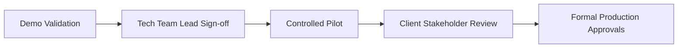

## Confidentiality Notice

This document contains Lilly internal information. Distribution is limited to authorized personnel with a legitimate business need. Do not share outside Lilly without appropriate approval.

---

## Table of Contents

| Section | Title |
|---|---|
| [1](#1-executive-summary) | Executive Summary |
| [2](#2-business-context) | Business Context |
| [3](#3-product-vision) | Product Vision |
| [4](#4-goals--success-metrics) | Goals & Success Metrics |
| [5](#5-scope) | Scope |
| [6](#6-stakeholders) | Stakeholders |
| [7](#7-user-personas) | User Personas |
| [8](#8-user-journeys--workflows) | User Journeys & Workflows |
| [9](#9-functional-requirements) | Functional Requirements |
| [10](#10-non-functional-requirements) | Non-Functional Requirements |
| [11](#11-data-requirements) | Data Requirements |
| [12](#12-roles--permissions-matrix) | Roles & Permissions Matrix |
| [13](#13-integration-requirements) | Integration Requirements |
| [14](#14-reporting--analytics) | Reporting & Analytics |
| [15](#15-assumptions) | Assumptions |
| [16](#16-risks--mitigations) | Risks & Mitigations |
| [17](#17-dependencies) | Dependencies |
| [18](#18-release-strategy) | Release Strategy |
| [19](#19-acceptance-criteria) | Acceptance Criteria |
| [20](#20-open-questions) | Open Questions |
| [21](#21-appendix) | Appendix |

---

# 1. Executive Summary

## 1.1 Product Overview

**Enterprise Operations Command Center (EOCC)** is Lilly's internal **operations intelligence platform** that unifies signals from AWS, Splunk, Jira, Confluence, and GitHub into a single layer answering five questions during incidents:

1. What is happening — and how serious is it?
2. Why is it happening?
3. What is the business impact?
4. Who owns it — and who should respond?
5. What should we do next?

EOCC delivers **cited, evidence-based answers** — distinct from undifferentiated chatbot responses. Phase 1 operates as a **read-only intelligence advisor**. Later phases evolve toward an **AI Operations Coordinator** with governed automation.

## 1.2 Business Problem

Enterprise operations teams at Lilly manage hundreds of AWS services supporting regulated, patient-facing, and revenue-critical business processes. Existing tooling provides **infrastructure alerts** but not **operational intelligence**:

- Ownership is tribal knowledge scattered across Jira, Slack, and org charts.
- Root-cause analysis requires manual correlation across Splunk, CloudWatch, tickets, and Confluence.
- Leadership cannot quickly determine **business capability impact** from infra metrics.
- Institutional memory of prior incidents is buried in closed tickets.
- No unified view ranks operational health by **business risk**.

**Quantified pain (industry benchmark — assumption):** 20–40 minutes lost per incident identifying service ownership before remediation begins.

## 1.3 Proposed Solution

EOCC sits **above** existing tools — it does not replace Jira, Splunk, or AWS consoles.

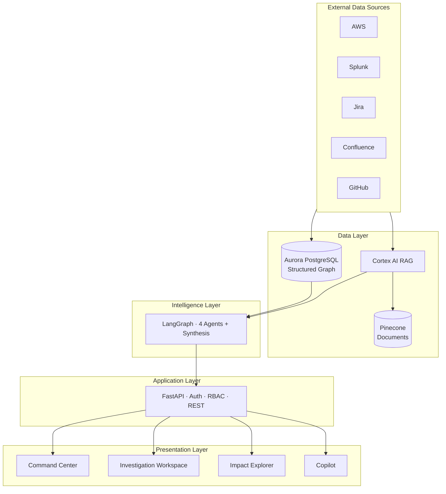

**Two-brain architecture:** Aurora provides deterministic facts (ownership, dependencies, business mapping). Cortex RAG provides semantic retrieval (runbooks, RCAs, procedures). LLM synthesis joins both with mandatory citations.

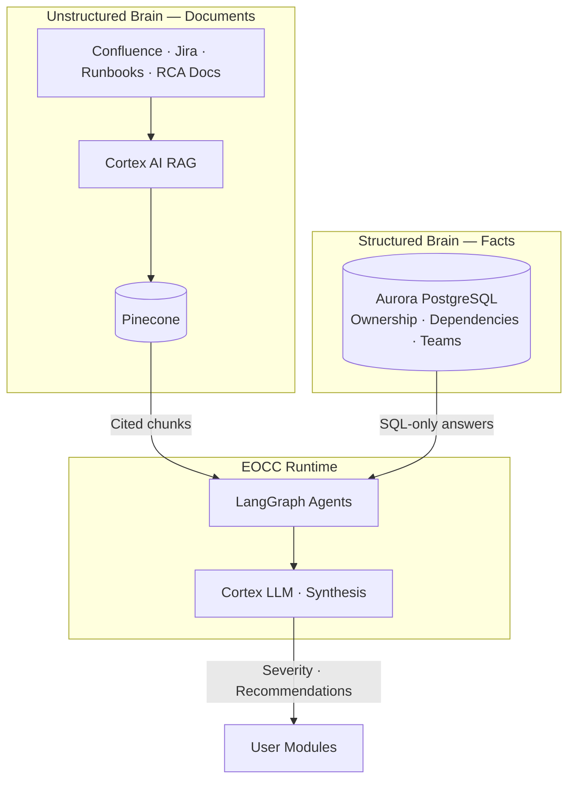

## 1.4 Expected Business Value

| Value dimension | Phase 1 outcome | Long-term outcome |
|---|---|---|
| **MTTR reduction** | Faster time-to-owner and time-to-context | Automated coordination and execution (Phase 3+) |
| **Business alignment** | Severity and dashboards ranked by business capability | Executive briefings and digital twin (Phase 4) |
| **Knowledge retention** | Cited runbooks and basic similarity | Full institutional memory and expert finder (Phase 2) |
| **Governance** | Ownership and dependency graph foundation | Runbook coverage, doc governance, gap detection (Phase 2) |
| **Risk reduction** | Read-only advisory — no production automation risk | Governed execution with senior approval (Phase 3) |
| **Cost of AI** | Reuses approved Cortex AI + Pinecone — no new AI vendor | Same — enterprise gateway model |

---

# 2. Business Context

## 2.1 Current State

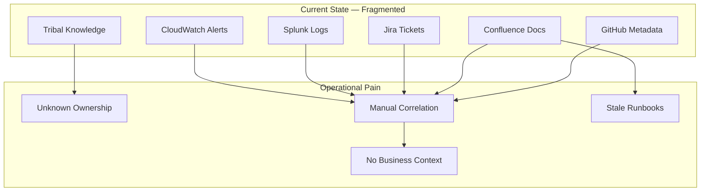

| Dimension | Current state |
|---|---|
| **Monitoring** | AWS CloudWatch, Splunk — infra-centric alerts |
| **Ticketing** | Jira — incidents, changes, ownership metadata (inconsistent) |
| **Documentation** | Confluence, GitHub — runbooks and architecture (often stale) |
| **Ownership** | Partially in CMDB/Jira/tags — not queryable in one place |
| **Incident response** | Manual correlation; senior engineer dependency |
| **Business context** | Lives in spreadsheets, Confluence, and tribal knowledge |
| **AI usage** | Cortex AI approved; no unified ops intelligence product |

## 2.2 Pain Points

| ID | Pain point | Affected personas | Phase 1 mitigation |
|---|---|---|---|
| PAIN-01 | Unknown service ownership during outages | Operations Engineer, Tech Lead | P1-UC04 / UC 1 |
| PAIN-02 | Manual log/ticket/runbook correlation | Operations Engineer, SRE | P1-UC02 / UC 4 |
| PAIN-03 | Infra alerts without business language | Tech Lead, Service Owner, Leadership | P1-UC03 / UC 3 |
| PAIN-04 | No unified risk-ranked operational view | Tech Lead, Service Owner | P1-UC01 / Command Center |
| PAIN-05 | Tribal knowledge for remediation steps | All engineers | P1-UC05 / Copilot |
| PAIN-06 | Repeated investigations for same failure | SRE (Phase 2) | P2-F02 Historical Incidents |
| PAIN-07 | Orphan resources after reorganizations | Platform SRE (Phase 2) | P2-F07 Ownership gaps |
| PAIN-08 | Inconsistent escalation and notification | Ops leads (Phase 3) | P3 coordination features |

## 2.3 Market / Business Drivers

| Driver | Relevance to Lilly |
|---|---|
| **Operational resilience** | Regulated environments require traceable, auditable incident response |
| **Cloud scale** | AWS service sprawl outpaces manual ownership maintenance |
| **AI maturity** | Enterprise-approved Cortex AI enables governed LLM use |
| **MTTR pressure** | Business capabilities (Payments, Clinical Data) demand faster resolution |
| **Key-person risk** | Expertise concentrated in senior engineers — not sustainable |
| **GxP documentation** | Stale runbooks create compliance and operational risk |

## 2.4 Strategic Alignment

| Lilly strategic theme | EOCC alignment |
|---|---|
| Digital transformation / cloud-first ops | AWS-native intelligence layer |
| Data integrity and patient impact | Business-weighted severity and impact analysis |
| Responsible AI | Citations, read-only Phase 1, approved Cortex gateway |
| Operational excellence | Reduced MTTR, institutional memory, governance |
| Cost discipline | Reuse existing Cortex + Pinecone — no new AI procurement (Phase 1) |

---

# 3. Product Vision

## 3.1 Vision Statement

> *Empower every Lilly operations engineer and leader with instant, cited operational intelligence — from alert to business impact to accountable action — transforming reactive monitoring into governed operational decision-making.*

## 3.2 Product Objectives

| # | Objective | Timeframe |
|---|---|---|
| OBJ-01 | Prove Phase 1 intelligence advisor value to onsite tech lead | Q3 2026 (assumption — pilot timing TBD) |
| OBJ-02 | Establish Aurora knowledge graph as system of record for ownership and dependencies | Phase 1 |
| OBJ-03 | Reduce time-to-owner and time-to-context in pilot scenarios | Pilot |
| OBJ-04 | Deepen institutional memory and governance | Phase 2 |
| OBJ-05 | Enable governed coordination and controlled execution | Phase 3 |
| OBJ-06 | Deliver executive visibility and operational digital twin | Phase 4 |

## 3.3 Long-Term Goals

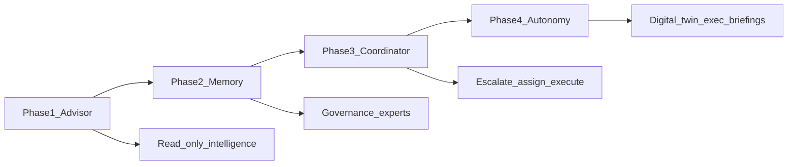

| Phase | Product mode | Capability theme |
|---|---|---|
| **Phase 1** | Intelligence advisor | Investigate, explain, recommend — human acts |
| **Phase 2** | Institutional memory | Search, history, governance, business process health |
| **Phase 3** | AI Operations Coordinator | Escalate, assign, notify, war room, approved execution |
| **Phase 4** | Governed autonomy | Digital twin, executive briefings, tiered automation |

---

# 4. Goals & Success Metrics

## 4.1 Business Goals

| ID | Goal | Target |
|---|---|---|
| BG-01 | Validate product fit with onsite tech lead | Qualitative: *"We can show the client"* |
| BG-02 | Reduce operational blind spots for pilot scope | 100% ownership coverage for pilot services |
| BG-03 | Improve incident context quality | >70% pilot scenarios rated business-helpful |
| BG-04 | Establish foundation for client-facing offering | Approved architecture + demo |

## 4.2 Product Goals

| ID | Goal | Target |
|---|---|---|
| PG-01 | Deliver 5 core Phase 1 use cases end-to-end | P1-UC01–05 functional in pilot |
| PG-02 | 100% citation rate on factual claims | Zero uncited ownership or runbook assertions |
| PG-03 | Sub-5s copilot response for single-agent queries | p95 latency |
| PG-04 | Investigation package within 30s async | p95 end-to-end |

## 4.3 KPIs

| KPI | Definition | Phase 1 target | Measurement |
|---|---|---|---|
| KPI-01 | Tech lead validation | Approval to proceed to pilot | Sign-off meeting |
| KPI-02 | Business helpfulness | % scenarios rated useful | Pilot survey (n≥5 engineers) |
| KPI-03 | Ownership accuracy | Correct owner from Aurora | Automated test vs registry |
| KPI-04 | Citation completeness | % claims with source ref | Investigation package audit |
| KPI-05 | Time-to-owner | Minutes from alert to identified owner | Pilot instrumentation |
| KPI-06 | Connector sync freshness | Max staleness of ownership data | `integration_sync_log` |

## 4.4 OKRs (Phase 1 Pilot — proposed)

| Objective | Key Result | Owner |
|---|---|---|
| **O1: Prove intelligence value** | KR1: ≥70% pilot users rate investigations helpful | Product |
| | KR2: Complete prescribed end-to-end demonstration (Section 8.5) without manual external lookup | Product |
| **O2: Establish trusted ownership graph** | KR1: 100% pilot services have ownership + escalation in Aurora | SRE |
| | KR2: Zero hallucinated owners in 50 test queries | QA |
| **O3: Secure tech lead approval** | KR1: Written approval to expand pilot scope | Tech Lead |

## 4.5 Adoption Metrics

| Metric | Definition | Target (pilot) |
|---|---|---|
| Weekly active users | Distinct users per week | ≥80% of pilot team |
| Investigations per incident | Avg investigations triggered | ≥1 for pilot alerts |
| Copilot queries per user per week | Engagement depth | ≥3 (assumption) |
| Command Center sessions | Dashboard views per week | Daily during pilot |

## 4.6 Operational Metrics

| Metric | Definition | Target |
|---|---|---|
| Investigation success rate | Packages completed without total failure | ≥95% |
| Agent timeout rate | Agents exceeding 15s | <5% |
| Partial package rate | Investigations with `gaps[]` | Tracked; <10% target (assumption) |
| Connector sync failure rate | Failed sync jobs | <2% per connector |

---

# 5. Scope

## 5.1 In Scope — Phase 1 (MVP / Demo / Pilot)

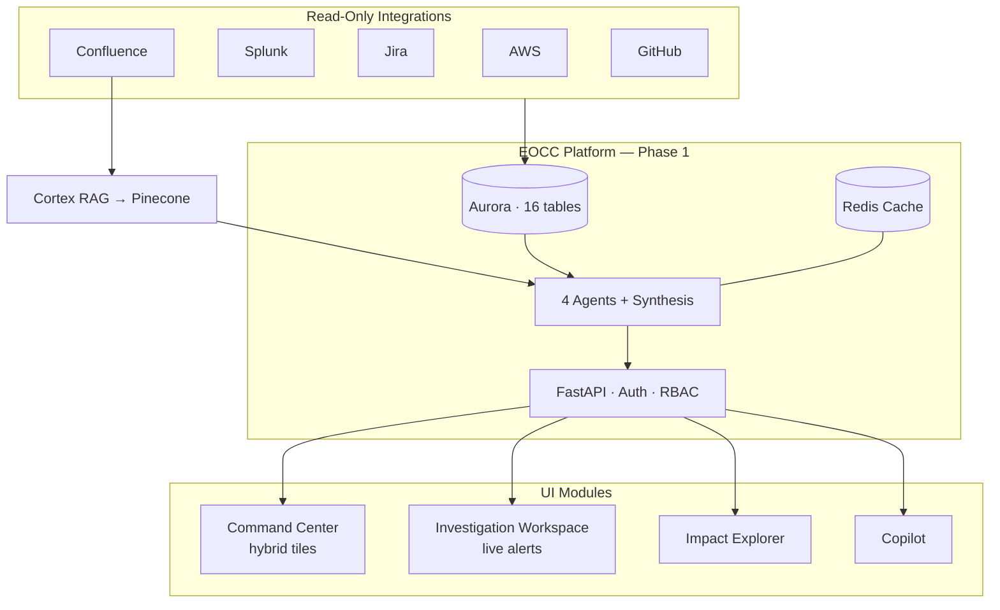

| Category | Items |
|---|---|
| **Core use cases** | P1-UC01 Health · P1-UC02 Investigation · P1-UC03 Impact · P1-UC04 Ownership · P1-UC05 Copilot |
| **Original UCs (demo-ready)** | UC 1 Ownership · UC 3 Dependency · UC 4 Investigation · Command Center module |
| **Features** | 18 Phase 1 features (P1-UC01–05, P1-F01–F13) — see Appendix A |
| **Mode** | Read-only / advisory — no production writes |
| **UI modules** | Command Center, Investigation Workspace, Impact Explorer, Copilot |
| **Integrations (read)** | AWS, Splunk, Jira, Confluence, GitHub |
| **AI** | Cortex AI LLM Router + Cortex RAG → Pinecone |
| **Data store** | Aurora PostgreSQL (16 Phase 1 tables), Redis cache |
| **Agents** | 4 parallel gather + 1 synthesis |
| **Demo data** | Hybrid: live connectors for investigation; seeded Command Center health tiles |

## 5.2 Out of Scope — Phase 1

| Category | Items | Deferred to |
|---|---|---|
| Production writes | Jira ticket create/assign, AWS restart/scale | Phase 3 |
| Microsoft Teams | War rooms, notifications | Phase 3 |
| ServiceNow | Read/write | Phase 2–3 |
| Governance Center UI | Gap detection, runbook coverage dashboards | Phase 2 |
| Expert Finder (full) | Skill ranking from Jira/GitHub aggregates | Phase 2 |
| Business Process Monitoring (live) | 5-min rollup — preview only in P1 | Phase 2 |
| Executive briefings | Leadership PDF generation | Phase 4 |
| Autonomous execution | Any AWS control plane action | Phase 3+ with approval |
| Budget / FTE / timeline commitments | Procurement and staffing | Separate governance |
| Staff reduction narrative | L1/L2 elimination claims | Never in Phase 1 messaging |

## 5.3 Conflicting Requirements — Resolved

| Conflict | Resolution |
|---|---|
| P1-UC01 maps to UC 2 (Phase 2) but is Phase 1 | **Command Center preview** with seeded health tiles; full UC 2 in Phase 2 |
| Dual numbering: P1-UC01–05 vs Original UC 1–20 | **Mapping table in Section 8** — always cite both IDs in traceability |
| Investigation storage: `incident_record` vs Redis | **Phase 1:** Redis investigation cache + `external_reference`; `incident_record` is Phase 2 |

---

# 6. Stakeholders

| Stakeholder | Type | Interest | Engagement |
|---|---|---|---|
| Onsite tech team lead | Business / Technical | Architecture validation, pilot approval, client path | Primary reviewer |
| Operations engineers | Business | Daily incident triage, investigation | Primary users (pilot) |
| Platform / SRE team | Technical | Connectors, ownership graph, reliability | Builders + admins |
| Service owners | Business | Ownership accuracy, business criticality | Data validators |
| Enterprise architecture | Technical | Integration patterns, Cortex/Aurora split | Design review |
| Information security | Technical | SSO, RBAC, data boundaries, AI governance | Security review |
| Compliance / GxP (if applicable) | External governance | Documentation, audit trail, citations | Phase 2+ review |
| Client stakeholder | External | Future product adoption | Post-pilot |
| EOCC Product Team | Product / Engineering | Build, validate, and deliver pilot | Delivery team |
| Lilly AI / Cortex platform team | Internal platform | Gateway, embedding models, Landing Zone | Integration partner |

---

# 7. User Personas

## 7.1 Tech Team Lead — `ROLE-LEAD`

| Attribute | Detail |
|---|---|
| **Responsibilities** | Validate solution architecture; approve pilot scope; represent team to client; prioritize operational investments |
| **Goals** | Confidence to demo to client; reduced escalations; business-aligned severity |
| **Pain points** | Too many tools; no single risk-ranked view; engineers waste time on ownership |
| **Permissions** | Full read; config review; demo approval; no production admin in Phase 1 |

## 7.2 Operations Engineer — `ROLE-OPS`

| Attribute | Detail |
|---|---|
| **Responsibilities** | On-call triage; incident investigation; execute remediation (outside EOCC in P1) |
| **Goals** | Fast answers: who owns it, what broke, what to do; cited runbooks |
| **Pain points** | Manual Splunk/Jira/Confluence correlation; senior engineer dependency |
| **Permissions** | Read; investigate; copilot query; Impact Explorer |

## 7.3 Platform / SRE Engineer — `ROLE-SRE`

| Attribute | Detail |
|---|---|
| **Responsibilities** | Maintain ownership registry; connector health; Aurora config; escalation policies |
| **Goals** | Accurate graph; reliable sync; observable integrations |
| **Pain points** | Orphan resources; stale metadata; no ownership gap visibility (until Phase 2) |
| **Permissions** | Admin connectors (pilot); read all modules; graph CRUD (pilot env) |

## 7.4 Service Owner — `ROLE-OWNER`

| Attribute | Detail |
|---|---|
| **Responsibilities** | Accountable for business capability; confirm ownership and criticality |
| **Goals** | Visibility into health of owned services; correct escalation paths |
| **Pain points** | Surprised by incidents on "unknown" services; unclear blast radius |
| **Permissions** | Read own services and applications in Command Center |

## 7.5 Platform Engineer (Interim) — `ROLE-BUILDER`

| Attribute | Detail |
|---|---|
| **Responsibilities** | Implement pilot environment; seed demonstration data; support tech team lead validation |
| **Goals** | Stable demonstration; accurate citations; clear Phase 1 boundaries |
| **Pain points** | Scope expansion into Phase 3 capabilities before formal approval |
| **Permissions** | Full administrative access in non-production environments only |

## 7.6 Client Stakeholder — `ROLE-CLIENT` (future)

| Attribute | Detail |
|---|---|
| **Responsibilities** | Approve expansion beyond internal pilot |
| **Goals** | Operational resilience for their estate |
| **Pain points** | Vendor solutions that don't integrate with enterprise stack |
| **Permissions** | None in Phase 1 demo |

---

# 8. User Journeys & Workflows

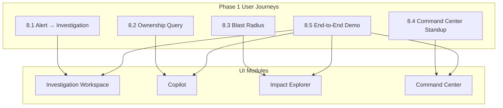

## 8.1 Primary Journey — Alert to Investigation (P1-UC02 / UC 4)

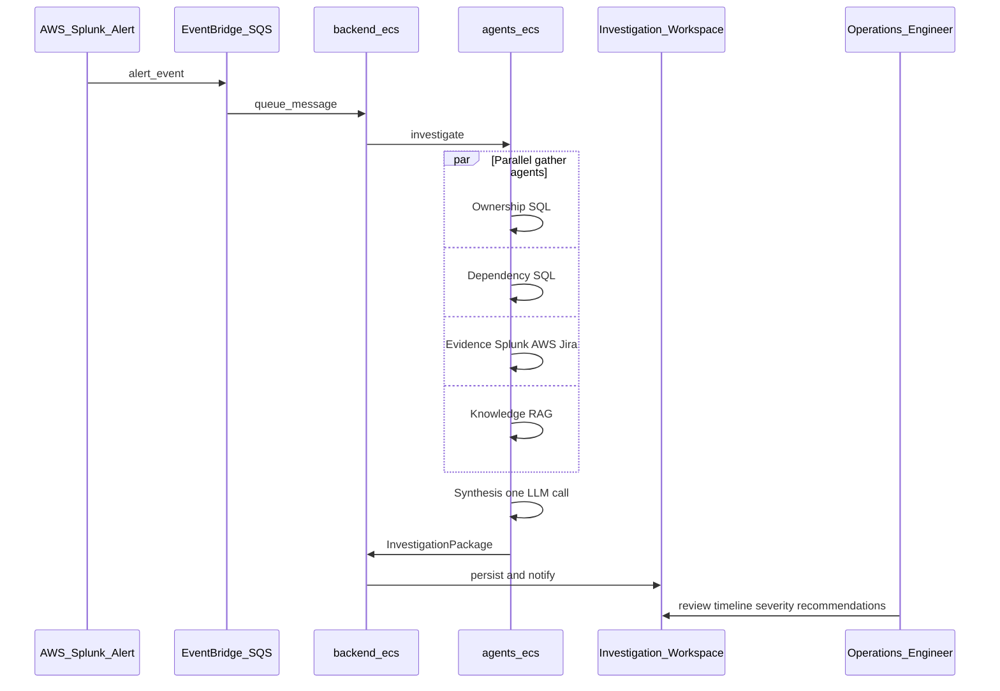

| Step | Actor | Action | Success criteria |
|---|---|---|---|
| 1 | System | Glue job fails → EventBridge → SQS | Alert received within 60s |
| 2 | System | 4 agents gather + synthesis | Package within 30s p95 |
| 3 | OPS | Opens Investigation Workspace | Timeline, severity, owner, runbook cited |
| 4 | OPS | Acts on recommendation (manual) | Outside EOCC in Phase 1 |

## 8.2 Journey — Ownership Query (P1-UC04 / UC 1)

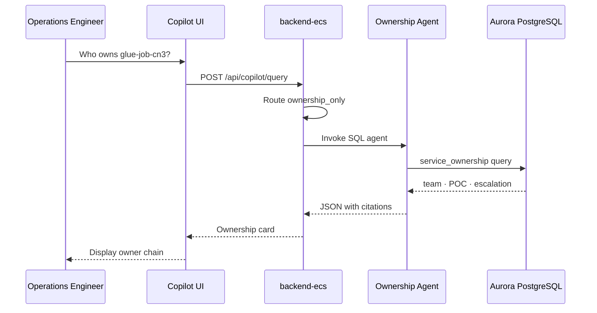

| Step | Actor | Action | Success criteria |
|---|---|---|---|
| 1 | OPS | Asks Copilot: *"Who owns glue-job-cn3?"* | Query submitted |
| 2 | System | Ownership agent → Aurora SQL only | Response < 5s p95 |
| 3 | OPS | Views ownership card | Team, POC, manager, escalation with citations |

## 8.3 Journey — Blast Radius (P1-UC03 / UC 3)

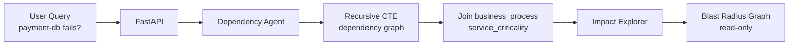

| Step | Actor | Action | Success criteria |
|---|---|---|---|
| 1 | OPS / LEAD | *"If payment-db fails, what breaks?"* | Query or alert trigger |
| 2 | System | Dependency agent → recursive CTE | Graph with business process labels |
| 3 | User | Impact Explorer | Read-only blast radius displayed |

## 8.4 Journey — Command Center Standup (P1-UC01)

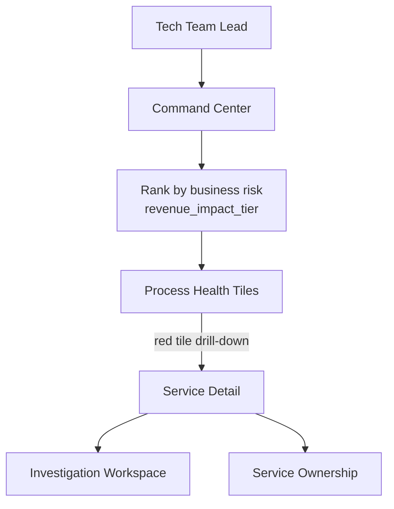

| Step | Actor | Action | Success criteria |
|---|---|---|---|
| 1 | LEAD | Opens Command Center Monday standup | Dashboard loads < 3s |
| 2 | System | Ranks processes by business risk | Payments red above internal tools |
| 3 | LEAD | Drills into red tile | Links to investigation or service detail |

## 8.5 Prescribed End-to-End Demonstration Workflow

Standard validation sequence for tech team lead review:

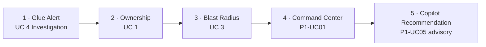

| Step | Capability | Use case reference |
|---|---|---|
| 1 | Trigger investigation from Glue failure alert | UC 4 — AI Incident Investigation |
| 2 | Resolve service ownership from the same incident | UC 1 — Enterprise Ownership Intelligence |
| 3 | Assess dependency blast radius | UC 3 — Enterprise Dependency Intelligence |
| 4 | Review business-risk-ranked Command Center view | P1-UC01 — Command Center |
| 5 | Obtain cited Copilot recommendation (advisory only) | P1-UC05 — Copilot |

## 8.6 Exception Scenarios

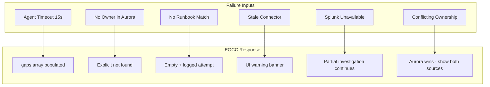

| Scenario | Expected behavior |
|---|---|
| Agent timeout (15s) | Partial package + `gaps[]`; no silent failure |
| No owner in Aurora | Explicit *"ownership not found"* — no LLM guess |
| No runbook match | Knowledge agent returns empty with citation attempt logged |
| Connector sync stale | `/health` shows stale; UI warning banner |
| Splunk unavailable | Evidence gap flagged; investigation continues with other agents |
| Conflicting ownership in Jira vs Aurora | **Aurora wins**; both sources shown if evidence disagrees |

## 8.7 P1 ↔ Original UC Mapping

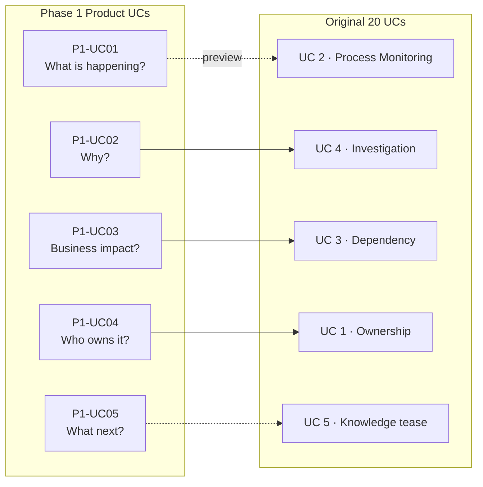

| P1-UC | Business question | Original UC | Phase | Module |
|---|---|---|---|---|
| P1-UC01 | What is happening? How serious? | UC 2 (preview) | P1 preview / P2 full | Command Center |
| P1-UC02 | Why is it happening? | UC 4 | P1 | Investigation Workspace |
| P1-UC03 | What is the business impact? | UC 3 | P1 | Impact Explorer |
| P1-UC04 | Who owns it? Who responds? | UC 1 | P1 | Copilot, Command Center |
| P1-UC05 | What should we do next? | Cross-cutting (UC 5 tease) | P1 | Copilot |

---

# 9. Functional Requirements

*Priority: **Must** = Phase 1 MVP · **Should** = pilot polish · **Could** = post-pilot Phase 1*

## 9.1 Module: Copilot (`P1-UC05`, `P1-F11`)

| ID | Description | Priority | Business rationale | Acceptance criteria |
|---|---|---|---|---|
| FR-P1-CP-001 | System shall accept natural-language queries via Copilot | Must | Single interface for ops questions | `POST /api/copilot/query` returns JSON within **5s p95** for single-agent queries |
| FR-P1-CP-002 | Ownership queries shall use Aurora SQL only — no LLM for owner facts | Must | Prevent hallucinated owners in regulated context | Zero LLM calls in Ownership agent; SQL `source` refs on every field |
| FR-P1-CP-003 | Ownership card shall display team, primary POC, manager, escalation chain | Must | #1 enterprise pain — who owns this? | Matches `service_ownership` + `escalation_step` for given `service_catalog.code` |
| FR-P1-CP-004 | Copilot shall route intent to single or multi-agent workflow | Must | Accuracy and latency | Router classifies: `ownership_only`, `dependency_only`, `investigation` |
| FR-P1-CP-005 | Copilot responses shall include citation metadata for every factual claim | Must | Trust and auditability | 100% claims have `source` + ref ID in response JSON |

## 9.2 Module: Investigation Workspace (`P1-UC02`, `P1-F02`, `P1-F13`)

| ID | Description | Priority | Business rationale | Acceptance criteria |
|---|---|---|---|---|
| FR-P1-INV-001 | Alerts via EventBridge → SQS shall trigger async investigation | Must | Real-time response to failures | InvestigationPackage created; API returns 202 + investigation ID |
| FR-P1-INV-002 | System shall run max **4 agents in parallel** with **15s timeout** per agent | Must | Performance and accuracy balance | Wall-clock ≤ slowest agent + synthesis; never > 4 parallel |
| FR-P1-INV-003 | Investigation Workspace shall display timeline, severity, recommendations | Must | Single pane for RCA context | All fields cite Splunk, Jira, AWS, Aurora, or RAG chunk |
| FR-P1-INV-004 | Partial agent failure shall populate `gaps[]` — never silent empty synthesis | Must | Honest partial results | Package delivered with `gaps[]` when agent fails; no invented data |
| FR-P1-INV-005 | System shall generate correlated incident timeline from multi-source events | Must | RCA-ready view | Timeline events ordered by `event_time` with `source_system` |
| FR-P1-INV-006 | Investigation shall perform exactly **one synthesis LLM call** after agent join | Must | Cost and accuracy | One `investigation_synthesis` task per package |
| FR-P1-INV-007 | Basic incident similarity shall match prior Jira incidents (basic) | Should | Avoid repeat work | Top-3 similar incidents when historical data available |

## 9.3 Module: Impact Explorer (`P1-UC03`, `P1-F03`, `P1-F12`)

| ID | Description | Priority | Business rationale | Acceptance criteria |
|---|---|---|---|---|
| FR-P1-IMP-001 | System shall compute blast radius from service ID via recursive dependency query | Must | Business impact visibility | Returns downstream services, apps, `business_process` labels |
| FR-P1-IMP-002 | Impact Explorer shall be read-only in Phase 1 | Must | Phase 1 safety boundary | No write/action buttons in UI |
| FR-P1-IMP-003 | Blast radius shall join `service_criticality` for business context | Must | Leadership understands severity | Each node shows SLA tier / customer-facing flag where available |

## 9.4 Module: Command Center (`P1-UC01`, `P1-F01`)

| ID | Description | Priority | Business rationale | Acceptance criteria |
|---|---|---|---|---|
| FR-P1-CC-001 | Dashboard shall rank health by **business risk** not alert count | Must | Standup prioritization | Customer-facing processes sort above internal tools |
| FR-P1-CC-002 | Smart severity shall use `service_criticality` business weighting | Must | Payments ≠ internal reporting severity | Same infra alert → different Sev based on `revenue_impact_tier` |
| FR-P1-CC-003 | Command Center shall support drill-down from process tile to service detail | Should | Actionable navigation | Click tile → service list with status |
| FR-P1-CC-004 | Hybrid demo: live alerts drive investigations; health tiles may be seeded | Must | Reliable demo storytelling | Documented in pilot config which tiles are live vs seeded |

## 9.5 Module: Agents & Orchestration

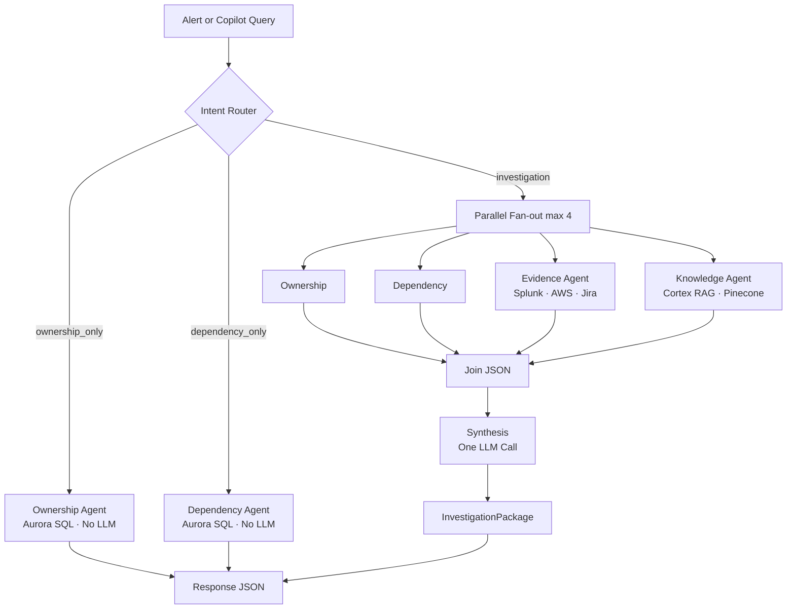

| ID | Description | Priority | Business rationale | Acceptance criteria |
|---|---|---|---|---|
| FR-P1-AG-001 | Router shall cap parallel gather agents at 4 | Must | Prevent agent sprawl | Enforced in LangGraph router |
| FR-P1-AG-002 | Synthesis shall run only after all gather results joined | Must | Full context for severity | Single synthesis step with joined JSON input |
| FR-P1-AG-003 | Ownership and Dependency agents shall be SQL-only — no LLM | Must | Deterministic facts | FR-P1-AG-004 verified in code review |
| FR-P1-AG-004 | Evidence agent may use LLM for log summarization only — with citations | Must | Compress Splunk volume | `evidence_summarize` task; sources retained |
| FR-P1-AG-005 | Knowledge agent shall return Cortex RAG chunks only — no generation | Must | Runbook accuracy | Top-k chunks with `source`, `doc_type`, URL |

## 9.6 Module: Action Recommendations (`P1-F09`)

| ID | Description | Priority | Business rationale | Acceptance criteria |
|---|---|---|---|---|
| FR-P1-ACT-001 | System shall suggest remediation actions with confidence score | Should | Guide next steps | Score 0.0–1.0 displayed; **no execute** in Phase 1 |
| FR-P1-ACT-002 | Recommendations shall cite runbook or evidence source | Must | Trust | Every recommendation links to RAG chunk or log ref |

## 9.7 Module: Integrations (read-only)

| ID | Description | Priority | Business rationale | Acceptance criteria |
|---|---|---|---|---|
| FR-P1-INT-001 | AWS connector shall sync resource metadata to Aurora | Must | Graph foundation | `aws_resource` rows updated on schedule; `integration_sync_log` entry |
| FR-P1-INT-002 | Splunk connector shall fetch cited log excerpts for Evidence agent | Must | Real operational signals | Splunk is **mandatory** — not optional |
| FR-P1-INT-003 | Jira connector shall read incidents and metadata | Must | Ticket correlation | Jira keys in investigation timeline |
| FR-P1-INT-004 | Confluence content shall index to Cortex RAG → Pinecone | Must | Runbook retrieval | Chunks include `source` URL; re-index on sync |
| FR-P1-INT-005 | GitHub connector shall read repo metadata and ownership hints | Should | Ownership enrichment | `external_reference` rows for repos |

## 9.8 Cross-Cutting: Evidence & Citation

| ID | Description | Priority | Business rationale | Acceptance criteria |
|---|---|---|---|---|
| FR-P1-EV-001 | Every factual claim shall include source reference | Must | Audit and trust | Aurora ID, Splunk query, Jira key, or RAG chunk ID |
| FR-P1-EV-002 | When data not found, system shall state explicitly — never invent | Must | Prevent AI harm | `"not found"` or empty with `complete: false` |

## 9.9 Module: Admin & Connectors (`ROLE-SRE`)

| ID | Description | Priority | Business rationale | Acceptance criteria |
|---|---|---|---|---|
| FR-P1-ADM-001 | Admin UI shall show connector sync status and last success time | Should | Operability | Visible to ROLE-SRE |
| FR-P1-ADM-002 | Manual sync trigger shall be available in pilot environment | Could | Demo recovery | `POST /admin/connectors/{id}/sync` |

---

# 10. Non-Functional Requirements

## 10.1 Security

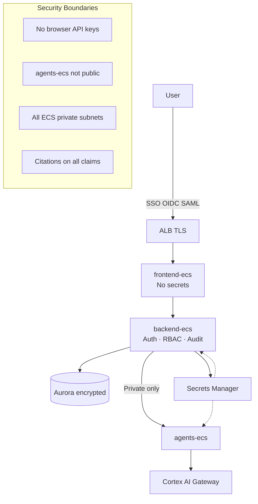

| ID | Requirement | Target | Phase |
|---|---|---|---|
| NFR-SEC-001 | Authentication via corporate SSO | SAML/OIDC — Lilly IdP | P1 |
| NFR-SEC-002 | Role-based access control (RBAC) | 6 roles per Section 7 | P1 |
| NFR-SEC-003 | No API keys or Cortex credentials in browser | All AI via backend-ecs | P1 |
| NFR-SEC-004 | agents-ecs not exposed on public ALB | Internal service discovery only | P1 |
| NFR-SEC-005 | All ECS tasks in private subnets | VPC security groups enforced | P1 |
| NFR-SEC-006 | Audit logging of investigation creation and copilot queries | CloudWatch + Aurora audit tables | P1 Should |
| NFR-SEC-007 | TLS termination at ALB | TLS 1.2+ | P1 |

## 10.2 Compliance

| ID | Requirement | Target | Notes |
|---|---|---|---|
| NFR-COMP-001 | Data residency per Lilly cloud policy | AWS regions per enterprise standard | **Assumption:** US-East primary |
| NFR-COMP-002 | Investigation exports retainable for audit | S3 optional P1; mandatory P2 | Phase 1 optional |
| NFR-COMP-003 | GxP runbook citations traceable to source document | Confluence page ID + version in citation | P1 for runbook refs |
| NFR-COMP-004 | No PHI in logs indexed to RAG without classification review | Connector scope excludes PHI sources | **Open question** — confirm with compliance |
| NFR-COMP-005 | AI outputs labeled as advisory in Phase 1 | UI disclaimer on recommendations | P1 Must |

## 10.3 Performance

| ID | Requirement | Target |
|---|---|---|
| NFR-PERF-001 | Copilot single-agent query p95 latency | < 5 seconds |
| NFR-PERF-002 | Investigation package async completion p95 | < 30 seconds |
| NFR-PERF-003 | Command Center dashboard initial load | < 3 seconds |
| NFR-PERF-004 | Blast radius query (≤3 hops) p95 | < 2 seconds |
| NFR-PERF-005 | Connector sync batch (pilot scope) | Complete within 15 minutes |

## 10.4 Scalability

| ID | Requirement | Target |
|---|---|---|
| NFR-SCALE-001 | Independent horizontal scale: frontend, backend, agents ECS | Per-service task count |
| NFR-SCALE-002 | Pilot: 50 concurrent users | No degradation |
| NFR-SCALE-003 | Production target: 500 concurrent users (assumption) | Phase 2 capacity plan |
| NFR-SCALE-004 | Aurora: 10K services in graph (assumption) | Indexed queries < 2s |
| NFR-SCALE-005 | Pinecone: 1M document chunks (assumption) | RAG p95 < 3s |

## 10.5 Availability & Reliability

| ID | Requirement | Target |
|---|---|---|
| NFR-AVAIL-001 | Pilot environment availability | Best effort — interim delivery team |
| NFR-AVAIL-002 | Production pilot SLA (assumption) | 99.5% business hours |
| NFR-AVAIL-003 | Aurora Multi-AZ | Enabled when client approves production |
| NFR-AVAIL-004 | SQS at-least-once delivery with idempotency keys | No duplicate investigations |
| NFR-AVAIL-005 | RTO / RPO (production — assumption) | RTO 4h · RPO 1h — to be confirmed with DR team |

## 10.6 Accessibility & Usability

| ID | Requirement | Target |
|---|---|---|
| NFR-A11Y-001 | WCAG 2.1 Level AA for core workflows | Phase 2 hardening; AA target for pilot critical paths |
| NFR-A11Y-002 | Keyboard navigation for Copilot and Investigation | Tab order logical |
| NFR-A11Y-003 | Color-blind safe status indicators (green/amber/red) | Icon + text label — not color alone |
| NFR-UX-001 | Minimum tap/click target 44×44px | Mobile-safe for tablet use in war room |
| NFR-UX-002 | Reduce Motion preference respected | Phase 2 — disable non-essential animation |

---

# 11. Data Requirements

## 11.1 Data Architecture Overview

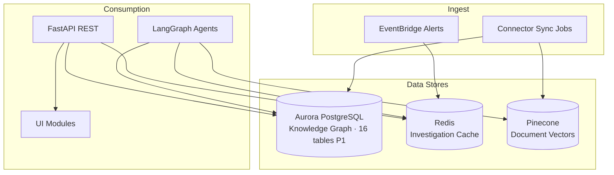

## 11.2 Data Entities (Phase 1 — canonical in Aurora)

| Entity | Owner | Description |
|---|---|---|
| `service_catalog` | Platform SRE | Hub — every AWS resource and app links here |
| `service_ownership` | Service Owner + SRE | Who owns what |
| `dependency` | SRE | Technical and business dependency edges |
| `business_process` | Service Owner | Business capabilities (Payments, Onboarding) |
| `service_criticality` | Service Owner | SLA tier, revenue impact, severity floors |
| `person`, `team` | HR/IT feed (assumption) | People and teams |
| `escalation_policy`, `escalation_step` | SRE | Escalation chains |
| `aws_resource` | AWS connector | Physical AWS resources |
| `external_reference` | Connectors | Jira, GitHub, Splunk, Confluence IDs |
| Investigation cache (Redis) | EOCC system | Ephemeral investigation packages |

*Full schema: [EOCC_Technical_Design_Document.md](EOCC_Technical_Design_Document.md) Section 3.*

## 11.3 Data Ownership

| Data domain | System of record | EOCC role |
|---|---|---|
| Ownership, dependencies, criticality | **Aurora** (curated) | SoR for ops graph |
| Logs, metrics | Splunk / CloudWatch | Read via connectors |
| Tickets | Jira | Read Phase 1; write Phase 3 |
| Runbooks, docs | Confluence | RAG index via Cortex |
| Semantic vectors | Pinecone | Derived from Confluence/Jira via Cortex |
| Investigation packages | Redis (P1) → Aurora (P2 assumption) | Cache then persist |

## 11.4 Data Lifecycle

| Stage | Policy |
|---|---|
| **Ingest** | Scheduled connector sync + EventBridge alerts |
| **Transform** | Normalize to `service_catalog` hub; embed docs to Pinecone |
| **Use** | Agents query Aurora + RAG; synthesis joins results |
| **Cache** | Redis TTL: investigation 15–60 min; agent results 5–15 min |
| **Retain** | Aurora: indefinite with soft-delete; Redis: ephemeral |
| **Purge** | `is_active=false` soft delete; hard delete per Lilly retention policy (TBD) |

## 11.5 Data Quality Requirements

| ID | Requirement | Measurement |
|---|---|---|
| DQ-001 | 100% pilot services have ownership row | Pre-pilot audit |
| DQ-002 | 100% pilot services have ≥1 dependency or documented leaf | Graph completeness |
| DQ-003 | Connector sync success rate ≥ 98% | `integration_sync_log` |
| DQ-004 | RAG index freshness ≤ 24h for Confluence runbooks | `last_seen_at` / sync timestamp |
| DQ-005 | No duplicate `service_catalog.code` values | UNIQUE constraint |

---

# 12. Roles & Permissions Matrix

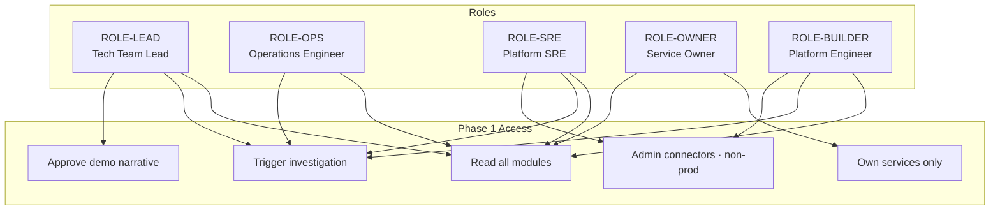

| Permission | LEAD | OPS | SRE | OWNER | BUILDER | CLIENT |
|---|:---:|:---:|:---:|:---:|:---:|:---:|
| View Command Center (all) | ✓ | ✓ | ✓ | Own only | ✓ | — |
| View Investigation Workspace | ✓ | ✓ | ✓ | ✓ | ✓ | — |
| Trigger investigation | ✓ | ✓ | ✓ | — | ✓ | — |
| View Impact Explorer | ✓ | ✓ | ✓ | ✓ | ✓ | — |
| Copilot query | ✓ | ✓ | ✓ | ✓ | ✓ | — |
| Approve demonstration / pilot narrative | ✓ | — | — | — | — | — |
| Admin connector config | — | — | ✓ | — | ✓ (non-prod) | — |
| Edit ownership graph | — | — | ✓ | — | ✓ (non-prod) | — |
| Execute remediation actions | — | Manual (outside EOCC P1) | — | — | — | — |
| Production AWS writes via EOCC | — | — | — | — | — | — |

**Phase 3 additions:** Approval queue (LEAD + seniors), Jira write (system), AWS execute (Control agent with approval).

---

# 13. Integration Requirements

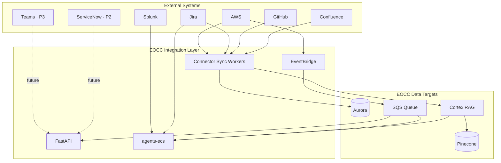

| System | Phase | Purpose | Data exchanged | API / protocol | Error handling |
|---|---|---|---|---|---|
| **AWS** | P1 | Resource metadata, alerts, CloudWatch | ARNs, tags, metrics, EventBridge events | AWS SDK, EventBridge, CloudWatch API | Retry 3x; DLQ for events; stale flag in UI |
| **Splunk** | P1 | Log evidence, incident signals | SPL search results, event excerpts | Splunk REST API | Gap in Evidence agent; investigation continues |
| **Jira** | P1 read | Incidents, metadata, ownership hints | Issue keys, summaries, comments, status | Jira REST API | Partial timeline; cite unavailable fields |
| **Confluence** | P1 | Runbooks, SOPs → RAG | Page content, IDs, URLs | Confluence API → Cortex ingest | Re-index retry; skip failed pages with log |
| **GitHub** | P1 | Repo metadata, ownership | Repo names, URLs, CODEOWNERS | GitHub API | Optional enrichment; non-blocking |
| **Cortex AI LLM** | P1 | Synthesis, summarization | Prompts, responses (audited) | Enterprise Cortex gateway | Fallback model chain; `gaps[]` on total failure |
| **Cortex AI RAG → Pinecone** | P1 | Semantic doc retrieval | Embeddings, chunk metadata | Cortex RAG API, Pinecone | Fallback to cohere index if configured |
| **Microsoft Teams** | P3 | War rooms, notifications | Channel create, messages | Graph API | Phase 3 — out of scope P1 |
| **ServiceNow** | P2–3 | Optional ITSM | Incidents, CMDB | REST API | Optional Phase 2 read |

**API specification:** OpenAPI 3.1 at `openapi/eocc-v1.yaml` — see TDD Section 8.

---

# 14. Reporting & Analytics

## 14.1 Operational Reports (Phase 1)

| Report | Audience | Content | Delivery |
|---|---|---|---|
| Connector sync health | SRE | Last sync, errors, record counts | Admin UI + `/health` |
| Investigation summary | OPS, LEAD | Count, avg duration, gap rate | Dashboard widget (Should) |
| Ownership coverage | SRE | % services with owner + escalation | Pre-pilot audit spreadsheet |

## 14.2 Business Reports (Phase 2+)

| Report | Audience | Phase |
|---|---|---|
| Business process health rollup | Leadership | P2 |
| Ownership gap remediation | Platform team | P2 |
| Runbook coverage % | Compliance, SRE | P2 |
| MTTR trend (pilot) | Tech lead | Pilot manual |

## 14.3 Dashboards

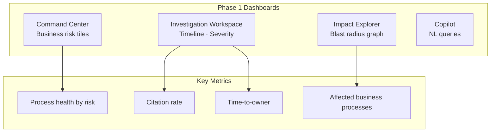

| Dashboard | Module | Phase 1 metrics |
|---|---|---|
| Command Center | P1-F01 | Process health tiles, alert count by business risk |
| Investigation Workspace | P1-F02 | Timeline, severity, recommendations, citations |
| Impact Explorer | P1-F03 | Blast radius graph, affected business processes |
| Governance Center | P2-F17 | Deferred |

## 14.4 Metric Definitions

| Metric | Formula / definition |
|---|---|
| Time-to-owner | `investigation.started_at` → first ownership field populated |
| Citation rate | `cited_claims / total_claims` in InvestigationPackage |
| Business helpfulness | Pilot survey Likert ≥ 4 ("helpful") / total responses |
| Connector freshness | `now() - integration_connector.last_success_at` |

---

# 15. Assumptions

| ID | Assumption | Risk if wrong |
|---|---|---|
| ASM-001 | Cortex AI + Pinecone remain approved and available via enterprise gateway | Blocks AI features |
| ASM-002 | Pilot scope limited to 1–2 business processes (e.g. Payments, Clinical Onboarding) | Over-scoped pilot fails |
| ASM-003 | Ownership data can be curated/semi-automated for pilot services | Inaccurate ownership undermines trust |
| ASM-004 | Splunk API access granted for pilot environment | Evidence agent degraded |
| ASM-005 | SSO integration follows standard Lilly IdP pattern | Delays auth |
| ASM-006 | Phase 1 read-only boundary is acceptable to tech lead and security | Scope creep pressure |
| ASM-007 | Hybrid demo (live + seeded) acceptable for Command Center | Demo credibility |
| ASM-008 | No PHI processed through EOCC in Phase 1 pilot scope | Compliance escalation |
| ASM-009 | Interim delivery team sufficient for pilot — no dedicated FTE allocated yet | Timeline risk |
| ASM-010 | 16 Aurora tables sufficient for Phase 1 — no `incident_record` until Phase 2 | Schema migration later |
| ASM-011 | English-only RAG index sufficient for Phase 1 | Multilingual in Phase 2 |
| ASM-012 | Tech lead is primary approval gate before client exposure | Governance alignment |

---

# 16. Risks & Mitigations

| ID | Risk | Impact | Probability | Mitigation |
|---|---|---|---|---|
| RISK-01 | Stale ownership metadata | High — wrong owner cited | Medium | Connector sync; Aurora SoR; `integration_sync_log`; SRE audit |
| RISK-02 | RAG hallucination in synthesis | High — wrong remediation advice | Medium | Citations mandatory; synthesis from joined JSON only; advisory disclaimer |
| RISK-03 | Low adoption post-pilot | High — limited return on investment | Medium | Tech lead co-design; address validated pilot pain points; measure KPI-02 |
| RISK-04 | Scope creep to Phase 3 writes | High — security delay | High | Hard Phase 1 boundary in PRD; explicit out-of-scope |
| RISK-05 | Splunk connector complexity | Medium — delayed Evidence agent | Medium | Splunk mandatory — prioritize early integration test |
| RISK-06 | Dual UC numbering confusion | Low — wrong requirements traced | Medium | Mapping table Section 8; dual IDs in traceability |
| RISK-07 | Key-person dependency on interim delivery team | Medium — continuity risk | Medium | Document in TDD; knowledge transfer to SRE |
| RISK-08 | Teams integration blocked by security (Phase 3) | Medium — coordinator vision delayed | Low (P3) | Phase 3 gate; alternative notification paths |
| RISK-09 | Aurora graph incomplete for blast radius | Medium — misleading impact | Medium | Pilot scope control; graph completeness DQ checks |
| RISK-10 | Client expects automation in demo | Medium — expectation mismatch | Medium | Clear "advisor not coordinator" messaging Phase 1 |

---

# 17. Dependencies

## 17.1 Internal Dependencies

| Dependency | Owner | Required for |
|---|---|---|
| Cortex AI Landing Zone model access | Lilly AI platform | LLM + embeddings |
| Pinecone enterprise index | AI platform / infra | RAG retrieval |
| AWS account and VPC for ECS | Cloud platform | Deployment |
| Aurora PostgreSQL provisioning | DBA / cloud platform | Knowledge graph |
| SSO / IdP integration | Identity team | Authentication |
| Splunk API credentials | Splunk admin | Evidence agent |
| Jira API token / OAuth | Jira admin | Incident read |
| Confluence API access | Confluence admin | RAG ingest |
| GitHub API access | GitHub org admin | Metadata read |
| Tech lead time for review | Business | Approval gate |

## 17.2 External Dependencies

| Dependency | Vendor | Notes |
|---|---|---|
| Cortex AI gateway | Internal enterprise | No direct OpenAI/Anthropic |
| Pinecone | Enterprise managed | Via Cortex RAG |
| AWS services | Amazon | ECS, Aurora, Redis, SQS, EventBridge, ALB, S3 |

---

# 18. Release Strategy

```mermaid
flowchart LR
    P1[Phase 1<br/>Intelligence Advisor<br/>Read-only · P1-UC01-05]
    P2[Phase 2<br/>Institutional Memory<br/>Governance · History]
    P3[Phase 3<br/>AI Coordinator<br/>Teams · Jira write · Execute]
    P4[Phase 4<br/>Strategic Autonomy<br/>Digital twin · Exec briefings]

    P1 -->|Tech lead approval| P2
    P2 -->|Client approval| P3
    P3 -->|Formal approvals| P4
```

## 18.1 MVP — Phase 1 (Demo / Pilot)

```mermaid
gantt
    title Phase 1 Milestones
    dateFormat YYYY-MM
    section Design
    M1 Architecture Approval    :m1, 2026-06, 1M
    section Build
    M2 Demonstration            :m2, after m1, 2M
    section Pilot
    M3 Controlled Pilot         :m3, after m2, 2M
    M4 Pilot Retrospective      :m4, after m3, 1M
```

| Milestone | Deliverable | Features |
|---|---|---|
| **M1: Architecture approval** | PRD + TDD sign-off | Design complete |
| **M2: Demonstration** | End-to-end workflow validation with tech team lead | P1-UC01–05, UC 1/3/4, Command Center |
| **M3: Pilot** | 1–2 business processes live | 18 Phase 1 features, hybrid data |
| **M4: Pilot retrospective** | KPI review, Phase 2 decision | KPI-01 through KPI-06 |

## 18.2 Phase 2 — Institutional Memory & Governance

17 features including: Business Process Monitoring (full), Knowledge Search, Historical Incidents, Expert Finder, Governance Center, Operational Risk Detection, Ownership Gap Detection, Runbook Coverage.

**Gate:** Client approval.

## 18.3 Phase 3 — AI Operations Coordinator

14 features including: Escalation, Assignment, Teams war rooms, Controlled Execution, Senior Approval.

**Gate:** Full formal approvals. **New integration:** Microsoft Teams, Jira write, AWS control plane.

## 18.4 Phase 4 — Strategic Autonomy

8 features: Executive briefings, Digital twin, Service consumption, Tiered autonomy.

**Gate:** Strategic rollout approval.

## 18.5 Complete Feature Catalog (57 features)

See **Appendix A** for full P1–P4 feature tables (preserved from source plan).

---

# 19. Acceptance Criteria — Major Features

| Feature | Acceptance criteria (testable) |
|---|---|
| **P1-UC01 Command Center** | Given 3 business processes with different `revenue_impact_tier`, when dashboard loads, then highest-risk customer-facing process ranks first; load < 3s |
| **P1-UC02 Investigation** | Given Glue failure alert, when investigation completes, then package includes timeline (≥3 events), severity, owner, ≥1 runbook citation, within 30s p95 |
| **P1-UC03 Impact** | Given `payment-db` service ID, when blast radius queried, then ≥1 downstream service returned with `business_process` label; read-only |
| **P1-UC04 Ownership** | Given `glue-job-cn3`, when Copilot queried, then response matches Aurora `service_ownership` exactly; response < 5s; zero LLM in ownership path |
| **P1-UC05 Copilot** | Given investigation context, when user asks *"what should we do next?"*, then recommendation includes confidence score and citation; no auto-execute button |
| **P1-F04 Smart Severity** | Given same CloudWatch alarm on Payments vs internal service, when severity calculated, then Payments severity ≥ internal severity |
| **P1-F09 Action Recommend** | Given investigation with runbook match, when recommendation shown, then confidence ∈ [0,1] and source URL present |
| **End-to-end demonstration** | Prescribed workflow (Section 8.5) completable without manual external lookup |

---

# 20. Open Questions

| ID | Question | Owner | Impact |
|---|---|---|---|
| OQ-001 | Which 1–2 business processes for pilot seed data? | Tech Lead + Product | Pilot scope |
| OQ-002 | Does pilot scope include GxP-regulated systems? | Compliance | Connector scope, PHI handling |
| OQ-003 | Target AWS region(s) and account(s)? | Cloud platform | Deployment |
| OQ-004 | SSO IdP integration timeline and test environment? | Identity | Auth NFR |
| OQ-005 | Splunk index/sourcetype scope for pilot? | Splunk admin | Evidence agent |
| OQ-006 | Production SLA target when moving beyond pilot? | Tech Team Lead | NFR-AVAIL-002 |
| OQ-007 | Incident package persistence: Redis only P1 or Aurora timeline table? | Architecture | Schema |
| OQ-008 | Client identity and naming in external-facing materials? | Product | Messaging |
| OQ-009 | ServiceNow integration priority in Phase 2? | Tech Lead | Roadmap |
| OQ-010 | WCAG AA mandatory for Phase 1 demo or Phase 2? | UX / Accessibility | NFR-A11Y-001 |

---

# 21. Appendix

## Appendix A — Complete Phased Feature Catalog (57 features)

### Phase 1 (18 features)

| ID | Feature | Category | Mode |
|---|---|---|---|
| P1-UC01 | Operational Health and Risk Monitoring | Core UC | Read |
| P1-UC02 | Automated Investigation | Core UC | Read |
| P1-UC03 | Impact Analysis | Core UC | Read |
| P1-UC04 | Intelligent Ownership and Coordination | Core UC | Read |
| P1-UC05 | AI Operations Copilot | Core UC | Read |
| P1-F01 | Enterprise Operations Command Center | Module | Read |
| P1-F02 | Investigation Workspace | Module | Read |
| P1-F03 | Dependency and Impact Explorer | Module | Read |
| P1-F04 | Smart Severity Calculation | Coordination | Read |
| P1-F05 | Service Dependency Intelligence | Intelligence | Read |
| P1-F06 | Ownership Discovery | Intelligence | Read |
| P1-F07 | Incident Timeline Generator | Investigation | Read |
| P1-F08 | Incident Similarity Search (basic) | Investigation | Read |
| P1-F09 | Action Recommendation Engine | Intelligence | Advisory |
| P1-F10 | Organizational Knowledge Graph (foundation) | Platform | Read |
| P1-F11 | Enterprise Ownership Intelligence | Top-20 UC | Read |
| P1-F12 | Enterprise Dependency Intelligence (basic) | Top-20 UC | Read |
| P1-F13 | AI Incident Investigation | Top-20 UC | Read |

### Phase 2 (17 features)

P2-F01 through P2-F17 — Knowledge search, business process monitoring, governance, expert finder, operational search, stakeholder updates, RCA draft, Business Process Dashboard, Governance Center. *Full table in [EOCC_Full_Product_Information.md](EOCC_Full_Product_Information.md).*

### Phase 3 (14 features)

P3-F01 through P3-F14 — Escalation, assignment, routing, war rooms, controlled execution, approval workflow, AI Incident Commander. *Requires Teams + write integrations.*

### Phase 4 (8 features)

P4-F01 through P4-F08 — Executive briefings, digital twin, consumption intelligence, full graph traversal, tiered autonomy.

## Appendix B — 20 UC Business Examples (summary)

Full narratives preserved in source plan §3f. Key Phase 1 examples:

| UC | Example scenario |
|---|---|
| UC 1 | `glue-job-cn3` fails at 2 AM — instant ownership via Copilot |
| UC 3 | `payment-db` alert — 12 services, Payments process at risk |
| UC 4 | Glue ETL regulatory batch failure — full Investigation Package |
| Command Center | 47 alerts — Payments red, ranked by business risk |

## Appendix C — 20 UC Fulfillment Matrix

| # | Use case | Phase | Status |
|---|---|---|---|
| 1 | Enterprise Ownership Intelligence | 1 | **Full** |
| 2 | Business Process Monitoring | 2 | Planned |
| 3 | Enterprise Dependency Intelligence | 1–2 | **Full** (basic) |
| 4 | AI Incident Investigation | 1 | **Full** |
| 5–20 | See TDD Section 4 / master doc | 2–4 | Planned / flow defined |

*Integration gaps: UC 7 (Teams), UC 20 (AWS write + approval) — Phase 3 only.*

## Appendix D — Glossary

| Term | Definition |
|---|---|
| **EOCC** | Enterprise Operations Command Center |
| **InvestigationPackage** | JSON artifact from 4-agent gather + synthesis |
| **Two-brain model** | Aurora (facts) + Cortex RAG (docs) |
| **Blast radius** | Downstream impact from a failed service |
| **Smart severity** | Business-weighted Sev1–4 using `service_criticality` |
| **Coordinator mode** | Phase 3+ — escalate, assign, notify, execute with approval |
| **Cortex AI** | Lilly enterprise LLM and RAG gateway |
| **Knowledge graph** | Aurora relational model: app → service → team → process |

## Appendix E — Acronyms

| Acronym | Meaning |
|---|---|
| EOCC | Enterprise Operations Command Center |
| MTTR | Mean Time To Repair / Resolve |
| RCA | Root Cause Analysis |
| RAG | Retrieval-Augmented Generation |
| RBAC | Role-Based Access Control |
| SLA | Service Level Agreement |
| SRE | Site Reliability Engineering |
| UC | Use Case |
| GxP | Good Practice (regulated quality) |
| POC | Proof of Concept |
| MVP | Minimum Viable Product |
| OKR | Objectives and Key Results |
| KPI | Key Performance Indicator |
| NFR | Non-Functional Requirement |
| FR | Functional Requirement |
| DDL | Data Definition Language |
| ALB | Application Load Balancer |
| ECS | Elastic Container Service |

## Appendix F — References

| Document | Purpose |
|---|---|
| [EOCC_Full_Product_Information.md](EOCC_Full_Product_Information.md) | Master document (PRD + TDD combined) |
| [EOCC_Technical_Design_Document.md](EOCC_Technical_Design_Document.md) | Architecture, schema, APIs, IAM |
| eocc_demo_prd_design_7feb39f9.plan.md | Source design plan |
| Cortex AI Landing Zone | Model catalog and governance |
| Lilly enterprise security standards | NFR-COMP, NFR-SEC |

---

*Document ID: EOCC-DOC-002 · Version 2.0 · Classification: Lilly Internal*
