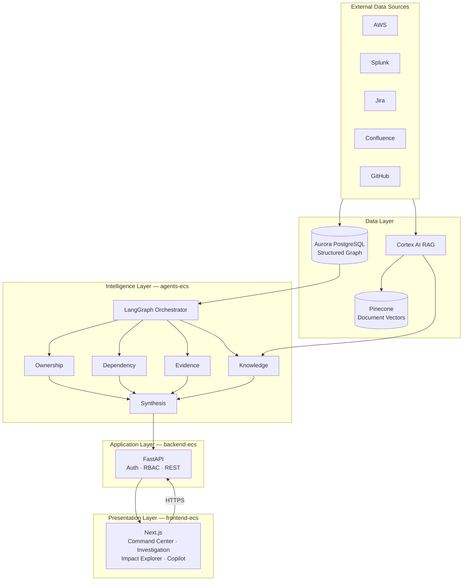
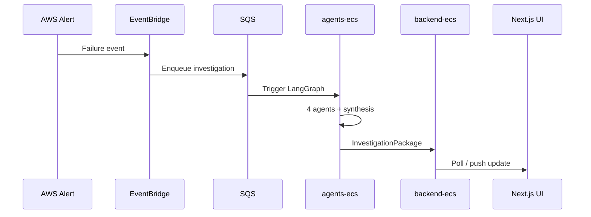
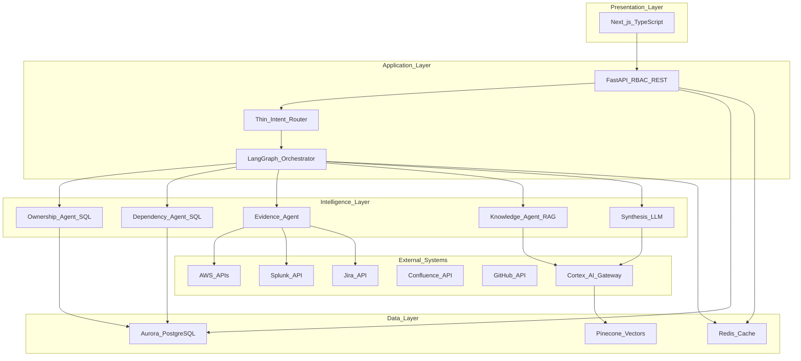
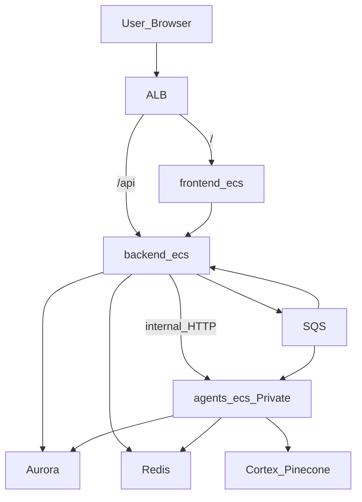
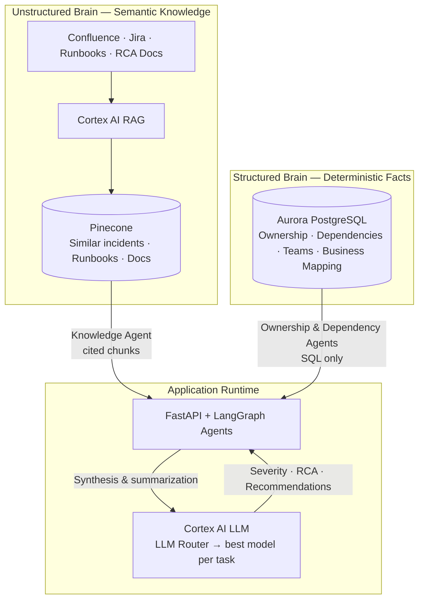
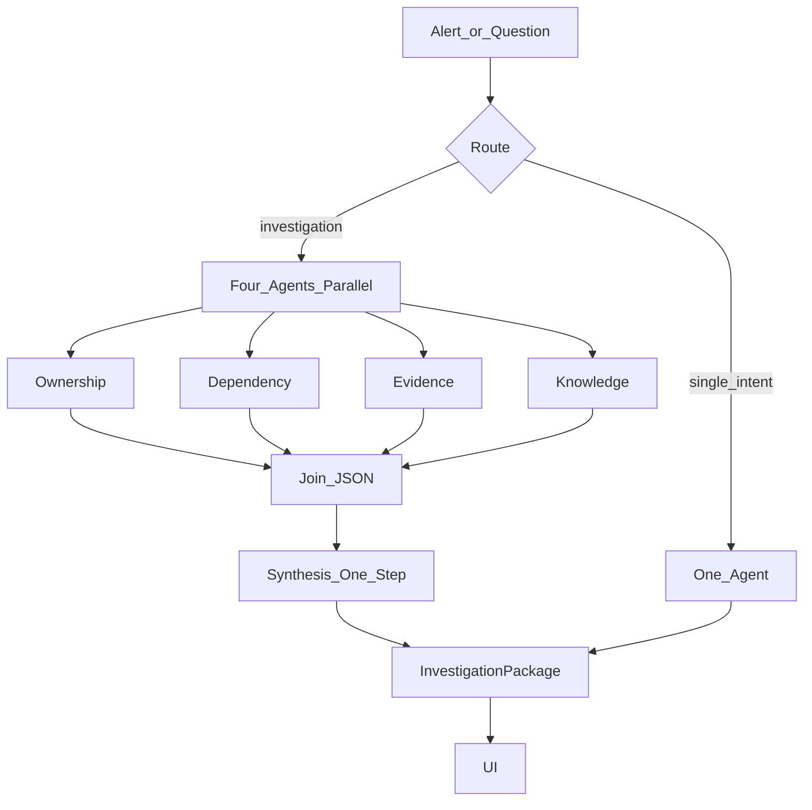
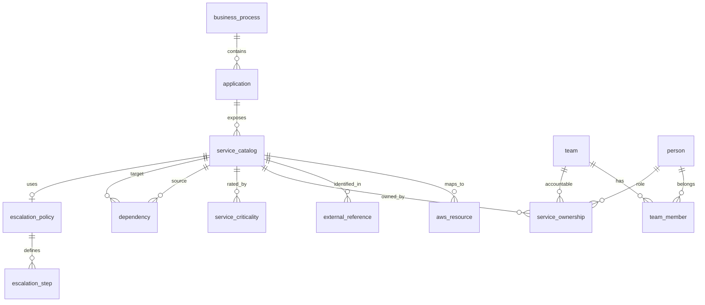
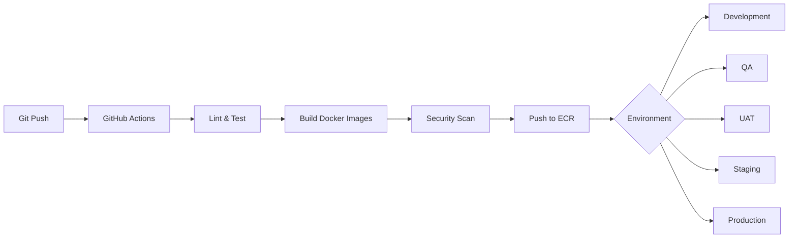
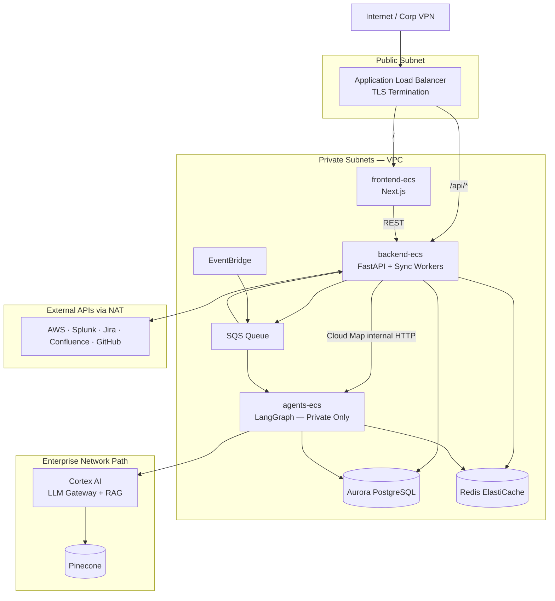

# EOCC Technical Design Document

**Enterprise Operations Command Center (EOCC)**

---

## Document Information

| Attribute | Value |
|---|---|
| **Document title** | EOCC Technical Design Document |
| **Document series** | 3 of 3 — Technical Design Document (TDD) |
| **Product** | Enterprise Operations Command Center (EOCC) |
| **Organization** | Lilly |
| **Version** | 2.0 |
| **Status** | Draft — Architecture & Engineering Review |
| **Classification** | Lilly Internal |
| **Effective date** | June 2026 |
| **Document owner** | EOCC Architecture Team |
| **Approver** | Tech Team Lead *(pending)* |

## Related Documents

| # | Document | Role |
|---|---|---|
| 1 | [EOCC_Full_Product_Information.md](EOCC_Full_Product_Information.md) | Master product specification |
| 2 | [EOCC_PRD.md](EOCC_PRD.md) | Product requirements, NFRs, acceptance criteria |

## Revision History

| Version | Date | Author | Summary of changes |
|---|---|---|---|
| 1.0 | June 2026 | EOCC Architecture Team | Initial TDD from design plan |
| 2.0 | June 2026 | EOCC Architecture Team | Enterprise restructure — 27 sections, expanded API/security/ops design |

## Intended Audience

| Audience | Purpose of review |
|---|---|
| Engineering & architecture | Implementation design, component boundaries, data model |
| Architecture Review Board | Architecture decisions, trade-offs, phase gates |
| Security & compliance | Authentication, authorization, encryption, audit |
| DevOps / SRE | Deployment, observability, runbooks, DR |
| QA | Test strategy, traceability, acceptance validation |
| Executive technical leadership | Solution overview, risks, roadmap |

## Confidentiality Notice

This document contains Lilly internal technical information. Distribution is limited to authorized personnel with a legitimate business need.

---

## Table of Contents

| Section | Title |
|---|---|
| [1](#1-executive-summary) | Executive Summary |
| [2](#2-system-overview) | System Overview |
| [3](#3-architecture-overview) | Architecture Overview |
| [4](#4-solution-architecture) | Solution Architecture |
| [5](#5-technology-stack) | Technology Stack |
| [6](#6-system-components) | System Components |
| [7](#7-functional-design) | Functional Design |
| [8](#8-data-architecture) | Data Architecture |
| [9](#9-api-design) | API Design |
| [10](#10-integration-architecture) | Integration Architecture |
| [11](#11-security-architecture) | Security Architecture |
| [12](#12-scalability-design) | Scalability Design |
| [13](#13-performance-design) | Performance Design |
| [14](#14-reliability--resilience) | Reliability & Resilience |
| [15](#15-observability--monitoring) | Observability & Monitoring |
| [16](#16-devops--deployment-design) | DevOps & Deployment Design |
| [17](#17-infrastructure-design) | Infrastructure Design |
| [18](#18-non-functional-requirements) | Non-Functional Requirements |
| [19](#19-failure-scenarios--recovery) | Failure Scenarios & Recovery |
| [20](#20-technical-risks--mitigations) | Technical Risks & Mitigations |
| [21](#21-assumptions--constraints) | Assumptions & Constraints |
| [22](#22-traceability-matrix) | Traceability Matrix |
| [23](#23-testing-strategy) | Testing Strategy |
| [24](#24-operational-readiness) | Operational Readiness |
| [25](#25-implementation-roadmap) | Implementation Roadmap |
| [26](#26-open-technical-questions) | Open Technical Questions |
| [27](#27-appendix) | Appendix |

---

# 1. Executive Summary

## 1.1 Solution Overview

**Enterprise Operations Command Center (EOCC)** is Lilly's internal **operations intelligence platform** that unifies AWS, Splunk, Jira, Confluence, and GitHub into a governed intelligence layer. The system answers operational questions during incidents with **cited, evidence-based responses** — not undifferentiated chatbot output.

**Phase 1 design:** Read-only advisory platform — no production writes, no autonomous remediation.

**Core technical pattern:** Two-brain architecture — **Aurora PostgreSQL** for deterministic structured facts (ownership, dependencies, business mapping); **Cortex AI RAG → Pinecone** for semantic document retrieval; **Cortex LLM gateway** for synthesis and summarization only where language reasoning adds value.

## 1.2 Business Context

Enterprise operations teams manage hundreds of AWS services supporting regulated, patient-facing, and revenue-critical processes. EOCC sits **above** existing tools (Jira, Splunk, AWS consoles) — it does not replace them. Phase 1 proves value to the onsite tech team lead via a controlled pilot before client expansion.

## 1.3 Technical Objectives

| ID | Objective | Phase 1 target |
|---|---|---|
| TEO-01 | Deliver accurate ownership and dependency answers without LLM hallucination | SQL-only gather agents |
| TEO-02 | Correlate multi-source incident evidence with mandatory citations | 4 parallel agents + synthesis |
| TEO-03 | Reuse enterprise-approved AI infrastructure (Cortex + Pinecone) | Zero new AI vendor |
| TEO-04 | Enforce read-only safety boundary | No write connectors in P1 |
| TEO-05 | Support independent scale of UI, API, and agent workloads | 3× ECS Fargate services |
| TEO-06 | Establish knowledge graph foundation for Phases 2–4 | 16 Aurora tables |

## 1.4 Key Architecture Decisions

| Decision | Rationale | Trade-off |
|---|---|---|
| Aurora PostgreSQL knowledge graph | ACID, deterministic SQL for ownership/deps | Requires curation; not auto-discovered |
| Cortex RAG + Pinecone (not pgvector) | Enterprise-governed; approved data path | Separate system from structured graph |
| LangGraph — 4 gather agents + 1 synthesis | Accuracy over agent sprawl | Less granular than 10+ agent designs |
| 3 ECS Fargate services | Independent scale/deploy for FE/BE/agents | More services than monolith |
| FastAPI middle tier | Auth, RBAC, audit gate; no keys in browser | Additional hop vs BFF-only |
| EventBridge + SQS async investigations | Decouple alert storms from API | At-least-once delivery complexity |
| Redis investigation cache (P1) | Fast repeat queries; LangGraph state | Not durable — Aurora in Phase 2 |
| Hybrid demo data | Live investigation chain + seeded health tiles | Must document live vs seeded |

## 1.5 Expected Outcomes

| Outcome | Measurement |
|---|---|
| End-to-end investigation workflow | InvestigationPackage with citations within 30s p95 |
| Ownership lookup accuracy | 100% match to Aurora `service_ownership` |
| Architecture approval | Tech team lead sign-off on PRD + TDD |
| Pilot readiness | 1–2 business processes with live connectors |
| Foundation for Phase 2+ | Schema and integration patterns extensible to 42 tables |

---

# 2. System Overview

## 2.1 System Purpose

EOCC provides a unified operational intelligence layer that answers five questions during incidents:

1. What is happening — and how serious is it?
2. Why is it happening?
3. What is the business impact?
4. Who owns it — and who should respond?
5. What should we do next?

## 2.2 Business Capabilities Supported

| Capability | Phase | Primary module |
|---|---|---|
| Enterprise Ownership Intelligence | 1 | Copilot, Command Center |
| AI Incident Investigation | 1 | Investigation Workspace |
| Enterprise Dependency Intelligence | 1 | Impact Explorer |
| Business Process Monitoring (preview) | 1 preview / 2 full | Command Center |
| Action recommendations (advisory) | 1 | Copilot, Investigation |
| Knowledge search, governance, coordination | 2–4 | Roadmap — see Section 25 |

## 2.3 High-Level Architecture Summary



**Async event path:**



## 2.4 Architectural Principles

| Principle | Implementation |
|---|---|
| **Facts before inference** | Ownership and dependency from Aurora SQL — never LLM |
| **Citations mandatory** | Every factual claim references source ID |
| **Fail honest** | Partial packages with `gaps[]` — no silent invention |
| **Separation of concerns** | UI never calls agents or Cortex directly |
| **Enterprise AI only** | All LLM/RAG via Cortex gateway — no direct provider APIs |
| **Phase gates** | Read-only P1; writes require Phase 3 approval |
| **Independent scale** | Frontend, backend, agents as separate ECS services |
| **Immutable deploys** | Container images from CI/CD — same artifact POC → prod |

---

# 3. Architecture Overview

## 3.1 Logical Architecture



## 3.2 Physical Architecture

| Tier | Components | Network exposure |
|---|---|---|
| Edge | ALB (TLS termination) | Public / corp VPN |
| Presentation | frontend-ecs (Next.js) | Public via ALB `/` |
| Application | backend-ecs (FastAPI + sync workers) | Public via ALB `/api/*` |
| Intelligence | agents-ecs (LangGraph) | **Private only** — Cloud Map |
| Data | Aurora, Redis, S3 | Private subnets |
| AI | Cortex LLM + RAG → Pinecone | Enterprise network path |
| Events | EventBridge, SQS | AWS managed |

## 3.3 Deployment Architecture



**Rule:** agents-ecs is **never** registered on the public ALB.

## 3.4 Component Architecture

| Component | Responsibility | Communicates with |
|---|---|---|
| frontend-ecs | SSR/CSR UI, no secrets | backend-ecs only |
| backend-ecs | Auth, RBAC, REST, connector sync, audit persist | Aurora, Redis, SQS, agents-ecs, external APIs |
| agents-ecs | LangGraph router, 4 agents, synthesis, LLM router | Aurora, Redis, Cortex, Splunk/AWS/Jira (via workers) |
| Aurora | Knowledge graph SoR | All application tiers |
| Redis | Investigation cache, LangGraph state, rate limits | backend-ecs, agents-ecs |
| EventBridge + SQS | Async alert and investigation triggers | backend-ecs, agents-ecs |
| Cortex + Pinecone | RAG retrieval, LLM synthesis | agents-ecs only |

## 3.5 Architecture Diagram — Data Flow (Two-Brain Model)



| Question type | System | Example |
|---|---|---|
| Who owns Payment API? | Aurora | SQL → team, primary POC |
| What breaks if Aurora fails? | Aurora | Recursive dependency CTE |
| How did we fix this before? | Cortex RAG | Similar incident chunks |
| What does the runbook say? | Cortex RAG | Confluence retrieval |
| What is business severity? | Cortex LLM synthesis | Joined agent JSON |

---

# 4. Solution Architecture

## 4.1 Component Catalog

| Component | Purpose | Responsibilities | Dependencies | Technology | Interfaces |
|---|---|---|---|---|---|
| **frontend-ecs** | User interface | Command Center, Investigation Workspace, Impact Explorer, Copilot; SSR dashboards | backend-ecs REST | Next.js, TypeScript | HTTPS → ALB `/` |
| **backend-ecs** | API gateway & orchestration | SSO auth, RBAC, REST, connector sync, investigation persist, audit | Aurora, Redis, SQS, agents-ecs, Secrets Manager | FastAPI, Python | HTTPS → ALB `/api/*`; internal → agents-ecs |
| **agents-ecs** | AI orchestration | Intent router, LangGraph, 4 gather agents, synthesis, LLM router | Aurora, Redis, Cortex, Splunk/AWS/Jira | LangGraph, Python | Internal HTTP from backend-ecs only |
| **Aurora PostgreSQL** | Structured knowledge graph | Ownership, deps, teams, business mapping, connector metadata | — | Aurora PostgreSQL 15+ | SQL from backend/agents |
| **Redis** | Cache & workflow state | InvestigationPackage TTL, LangGraph checkpoints, rate limits | — | ElastiCache Redis | Redis protocol |
| **Cortex AI RAG** | Document retrieval | Embed, index, query Confluence/Jira/runbooks | Pinecone | Cortex gateway | REST via enterprise path |
| **Pinecone** | Vector store | Semantic search index `eocc-primary` | Cortex embeddings | Managed Pinecone | Via Cortex RAG |
| **Cortex LLM** | Language reasoning | Synthesis, evidence summarization | Landing Zone models | Cortex gateway | REST via enterprise path |
| **EventBridge + SQS** | Async events | Alert ingestion, investigation queue | IAM producers/consumers | AWS managed | Event patterns, SQS API |
| **S3** | Object storage | Investigation exports, connector staging (optional P1) | IAM | AWS S3 | S3 API |
| **ALB** | Load balancing | TLS, path routing, health checks | ECS target groups | AWS ALB | HTTPS |

## 4.2 Agent Architecture (Phase 1 — Locked)

**Design rule:** 4 parallel gather agents maximum. One synthesis step after join. Thin LangGraph router — not a separate LLM agent.

| Agent | Purpose | LLM? | Source |
|---|---|---|---|
| **Ownership** | Owner, team, escalation chain | **No** — Aurora SQL only | Aurora |
| **Dependency** | Blast radius, business impact | **No** — Aurora SQL/graph only | Aurora |
| **Evidence** | Signals, timeline, similar Jira | Summarize only (`evidence_summarize`) | AWS, Splunk, Jira |
| **Knowledge** | Runbooks, docs | Retrieval only | Cortex RAG → Pinecone |
| **Synthesis** | Severity, summary, recommendations | Yes — one call after join | Cortex LLM |

**Phase 2–3 additions:** Governance Agent (scheduled scans); Coordination Agent (escalation/notify); Control Agent (approved AWS writes).



### InvestigationPackage Schema

```json
{
  "service_id": "uuid",
  "ownership": { "data": {}, "complete": true },
  "dependency": { "data": {}, "complete": true },
  "evidence": { "timeline": [], "sources": [] },
  "knowledge": { "runbooks": [], "sources": [] },
  "synthesis": { "severity": "", "business_summary": "", "recommendations": [], "confidence": 0.0 },
  "gaps": []
}
```

### Accuracy Safeguards

| Layer | Rule |
|---|---|
| Ownership / Dependency | Return Aurora SQL results unchanged |
| Evidence / Knowledge | Citations required; no match = `"not found"` |
| Synthesis | Uses joined JSON only; cannot invent owners |
| Failure | Partial package + `gaps[]` — never fill with guesses |
| Conflict | Aurora wins for ownership; show both if evidence disagrees |

### Routing Rules

| Scenario | Parallel? | Agents |
|---|---|---|
| Full incident / alert | Yes — max 4 | Ownership + Dependency + Evidence + Knowledge |
| "Who owns X?" | No | Ownership only |
| "What breaks if X fails?" | No | Dependency only |
| Dashboard health metrics | No | Direct Aurora/Redis queries — no agents |

| Standard | Value |
|---|---|
| Max parallel agents | 4 |
| Per-agent timeout | 15s |
| Synthesis calls per investigation | 1 |

---

# 5. Technology Stack

## 5.1 Stack Summary

| Layer | Technology | Version / notes |
|---|---|---|
| **Frontend** | Next.js, TypeScript, React | App Router; system fonts per UI standards |
| **Backend API** | FastAPI, Python 3.11+ | Async I/O, OpenAPI 3.1 |
| **Agents** | LangGraph | State machine + parallel fan-out |
| **RDBMS** | Aurora PostgreSQL | Multi-AZ for pilot+ |
| **Cache** | ElastiCache Redis | AUTH token, VPC-only |
| **Vectors** | Pinecone via Cortex RAG | `eocc-primary` index, 3072 dims |
| **LLM** | Cortex AI gateway | Landing Zone model catalog |
| **Embeddings** | text-embedding-3-large | Primary; cohere.embed-english-v3 fallback |
| **Messaging** | EventBridge, SQS | DLQ for poison messages |
| **Compute** | ECS Fargate | 3 services: frontend, backend, agents |
| **Load balancer** | ALB | TLS 1.2+; WAF-ready |
| **Object storage** | S3 | SSE-S3 or SSE-KMS |
| **Secrets** | AWS Secrets Manager | Connector credentials, Redis AUTH |
| **Monitoring** | CloudWatch, X-Ray *(assumption)* | Logs, metrics, traces |
| **CI/CD** | GitHub Actions *(assumption)* | Build, test, deploy pipelines |
| **IaC** | Terraform or CDK *(assumption — OQ)* | Environment provisioning |

## 5.2 Eliminated Alternatives

| Alternative | Reason not selected |
|---|---|
| pgvector / self-hosted vectors | Duplicates governed Pinecone; new data boundary |
| Lambda for agents | Timeouts, cold starts break parallel LangGraph |
| EKS | Operational burden exceeds interim team capacity |
| Direct OpenAI/Anthropic APIs | Bypasses Cortex audit and governance |
| LLM per gather agent | Accuracy risk; higher cost and latency |

---

# 6. System Components

## 6.1 frontend-ecs

| Attribute | Specification |
|---|---|
| **Description** | Next.js presentation tier — zero secrets in browser |
| **Inputs** | User HTTP requests; JSON from `/api/*` |
| **Outputs** | HTML/JS pages; investigation UI state |
| **Processing** | SSR for Command Center; client hydration for interactive modules |
| **Failure handling** | ALB health check removes unhealthy tasks; static error boundary |
| **Scalability** | Horizontal — add ECS tasks; stateless |

## 6.2 backend-ecs

| Attribute | Specification |
|---|---|
| **Description** | FastAPI application — auth gate, RBAC, REST, connector sync workers |
| **Inputs** | Authenticated API requests; SQS investigation messages; connector webhooks |
| **Outputs** | JSON responses; SQS enqueue; Aurora writes; internal agent invoke |
| **Processing** | Validate input → authorize → route to Aurora or agents-ecs → persist audit |
| **Failure handling** | 4xx/5xx with structured errors; SQS retry for async; idempotency keys |
| **Scalability** | Horizontal; connector sync colocated until workers-ecs (Phase 2+) |

## 6.3 agents-ecs

| Attribute | Specification |
|---|---|
| **Description** | LangGraph orchestration — router, 4 agents, synthesis, LLM router |
| **Inputs** | Internal investigate/copilot requests; SQS alert payloads |
| **Outputs** | InvestigationPackage JSON; agent telemetry |
| **Processing** | Classify intent → parallel gather (≤4) → join → single synthesis |
| **Failure handling** | Per-agent timeout 15s → `gaps[]`; LLM fallback chain → degrade before fail |
| **Scalability** | Scale on SQS depth and investigation concurrency |

## 6.4 Connector Sync Workers (backend-ecs)

| Attribute | Specification |
|---|---|
| **Description** | Scheduled and on-demand sync jobs for external systems |
| **Inputs** | Cron triggers; admin manual sync |
| **Outputs** | Aurora upserts; `integration_sync_log`; RAG re-index triggers |
| **Processing** | Incremental fetch → normalize → upsert `service_catalog`, `external_reference`, etc. |
| **Failure handling** | Log to `integration_sync_log`; alert on 3 consecutive failures |
| **Scalability** | Dedicated workers-ecs when sync volume exceeds backend capacity (Phase 2+) |

## 6.5 LLM Router (agents-ecs)

| Attribute | Specification |
|---|---|
| **Description** | Deterministic model selection per task type via Cortex |
| **Inputs** | `task_type`, `complexity_score` (1–5), `domain_tag`, `latency_budget_ms` |
| **Outputs** | `cortex_model_id`, `temperature`, `max_tokens` |
| **Processing** | Config-driven routing; fallback chain on provider failure |
| **Failure handling** | Next model in tier → `gaps[]` if all fail |

### Task → Model Routing (Phase 1)

| Task type | Primary model | Fallback | LLM? |
|---|---|---|---|
| `none` | — | — | Ownership/Dependency agents |
| `evidence_summarize` | GPT-4o / Claude 3.5 Sonnet | Claude Haiku | Evidence compression |
| `investigation_synthesis` | Claude 3.5 Sonnet | GPT-4o | Post-join RCA |
| `deep_rca` | o-series / DeepSeek | Claude 3.5 Sonnet | complexity ≥ 4 |
| `copilot_simple` | GPT-4o | Claude Haiku | Short FAQ |
| `life_sciences_rag` | BioMistral | Claude 3.5 Sonnet | GxP docs *(if in scope)* |

### Embedding Model Selection (Locked)

| Role | Model | Dimensions |
|---|---|---|
| Primary — all Phase 1 RAG | text-embedding-3-large | 3072 |
| Fallback index | cohere.embed-english-v3 | 1024 |
| Phase 2 multilingual | cohere.embed-multilingual-v3 | 1024 (separate namespace) |

**Chunk strategy:** 512–1024 tokens; metadata: `source`, `service_id`, `doc_type`, `updated_at`.

---

# 7. Functional Design

*Maps PRD functional requirements to technical implementation.*

## 7.1 Phase 1 Feature Design Summary

| Feature ID | Technical design | PRD mapping | Data flow | Validation | Error handling | Acceptance |
|---|---|---|---|---|---|---|
| P1-UC01 | Command Center API aggregates process health from Redis rollup + `service_criticality` | FR-P1-CC-* | Aurora → Redis cache → `GET /api/business-processes` | `revenue_impact_tier` sort order | Stale cache banner if sync > threshold | Highest-risk process ranks first; load < 3s |
| P1-UC02 | SQS trigger → agents-ecs 4-agent parallel → Redis cache package | FR-P1-INV-* | EventBridge → SQS → agents → Redis | 4-agent cap; 15s timeout | `gaps[]` on partial failure | Package with timeline + citations; p95 ≤ 30s |
| P1-UC03 | Recursive CTE on `dependency` + business joins | FR-P1-IMP-* | `GET /api/services/{id}/dependencies` → Aurora | `service_catalog_id` exists | 404 if service unknown | Blast radius with business labels |
| P1-UC04 | Ownership SQL path — no LLM | FR-P1-CP-002/003 | Copilot → router `ownership_only` → Aurora | `service_catalog.code` match | Explicit not-found | Matches Aurora exactly; < 5s |
| P1-UC05 | Copilot router + optional synthesis | FR-P1-CP-* | `POST /api/copilot/query` | Citation on every claim | Route to single agent when possible | JSON with `sources[]` |
| P1-F04 | Smart severity from `service_criticality` | FR-P1-CC-002 | Synthesis input includes criticality floor/ceiling | Enum severity Sev1–4 | Default to infra severity if no mapping | Business-weighted severity |
| P1-F09 | Recommendations in synthesis output | FR-P1-ACT-* | RAG chunks → synthesis | confidence ∈ [0,1] | No execute button P1 | Cited recommendation |

## 7.2 Use Case Flows — Phase 1 (Detail)

### UC 1 — Enterprise Ownership Intelligence

1. User: *"Who owns glue-job-cn3?"* → `POST /api/copilot/query`
2. Router: `ownership_only` → Ownership agent only
3. Aurora SQL: `service_catalog` → `service_ownership` → `team`, `person`, `escalation_step`
4. Result: `{ team, primary_poc, escalation[], sources[] }` → Ownership card

### UC 3 — Enterprise Dependency Intelligence

1. User: *"If payment-db fails, what breaks?"* → `GET /api/services/{id}/dependencies`
2. Router: `dependency_only` → Dependency agent
3. Aurora recursive CTE on `dependency` + `business_process` join
4. Result: blast radius → Impact Explorer

### UC 4 — AI Incident Investigation

1. Glue failure → EventBridge → SQS `{ alert_id, service_arn }`
2. backend-ecs → agents-ecs `/investigate` → 4 parallel agents (15s timeout)
3. Ownership + Dependency + Evidence (Splunk/AWS/Jira) + Knowledge (Pinecone)
4. Join → Synthesis → InvestigationPackage → Redis + Investigation Workspace

## 7.3 Master Flow Table (All 20 Use Cases)

| UC | Use case | Phase | Trigger | Flow summary | Agents | Result |
|---|---|---|---|---|---|---|
| 1 | Enterprise Ownership Intelligence | 1 | Copilot click | Query → ownership_only → Aurora SQL | Ownership | Ownership card |
| 2 | Business Process Monitoring | 2 | EventBridge cron | Rollup metrics → Redis/Aurora → Dashboard | Metrics rollup | Process tiles |
| 3 | Enterprise Dependency Intelligence | 1–2 | Alert/Copilot | dependency_only → recursive CTE | Dependency | Blast radius |
| 4 | AI Incident Investigation | 1 | SQS / Investigate | 4 parallel → join → synthesis | All 4 + Synthesis | InvestigationPackage |
| 5 | Enterprise Knowledge Search | 2 | Copilot search | Knowledge → Pinecone top-k | Knowledge | Ranked docs |
| 6 | Historical Incident Intelligence | 2 | During investigation | Evidence + `incident_record` similarity | Evidence + Knowledge | Similar incidents |
| 7 | Autonomous Incident Coordination | 3 | risk ≥ 70% | Coordination → Jira write + Teams | Coordination | Assigned + notified |
| 8 | AI Executive Briefings | 4 | Sev1 / cron | Synthesis exec template → S3 PDF | Synthesis | Leadership brief |
| 9 | Architecture Intelligence | 2 | Copilot query | `architecture_component` + RAG | Knowledge + Aurora | App map |
| 10 | Change Risk Intelligence | 3 | GitHub webhook | `change_request` + blast radius | Dependency + Synthesis | Risk score |
| 11 | Operational Risk Detection | 2 | 15-min cron | Governance rules → risk signals | Governance | Risk cards |
| 12 | Ownership Gap Detection | 2 | Nightly cron | Scan missing owners → findings | Governance SQL | Gap list |
| 13 | Runbook Coverage Analysis | 2 | Weekly cron | `runbook_registry` match | Governance | Coverage % |
| 14 | Documentation Governance | 2 | Weekly cron | Stale doc scan | Governance | Stale report |
| 15 | Organizational Dependency Analysis | 2 | Team view | `team_dependency` rollup | Dependency | Team graph |
| 16 | Critical Expert Detection | 2 | Copilot | `engineer_service_experience` rank | Aurora aggregate | Expert list |
| 17 | Service Consumption Intelligence | 4 | Exec dashboard | `service_consumption` query | Dependency | Consumer map |
| 18 | Enterprise Operational Search | 2 | Unified search | Pinecone + Aurora merge | Knowledge + SQL | Unified results |
| 19 | Operational Digital Twin | 4 | Hourly cron | Full sync → `digital_twin_snapshot` | Connector sync | Graph export |
| 20 | Controlled Operational Execution | 3 | Approve action | Approval quorum → AWS API | Control | Audit trail |

### P1 ↔ Original UC Mapping

| P1-UC | Original UC | Module | Phase 1 storage |
|---|---|---|---|
| P1-UC01 | UC 2 (preview) | Command Center | Redis health rollup + seeded tiles |
| P1-UC02 | UC 4 | Investigation Workspace | **Redis** investigation cache |
| P1-UC03 | UC 3 | Impact Explorer | Aurora `dependency` |
| P1-UC04 | UC 1 | Copilot | Aurora ownership tables |
| P1-UC05 | Cross-cutting | Copilot | Agents + Cortex |

**Note:** `incident_record` and `incident_timeline_event` are **Phase 2** — Phase 1 uses Redis + `external_reference`.

---

# 8. Data Architecture

## 8.1 Design Principles

- `service_catalog` is the canonical operational entity (glue for Jira, AWS, GitHub, Splunk).
- Polymorphic `external_reference` links each service to source-system IDs.
- `dependency` supports technical, business, and team relationship types.
- Phase 1 = curated config graph; Phase 2+ = incident aggregates and coordination tables.
- All tables: `id` UUID PK, `created_at`, `updated_at`, `created_by`, `is_active`; soft-delete via `is_active`.
- Naming: `snake_case`; enums as PostgreSQL `ENUM` or lookup tables.

## 8.2 Entity Relationship (Core Graph)



## 8.3 Phase 1 Tables (16 — Implement First)

### A. Organization and Business Layer

| Table | PK | Key FKs | Purpose |
|---|---|---|---|
| `business_domain` | `id` | — | Top-level business area |
| `business_process` | `id` | `domain_id` → `business_domain` | Capability (Payments, Onboarding) |
| `application` | `id` | `business_process_id` → `business_process` | Logical application |
| `application_service` | `id` | `application_id`, `service_catalog_id` | App ↔ service M:N |

### B. Service Catalog (Hub)

| Table | PK | Key FKs | Purpose |
|---|---|---|---|
| `service_catalog` | `id` | — | **Canonical service** — hub table |
| `aws_resource` | `id` | `service_catalog_id` | AWS ARN mapping |
| `external_reference` | `id` | `service_catalog_id` | Jira/GitHub/Splunk/Confluence IDs |

### C. People and Teams

| Table | PK | Key FKs | Purpose |
|---|---|---|---|
| `team` | `id` | `manager_person_id` → `person` | Owning team |
| `person` | `id` | — | Engineer, lead, manager |
| `team_member` | `id` | `team_id`, `person_id` | Membership |

### D. Ownership and Escalation

| Table | PK | Key FKs | Purpose |
|---|---|---|---|
| `service_ownership` | `id` | `service_catalog_id`, `team_id`, `primary_person_id` | Who owns what |
| `escalation_policy` | `id` | — | Named escalation chain |
| `escalation_step` | `id` | `escalation_policy_id` | Ordered levels |
| `service_escalation` | `id` | `service_catalog_id`, `escalation_policy_id` | Service → policy |

### E. Dependencies and Impact

| Table | PK | Key FKs | Purpose |
|---|---|---|---|
| `dependency` | `id` | `source_service_id`, `target_service_id` | Graph edges |
| `team_dependency` | `id` | `upstream_team_id`, `downstream_team_id` | Cross-team deps |
| `service_criticality` | `id` | `service_catalog_id` | Business impact profile |

### F. Integration Metadata

| Table | PK | Key FKs | Purpose |
|---|---|---|---|
| `integration_connector` | `id` | — | Connector registry |
| `integration_sync_log` | `id` | `connector_id` | Sync audit |

## 8.4 Phase 2–4 Tables (Roadmap)

| Phase | New tables | Cumulative | Examples |
|---|---|---|---|
| Phase 2 | 8 | 24 | `incident_record`, `engineer_service_experience`, `governance_finding` |
| Phase 3 | 12 | 36 | `active_incident`, `approval_request`, `action_execution_log` |
| Phase 4 | 6 | 42 | `digital_twin_snapshot`, `autonomy_policy`, `executive_briefing` |

## 8.5 Indexes (Enterprise Performance)

| Table | Index | Type |
|---|---|---|
| `service_catalog` | `(code)` | UNIQUE |
| `service_catalog` | `(service_type, environment)`, `(status)` | B-tree |
| `aws_resource` | `(resource_arn)` | UNIQUE |
| `external_reference` | `(source_system, external_id)` | UNIQUE |
| `dependency` | `(source_service_id)`, `(target_service_id)`, `(dependency_type)` | B-tree |
| `service_ownership` | `(service_catalog_id)`, `(primary_person_id)`, `(team_id)` | B-tree |
| `incident_record` *(P2)* | `(jira_key)` | UNIQUE |
| `active_incident` *(P3)* | `(status, calculated_severity)` | B-tree |

**Partitioning strategy *(production assumption)*:** `integration_sync_log` partitioned by month; `incident_timeline_event` by `event_time` (Phase 3).

## 8.6 Sample Query — Ownership (P1-F06)

```sql
SELECT sc.name, t.name AS team, p.display_name AS primary_poc,
       m.display_name AS manager, t.teams_channel_url
FROM service_catalog sc
JOIN service_ownership so ON so.service_catalog_id = sc.id
JOIN team t ON t.id = so.team_id
JOIN person p ON p.id = so.primary_person_id
LEFT JOIN person m ON m.id = t.manager_person_id
WHERE sc.code = :service_code AND so.is_active = true;
```

## 8.7 Data Lifecycle

| Data class | Creation | Updates | Archival | Purging |
|---|---|---|---|---|
| Knowledge graph (Aurora) | Connector sync + manual curation | Incremental sync; SRE edits in pilot | Soft-delete `is_active=false` | Hard delete — admin only *(assumption)* |
| Investigation packages | Agent synthesis | Redis TTL refresh on re-query | Export to S3 optional | Redis TTL 15–60 min (P1) |
| RAG index (Pinecone) | Cortex ingest on sync | Delta re-index post Confluence/Jira sync | Namespace versioning | Orphan chunk cleanup job (P2) |
| Audit logs | API middleware | Append-only | S3 Glacier *(assumption P2)* | Per retention policy |
| Sync logs | Connector jobs | Append-only | Partition drop > 90 days *(assumption)* | Automated |

## 8.8 Data Governance

| Domain | Owner | Retention | Compliance |
|---|---|---|---|
| Ownership graph | Platform SRE | Indefinite while active | Internal — no PHI in P1 *(assumption)* |
| Investigation artifacts | Operations | 90 days Redis; 1 year S3 *(assumption)* | Audit trail required |
| RAG document corpus | Knowledge admin | Matches source system | Confluence/Jira access policies |
| Connector credentials | Security / SRE | Rotated per policy | Secrets Manager only |

---

# 9. API Design

**Versioning:** `/api/v1/*` prefix at implementation. OpenAPI spec: `openapi/eocc-v1.yaml`.

**Authentication:** Bearer session token from SSO (OIDC/SAML) — cookie or `Authorization` header.

**Rate limiting:** Redis `ratelimit:{user}` — 60 req/min default *(assumption)*; 429 on exceed.

## 9.1 API Catalog — Phase 1

| Endpoint | Method | Auth | Roles | Request | Response | Errors |
|---|---|---|---|---|---|---|
| `/health` | GET | None | Public | — | `{ status, connectors[] }` | 503 if critical deps down |
| `/api/v1/copilot/query` | POST | SSO | LEAD, OPS, SRE, OWNER, BUILDER | `{ query, context? }` | `{ answer, sources[], agent_path }` | 400, 401, 403, 429, 500 |
| `/api/v1/agents/investigate` | POST | SSO | LEAD, OPS, SRE, BUILDER | `{ alert_id?, service_arn?, trigger }` | `202 { investigation_id }` | 400, 401, 403 |
| `/api/v1/investigations/{id}` | GET | SSO | LEAD, OPS, SRE, OWNER, BUILDER | — | `{ status, progress, gaps? }` | 404 |
| `/api/v1/investigation-package/{id}` | GET | SSO | LEAD, OPS, SRE, OWNER, BUILDER | — | InvestigationPackage JSON | 404 |
| `/api/v1/services` | GET | SSO | All read roles | `?type=&env=` | `{ services[] }` | 401, 403 |
| `/api/v1/services/{code}/ownership` | GET | SSO | All read roles | — | Ownership card JSON | 404 |
| `/api/v1/services/{id}/dependencies` | GET | SSO | All read roles | `?depth=3` | Blast radius graph | 404 |
| `/api/v1/business-processes` | GET | SSO | LEAD, OPS, SRE, OWNER | — | Process health tiles | 401 |
| `/api/v1/admin/connectors` | GET | SSO | SRE, BUILDER | — | Connector status list | 403 |
| `/api/v1/admin/connectors/{id}/sync` | POST | SSO | SRE, BUILDER | — | `{ sync_id, status }` | 403, 409 if running |

## 9.2 Error Response Schema

```json
{
  "error": {
    "code": "INVESTIGATION_NOT_FOUND",
    "message": "Human-readable message",
    "correlation_id": "uuid",
    "details": {}
  }
}
```

| HTTP | When |
|---|---|
| 400 | Validation failure |
| 401 | Unauthenticated |
| 403 | RBAC denial |
| 404 | Resource not found |
| 409 | Conflict (sync in progress) |
| 429 | Rate limit exceeded |
| 500 | Unhandled server error |
| 503 | Dependency unavailable |

## 9.3 Internal API (agents-ecs — Private)

| Endpoint | Method | Caller | Purpose |
|---|---|---|---|
| `/internal/investigate` | POST | backend-ecs | Run LangGraph investigation |
| `/internal/copilot/route` | POST | backend-ecs | Single/multi-agent query |
| `/internal/health` | GET | backend-ecs | Agent service health |

**Not exposed on public ALB.**

---

# 10. Integration Architecture

| System | Pattern | Protocol | Data contract | Security | Retry | Failure handling | Monitoring |
|---|---|---|---|---|---|---|---|
| **AWS** | Scheduled sync + on-demand API | AWS SDK / CloudWatch API | `aws_resource`, tags JSON | IAM task role, least privilege | Exponential backoff 3× | Skip resource; log sync error | `integration_sync_log` |
| **Splunk** | Search API on investigation | HTTPS REST | Log excerpts + query ref | Service account token in Secrets Manager | 2 retries, 15s timeout | Evidence `gaps[]`; continue investigation | Connector freshness metric |
| **Jira** | Scheduled sync + read on investigation | REST API v3 | Tickets, keys, metadata | OAuth / PAT in Secrets Manager | 3 retries | Timeline gap flagged | Sync success rate ≥ 98% |
| **Confluence** | Scheduled ingest → Cortex RAG | REST API | Page HTML → chunks | API token in Secrets Manager | 3 retries | Knowledge agent empty result | Re-index job status |
| **GitHub** | Scheduled metadata sync | REST API | Repos, CODEOWNERS hints | GitHub App or PAT | 3 retries | Ownership enrichment skipped | Sync log |
| **Cortex LLM** | Sync request per synthesis | Enterprise gateway HTTPS | Prompt + joined JSON | No keys in app — gateway auth | Model fallback chain | `gaps[]` in synthesis | Latency + error rate |
| **Cortex RAG** | Sync embed + query | Enterprise gateway | Chunks + metadata | Governed ingest path | 2 retries | "No runbook found" | Retrieval latency |
| **EventBridge** | Event-driven | AWS events | Alert payload schema | IAM scoped rules | SQS DLQ | DLQ alert + manual replay | Queue depth alarm |

### Phased Integration Roadmap

| Source | Phase 1 | Phase 2 | Phase 3 |
|---|---|---|---|
| AWS | Read | Read | Read + **write actions** |
| Splunk | **Mandatory** | Yes | Yes |
| Jira | Read | Read + history | **Write tickets** |
| Confluence | Read → RAG | Yes | Yes |
| GitHub | Read | Yes | Yes |
| Teams | — | — | Notify + war room |
| ServiceNow | — | Optional read | Optional write |

### Scheduled Sync Jobs

| Job | Cadence | Target |
|---|---|---|
| AWS resource sync | 15 min | Aurora `aws_resource` |
| Jira metadata | 30 min | `external_reference`, ownership hints |
| Confluence → RAG | 60 min | Pinecone re-index |
| Ownership validation | Daily | `governance_finding` *(P2)* |

---

# 11. Security Architecture

## 11.1 Authentication

| Control | Implementation |
|---|---|
| User authentication | Corporate SSO — SAML 2.0 or OIDC via Lilly IdP |
| Session management | HTTP-only secure cookies; session TTL 8h *(assumption)* |
| Service-to-service | Internal mTLS or signed service tokens *(assumption — Cloud Map)* |
| API authentication | Session validated on every `/api/*` request |

## 11.2 Authorization

| Control | Implementation |
|---|---|
| Model | RBAC — 6 roles per PRD Section 12 |
| Enforcement | FastAPI dependency injection — role check before handler |
| Data scoping | Service Owner sees own services only in Command Center |
| Admin operations | SRE + BUILDER (non-prod only) for connector config |

## 11.3 RBAC Matrix (Technical Enforcement)

| Permission | LEAD | OPS | SRE | OWNER | BUILDER | CLIENT |
|---|:---:|:---:|:---:|:---:|:---:|:---:|
| Read investigations | ✓ | ✓ | ✓ | ✓ | ✓ | — |
| Trigger investigation | ✓ | ✓ | ✓ | — | ✓ | — |
| Admin connectors | — | — | ✓ | — | ✓ (non-prod) | — |
| Edit ownership graph | — | — | ✓ | — | ✓ (non-prod) | — |
| AWS writes via EOCC | — | — | — | — | — | — |

## 11.4 Encryption

| Layer | At rest | In transit |
|---|---|---|
| Aurora | AES-256 (AWS managed) | TLS 1.2+ to ECS tasks |
| Redis | Encryption at rest enabled | TLS in transit *(assumption)* |
| S3 | SSE-S3 or SSE-KMS | HTTPS only |
| Secrets Manager | KMS encrypted | HTTPS API |
| ALB | — | TLS 1.2+ termination |
| Pinecone | Vendor managed | HTTPS via Cortex |

## 11.5 Secrets Management

- All connector credentials in **AWS Secrets Manager** — rotated per Lilly policy.
- **No** Cortex API keys, Splunk tokens, or DB passwords in code, env files, or frontend.
- ECS task IAM roles grant `secretsmanager:GetSecretValue` scoped to EOCC secrets prefix.

## 11.6 Audit Logging

| Event | Logged fields | Destination |
|---|---|---|
| API request | user_id, role, endpoint, correlation_id, timestamp | CloudWatch Logs |
| Investigation start/complete | investigation_id, trigger, agents_run, gaps | Aurora audit table *(P2)* + CloudWatch |
| Copilot query | query hash, agent_path, model_id | CloudWatch |
| Connector sync | connector_id, records_upserted, status | `integration_sync_log` |
| Admin actions | actor, action, target | CloudWatch + immutable S3 *(assumption P2)* |

## 11.7 Threat Mitigation

| Threat | Mitigation |
|---|---|
| Prompt injection | Synthesis uses structured JSON only; system prompts constrain output |
| Data exfiltration via Copilot | RBAC; no bulk export endpoints; rate limits |
| Unauthorized agent access | agents-ecs private subnet; no public ALB |
| Credential leakage | Secrets Manager; no keys in browser |
| LLM hallucination on facts | SQL-only ownership/dependency; citations mandatory |
| Supply chain | Container image scanning in CI *(assumption)* |

## 11.8 Compliance Considerations

| Area | Phase 1 posture |
|---|---|
| PHI / GxP | **Assumption:** No PHI in pilot scope — confirm OQ-002 |
| Data residency | AWS region per Lilly cloud standards *(OQ)* |
| AI governance | Cortex Landing Zone model approval |
| Audit retention | 1 year minimum *(assumption — align with compliance)* |

## 11.9 IAM — ECS Task Roles (Conceptual)

| Service | Phase 1 permissions |
|---|---|
| frontend-ecs | No AWS SDK |
| backend-ecs | Aurora, SQS, S3, Secrets Manager, CloudWatch; connector read APIs |
| agents-ecs | Aurora read/write (investigation), Redis, Secrets Manager (Cortex path) |

**IAM JSON templates:** `iam/` directory at implementation.

---

# 12. Scalability Design

## 12.1 Horizontal Scaling

| Component | Strategy | Trigger |
|---|---|---|
| frontend-ecs | Add ECS tasks | CPU > 70% or request count |
| backend-ecs | Add ECS tasks | API latency p95 > target |
| agents-ecs | Add ECS tasks | SQS queue depth > threshold |
| Aurora | Read replicas | Read query load *(P2)* |
| Redis | Cluster mode | Memory > 80% *(P2)* |

## 12.2 Vertical Scaling

| Component | Pilot | Production V1 *(assumption)* |
|---|---|---|
| frontend-ecs | 1 vCPU / 2 GB | 1 vCPU / 2 GB × 2 tasks |
| backend-ecs | 1 vCPU / 2 GB | 2 vCPU / 4 GB × 2 tasks |
| agents-ecs | 2 vCPU / 4 GB | 4 vCPU / 8 GB × 2 tasks |
| Aurora | 2 vCPU / 8 GB | 2–4 vCPU / 16 GB |

## 12.3 Load Balancing

- ALB distributes across healthy ECS tasks per service.
- Path-based routing: `/` → frontend; `/api/*` → backend.
- agents-ecs via **AWS Cloud Map** service discovery — round-robin internal.

## 12.4 Caching Strategy

| Key pattern | Purpose | TTL | Invalidation |
|---|---|---|---|
| `investigation:{id}` | InvestigationPackage | 15–60 min | New investigation |
| `langgraph:{thread_id}` | Workflow state | Session | Workflow complete |
| `agent:{incident}:{agent}` | Agent result reuse | 5–15 min | Connector sync |
| `ratelimit:{user}` | API throttle | 1 min | Rolling window |
| `health:process:{id}` | Command Center rollup | 5 min | Metric sync job |

## 12.5 Traffic Growth Assumptions

| Metric | Pilot | Production V1 *(assumption)* |
|---|---|---|
| Concurrent users | 10–25 | 100–500 |
| Investigations / hour | 5–20 | 50–200 |
| Services in graph | 500–2,000 | 10,000 |
| RAG document chunks | 50K–200K | 1M |

---

# 13. Performance Design

## 13.1 Workload Profile

| Workload | Pattern | Peak |
|---|---|---|
| Command Center load | Read-heavy, cacheable | Monday standup |
| Copilot queries | Mixed read + agent | Incident hours |
| Investigations | CPU-heavy, parallel I/O | Alert storms |
| Connector sync | Background batch | Off-peak preferred |

## 13.2 Latency Targets

| Operation | Target (p95) | Phase |
|---|---|---|
| Command Center dashboard | < 3s | P1 |
| Single-agent Copilot query | < 5s | P1 |
| Full investigation (4 agents + synthesis) | < 30s | P1 |
| Ownership SQL lookup | < 500ms | P1 |
| Blast radius query (depth 3) | < 2s | P1 |
| RAG retrieval (top-k) | < 3s | P1 |

## 13.3 Throughput Targets *(assumption)*

| Metric | Pilot | Production V1 |
|---|---|---|
| API requests / sec (backend) | 10 | 100 |
| Parallel investigations | 3 | 20 |
| Connector records / sync | 1,000 | 50,000 |

## 13.4 Optimization Strategies

- Parallel agent fan-out — wall-clock = slowest agent, not sum.
- Redis cache-aside for repeat investigations and health rollups.
- Aurora indexes on `service_catalog.code`, `dependency` edges, `external_reference`.
- Fast models (Haiku/mini) for evidence summarization; Sonnet only for synthesis.
- Async investigations via SQS — API returns 202 immediately.
- SSR/ISR for Command Center first paint.

## 13.5 Benchmark Recommendations

| Test | Tool | Pass criteria |
|---|---|---|
| API load test | k6 / Locust | p95 < targets at pilot concurrency |
| Investigation soak | Custom script | 50 sequential investigations, < 1% failure |
| Aurora query plan | EXPLAIN ANALYZE | Ownership query < 50ms at 10K services |
| RAG recall | Golden set of 20 queries | ≥ 90% relevant doc in top-3 |

---

# 14. Reliability & Resilience

## 14.1 High Availability

| Component | HA approach |
|---|---|
| ECS services | Multi-task + ALB health checks; min 2 tasks in prod |
| Aurora | Multi-AZ deployment (pilot+ after approval) |
| Redis | Replication with automatic failover *(prod assumption)* |
| SQS | Managed durability; multi-AZ |
| Cortex / Pinecone | Enterprise SLA — gateway fallback chain |

## 14.2 Failover Mechanisms

- ALB removes unhealthy ECS tasks automatically.
- Aurora automatic failover to standby (< 60s typical).
- LLM router fallback chain across Cortex catalog models.
- Partial investigation results on single-agent failure.

## 14.3 Disaster Recovery

| Metric | Pilot | Production *(assumption — confirm DR team)* |
|---|---|---|
| **RTO** | Best effort (24h) | 4 hours |
| **RPO** | 24 hours | 1 hour |
| Aurora backups | Automated daily + PITR | PITR enabled |
| Redis | Ephemeral — rebuild from Aurora | Snapshot daily *(prod)* |
| Pinecone | Re-index from source docs | Index backup via vendor |

## 14.4 Backup Strategy

| Asset | Method | Frequency |
|---|---|---|
| Aurora | Automated snapshots + PITR | Continuous WAL |
| S3 exports | Versioning enabled | On investigation export |
| IaC / config | Git repository | Every merge |
| Secrets | Secrets Manager rotation | Per policy |

---

# 15. Observability & Monitoring

## 15.1 Logging

| Log stream | Content | Retention |
|---|---|---|
| frontend-ecs | Access logs, SSR errors | 30 days |
| backend-ecs | API requests, auth events, sync jobs | 90 days |
| agents-ecs | Agent execution, LLM calls, timeouts | 90 days |
| Aurora | Slow query log (> 1s) | 30 days |

**Format:** Structured JSON — `correlation_id`, `timestamp`, `level`, `service`, `message`.

## 15.2 Metrics

| Metric | Type | Alert threshold *(assumption)* |
|---|---|---|
| `api.request.duration` | Histogram | p95 > SLA |
| `investigation.duration` | Histogram | p95 > 30s |
| `agent.timeout.count` | Counter | > 5/hour |
| `connector.sync.failure` | Counter | 3 consecutive failures |
| `sqs.queue.depth` | Gauge | > 100 messages |
| `llm.error.rate` | Counter | > 5% of calls |
| `citation.missing.count` | Counter | > 0 in production |

## 15.3 Distributed Tracing

- **AWS X-Ray** *(assumption)* on backend-ecs and agents-ecs.
- Trace spans: API → agent invoke → Aurora query → Cortex call → Splunk fetch.
- `correlation_id` propagated across all tiers.

## 15.4 Alerting

| Alert | Severity | Response |
|---|---|---|
| ECS service unhealthy | P1 | Page on-call SRE |
| Aurora CPU > 85% | P2 | Scale / optimize queries |
| SQS DLQ messages | P2 | Investigate poison payload |
| Connector sync failed 3× | P2 | Check credentials / API |
| Investigation error rate > 10% | P1 | Eng on-call |

## 15.5 Dashboards

| Dashboard | Audience | Panels |
|---|---|---|
| EOCC Operations | SRE | ECS health, queue depth, connector status |
| EOCC Product | Product | Investigation volume, citation rate, user adoption |
| EOCC AI | AI platform | LLM latency, model usage, RAG recall |

## 15.6 Incident Response Triggers

- P1: Complete investigation failure rate > 25% for 15 min.
- P1: All agents-ecs tasks unhealthy.
- P2: Connector stale > 4 hours for mandatory Splunk.

---

# 16. DevOps & Deployment Design

## 16.1 CI/CD Architecture



## 16.2 Build Pipeline

| Stage | Actions |
|---|---|
| Lint | ESLint (frontend), Ruff (backend/agents) |
| Unit test | pytest, Jest — gate on 80% critical paths *(assumption)* |
| Integration test | API + Aurora test container |
| Security scan | Container image CVE scan |
| Build | Docker multi-stage images per ECS service |
| Publish | ECR tag `{git-sha}` + `{env}-latest` |

## 16.3 Environment Strategy

| Environment | Purpose | Data | Access |
|---|---|---|---|
| **Development** | Engineer local + shared dev ECS | Synthetic / seeded | BUILDER, dev team |
| **QA** | Automated test runs | Seeded + mock connectors | QA, BUILDER |
| **UAT** | Tech lead validation | Hybrid demo data | LEAD, OPS, BUILDER |
| **Staging** | Pre-production soak | Pilot-like live connectors | SRE, LEAD |
| **Production** | Pilot / production | Live connectors | All roles per RBAC |

## 16.4 Release Strategy

| Phase | Approach |
|---|---|
| Pilot | Rolling ECS deployment — 1 task at a time |
| Production | Rolling with circuit breaker; min healthy 50% |

## 16.5 Rollback Strategy

- ECS rolling deploy auto-rollback on health check failure.
- Previous ECR image tag retained 30 days.
- Database migrations: backward-compatible expand-only in P1; rollback scripts for P2+.

## 16.6 Deployment Patterns

| Pattern | Applicability |
|---|---|
| **Rolling deploy** | Default — all ECS services |
| **Blue-green** | Recommended for production cutover *(assumption)* |
| **Canary** | Optional for agents-ecs model routing changes *(P2)* |

---

# 17. Infrastructure Design

## 17.1 Cloud Architecture (AWS)

| Service | Configuration |
|---|---|
| VPC | Private subnets for ECS, Aurora, Redis; public subnets for ALB only |
| ECS Fargate | 3 services — see Section 17.4 |
| Aurora PostgreSQL | PostgreSQL 15+, Multi-AZ when approved |
| ElastiCache Redis | Single node pilot; replication prod |
| ALB | Internet-facing or internal per corp policy |
| S3 | Investigation exports, connector staging |
| SQS + EventBridge | Alert pipeline |
| Secrets Manager | Connector + Redis AUTH |
| CloudWatch | Logs, metrics, alarms |
| ECR | Container registry |

## 17.2 Network Architecture



- All ECS tasks in **private subnets**.
- NAT gateway for outbound connector API calls.
- Security groups: least privilege — agents-ecs accepts only from backend-ecs SG.

## 17.3 Containerization Strategy

| Image | Base | Contents |
|---|---|---|
| `eocc-frontend` | Node 20 Alpine | Next.js standalone build |
| `eocc-backend` | Python 3.11 slim | FastAPI + connector workers |
| `eocc-agents` | Python 3.11 slim | LangGraph + agent code |

**No Kubernetes** for Phase 1 — ECS Fargate sufficient. EKS evaluation deferred to Phase 3+ if coordination scale demands.

## 17.4 Compute Sizing

**Pilot (1 task per service):**

| ECS service | Size | Notes |
|---|---|---|
| frontend-ecs | 1 vCPU / 2 GB | Single task |
| backend-ecs | 1 vCPU / 2 GB | API + sync workers |
| agents-ecs | 2 vCPU / 4 GB | LangGraph fan-out |
| Aurora | 2 vCPU / 8 GB | Multi-AZ when approved |
| Redis | 1 GB | ElastiCache |

**Production V1 *(after client approval)*:**

| ECS service | Size |
|---|---|
| frontend-ecs | 2 × 1 vCPU / 2 GB |
| backend-ecs | 2 × 2 vCPU / 4 GB |
| agents-ecs | 2 × 4 vCPU / 8 GB |
| Aurora | 2–4 vCPU / 16 GB |
| Redis | 2–4 GB |

## 17.5 Service Selection Rationale (Five Pillars)

Every infrastructure choice evaluated on: **Scalable · Secure · Accurate · Fast · Reliable**.

| Service | Pillar emphasis |
|---|---|
| Next.js on frontend-ecs | Secure (no secrets in browser), Fast (SSR) |
| FastAPI on backend-ecs | Secure (auth gate), Accurate (validation) |
| LangGraph on agents-ecs | Accurate (parallel gather + synthesis), Fast (parallel I/O) |
| Aurora | Accurate (ACID SQL), Reliable (Multi-AZ) |
| Redis | Fast (sub-ms cache), Reliable (ephemeral by design) |
| Cortex RAG + Pinecone | Accurate (cited chunks), Secure (governed path) |
| EventBridge + SQS | Scalable (queue absorbs storms), Reliable (DLQ) |

---

# 18. Non-Functional Requirements

*Aligned with [EOCC_PRD.md](EOCC_PRD.md) Section 10.*

| Category | ID | Target | Measurable |
|---|---|---|---|
| **Availability** | NFR-AVAIL-002 | 99.5% business hours (pilot+) | Uptime monitor |
| **Scalability** | NFR-SCALE-003 | 500 concurrent users (prod) | Load test |
| **Security** | NFR-SEC-001–006 | SSO, RBAC, private agents, no browser keys | Security review checklist |
| **Performance** | NFR-PERF-001–005 | See Section 13.2 | k6 benchmarks |
| **Maintainability** | NFR-MAINT-001 | OpenAPI + TDD traceability | Doc coverage |
| **Extensibility** | NFR-EXT-001 | Phase 2 tables without breaking P1 APIs | Schema migration test |
| **Compliance** | NFR-COMP-001 | Audit log for investigations | Log audit |
| **Accessibility** | NFR-A11Y-001 | WCAG 2.1 AA *(Phase 2 — OQ)* | axe scan |
| **Interoperability** | NFR-INT-001 | REST + OpenAPI 3.1 | Contract tests |

---

# 19. Failure Scenarios & Recovery

| Failure | Detection | Recovery | Business impact |
|---|---|---|---|
| Single ECS task crash | ALB health check fail | Auto-replace task | Brief request retry |
| All backend-ecs tasks down | ALB 503; synthetic monitor | ECS service restart; rollback image | Investigation unavailable |
| Aurora failover | Connection errors; RDS event | Automatic standby promotion | < 60s read/write pause |
| Redis unavailable | Connection timeout | Degrade — direct Aurora; rebuild cache | Higher latency |
| Splunk API down | Evidence agent timeout | `gaps[]` in package; continue other agents | Missing log evidence |
| Jira API down | Connector sync failure | Timeline from AWS/Splunk only | Missing ticket correlation |
| Cortex LLM outage | Gateway 5xx | Fallback model chain → `gaps[]` | Degraded synthesis |
| Pinecone / RAG outage | Knowledge agent empty | Explicit "no runbook found" | No doc recommendations |
| SQS poison message | DLQ depth alarm | Inspect DLQ; fix payload; replay | Single investigation stuck |
| Agent timeout (15s) | LangGraph timeout handler | Partial package + `gaps[]` | Incomplete investigation |
| Connector stale data | `last_success_at` threshold | UI warning; manual sync trigger | Stale ownership risk |
| Network partition (agents) | Internal health check fail | backend-ecs circuit breaker on agents-ecs | Investigations queued |

---

# 20. Technical Risks & Mitigations

| ID | Risk | Impact | Likelihood | Mitigation | Contingency |
|---|---|---|---|---|---|
| TR-01 | Stale ownership in Aurora | Wrong owner cited | Medium | Connector sync; SRE audit; DQ checks | Manual override in pilot |
| TR-02 | RAG hallucination in synthesis | Wrong remediation | Medium | Citations mandatory; JSON-only synthesis input | Disable synthesis; show raw agent JSON |
| TR-03 | Splunk integration complexity | Delayed Evidence agent | Medium | Early integration spike; mandatory in P1 | Mock Splunk in UAT only |
| TR-04 | LangGraph state corruption | Lost investigation | Low | Redis checkpointing; idempotent investigate | Re-trigger from SQS |
| TR-05 | Aurora schema migration pain P1→P2 | Deployment delay | Medium | Expand-only migrations; `incident_record` deferred | Feature flags |
| TR-06 | Cortex model deprecation | Broken synthesis | Low | Config-driven router; Landing Zone monitoring | Fallback model in config |
| TR-07 | agents-ecs resource exhaustion | Investigation backlog | Medium | Auto-scale on queue depth; 15s timeouts | Rate limit investigate API |
| TR-08 | Key-person dependency | Delivery delay | Medium | TDD documentation; knowledge transfer | Engage platform SRE |
| TR-09 | Teams integration blocked (P3) | Coordinator vision delayed | Low | Phase gate; email fallback | Defer UC 7 |
| TR-10 | Dual UC numbering confusion | Wrong component built | Medium | Traceability matrix Section 22 | Dual IDs in all tickets |

---

# 21. Assumptions & Constraints

## 21.1 Technical Assumptions

| ID | Assumption |
|---|---|
| TASM-01 | Cortex AI + Pinecone remain approved via enterprise gateway |
| TASM-02 | Lilly IdP supports OIDC/SAML for pilot app |
| TASM-03 | Splunk API access granted for pilot environment |
| TASM-04 | Aurora 16-table schema sufficient for Phase 1 |
| TASM-05 | Redis acceptable for investigation persistence in P1 |
| TASM-06 | text-embedding-3-large available in Cortex Landing Zone |
| TASM-07 | CloudWatch + X-Ray available for observability |
| TASM-08 | GitHub Actions approved for CI/CD |
| TASM-09 | No PHI in Phase 1 connector scope |
| TASM-10 | English-only RAG index sufficient for P1 |

## 21.2 Business Assumptions

| ID | Assumption |
|---|---|
| BASM-01 | Tech team lead is architecture approval gate |
| BASM-02 | Phase 1 read-only boundary acceptable to security |
| BASM-03 | Hybrid demo (live + seeded) acceptable for validation |
| BASM-04 | Pilot limited to 1–2 business processes |

## 21.3 Constraints

| Constraint | Impact |
|---|---|
| No direct LLM provider APIs | All AI via Cortex only |
| No public agents-ecs endpoint | Internal service discovery required |
| No production writes Phase 1 | UC 20 deferred to Phase 3 |
| Interim delivery team capacity | No EKS; minimal connector fleet |
| Enterprise embedding policy | 3072-dim index — no mixed dimensions |

---

# 22. Traceability Matrix

| PRD FR | Technical component | API | Data store | Test |
|---|---|---|---|---|
| FR-P1-CP-001 | Copilot router | `POST /api/v1/copilot/query` | — | INT-COP-001 |
| FR-P1-CP-002 | Ownership agent | Copilot → ownership_only | Aurora SQL | UNIT-OWN-001 |
| FR-P1-INV-001 | Event pipeline | SQS consumer | Redis | INT-INV-001 |
| FR-P1-INV-002 | LangGraph parallel | `/internal/investigate` | Redis | UNIT-AG-001 |
| FR-P1-INV-006 | Synthesis step | LLM router | Cortex | UNIT-SYN-001 |
| FR-P1-IMP-001 | Dependency agent | `GET .../dependencies` | Aurora CTE | UNIT-DEP-001 |
| FR-P1-CC-001 | Health rollup worker | `GET /api/v1/business-processes` | Redis + Aurora | INT-CC-001 |
| FR-P1-AG-003 | SQL-only agents | agents-ecs | Aurora | CODE-REVIEW |
| FR-P1-INT-002 | Splunk connector | Evidence agent | Splunk API | INT-SPL-001 |
| FR-P1-EV-001 | Citation middleware | All agent outputs | — | UNIT-CIT-001 |
| NFR-SEC-004 | Network design | — | VPC/SG | SEC-NET-001 |
| NFR-PERF-003 | Investigation SLA | agents-ecs | Redis | PERF-INV-001 |

### Architecture Fulfillment — Original 20 UCs

| UC | Phase | Arch status | Gap |
|---|---|---|---|
| 1 Ownership | 1 | **Full** | None |
| 2 Business Process Monitoring | 2 | Planned | Health rollup logic |
| 3 Dependency | 1–2 | **Full** (basic) | Recursive API spec |
| 4 Investigation | 1 | **Full** | None |
| 5–6 Knowledge / History | 2 | Planned | Jira sync + similarity |
| 7 Coordination | 3 | Planned | **Teams connector** |
| 8–9 Executive / Architecture | 4 / 2 | Planned | Templates, ingest rules |
| 10–20 | 2–4 | Planned | Per master flow table |
| Command Center | 1 | **Full** | Widget data contracts |

---

# 23. Testing Strategy

## 23.1 Unit Testing

| Scope | Approach | Entry | Exit |
|---|---|---|---|
| Ownership SQL queries | pytest + test DB | Schema migrated | 100% pass; match golden JSON |
| Dependency CTE | pytest | Seed graph fixture | Correct blast radius for 3 fixtures |
| LLM router config | pytest | Config file present | All task types map to model |
| Citation validator | pytest | Sample agent outputs | Reject missing `sources` |

## 23.2 Integration Testing

| Scope | Approach | Entry | Exit |
|---|---|---|---|
| API + Aurora | Testcontainers PostgreSQL | Backend builds | All P1 endpoints 2xx |
| Copilot → agents-ecs | Docker compose | Services healthy | Ownership query < 5s |
| SQS investigation | LocalStack or dev SQS | Queue configured | Package in Redis |
| Splunk connector | Mock server or dev index | Credentials set | Evidence agent returns timeline |

## 23.3 System Testing

| Scope | Approach | Entry | Exit |
|---|---|---|---|
| End-to-end demonstration (PRD §8.5) | Manual + automated | UAT env deployed | All 5 steps pass |
| RBAC enforcement | Role matrix tests | 6 test users | 403 for denied actions |
| Hybrid demo config | Config review | Seed manifest documented | Live vs seeded labeled |

## 23.4 Performance Testing

| Scope | Approach | Entry | Exit |
|---|---|---|---|
| Investigation p95 | k6 at pilot concurrency | Staging env | < 30s p95 |
| Dashboard load | k6 25 VUs | Cached data warm | < 3s p95 |
| Aurora at 10K services | Seed script | Indexes applied | Ownership < 500ms |

## 23.5 Security Testing

| Scope | Approach | Entry | Exit |
|---|---|---|---|
| OWASP API top 10 | DAST scan | Staging deployed | No critical findings |
| agents-ecs isolation | Pen test / network scan | VPC configured | No public route to agents |
| Secrets scan | CI gitleaks | Every PR | Zero secrets in repo |

## 23.6 UAT Testing

| Scope | Approach | Entry | Exit |
|---|---|---|---|
| Tech lead validation | Prescribed workflow §7.2 | UAT sign-off checklist | Written approval |
| Pilot users | 5+ ops engineers | Training complete | KPI-01 ≥ 70% helpful |

---

# 24. Operational Readiness

## 24.1 Runbooks

| Runbook | Purpose |
|---|---|
| RB-001 Connector sync failure | Diagnose and recover failed AWS/Jira/Splunk sync |
| RB-002 Investigation backlog | Scale agents-ecs; inspect SQS DLQ |
| RB-003 Aurora failover | Verify application reconnect; check RPO |
| RB-004 Cortex outage | Enable fallback models; degrade synthesis |
| RB-005 Redis flush | Rebuild cache from Aurora; no data loss for graph |

## 24.2 SOPs

| SOP | Owner |
|---|---|
| SOP-001 Onboard new service to graph | SRE |
| SOP-002 Rotate connector credentials | SRE + Security |
| SOP-003 Deploy new ECS image | DevOps |
| SOP-004 RAG re-index after Confluence bulk update | SRE |

## 24.3 Support Model

| Tier | Scope | Hours |
|---|---|---|
| L1 | UI issues, access requests | Business hours |
| L2 | Connector failures, investigation errors | Business hours + on-call P1 |
| L3 | Architecture, schema, agent logic | Eng team |

## 24.4 Escalation Matrix

| Severity | Response time | Escalate to |
|---|---|---|
| P1 — EOCC down | 15 min | SRE on-call → Tech lead |
| P2 — Degraded investigations | 1 hour | SRE |
| P3 — Stale connector | 4 hours | SRE (next business day) |

## 24.5 Maintenance Strategy

| Activity | Cadence |
|---|---|
| ECS image updates / patching | Monthly |
| Aurora minor version | Quarterly |
| Dependency CVE scan | Every build |
| Ownership graph audit | Weekly (pilot) |
| RAG index freshness review | Weekly |

---

# 25. Implementation Roadmap

## 25.1 Phase 1 — MVP (Demo / Pilot)

| Milestone | Deliverable | Dependencies |
|---|---|---|
| M1 | PRD + TDD approval | Tech lead review |
| M2 | Aurora schema (16 tables) + seed data | DBA provisioning |
| M3 | backend-ecs + auth + graph APIs | IdP integration |
| M4 | agents-ecs + 4 agents + synthesis | Cortex access |
| M5 | Connectors: AWS, Splunk, Jira, Confluence, GitHub | API credentials |
| M6 | frontend-ecs — 4 modules | API complete |
| M7 | End-to-end demonstration | M3–M6 |
| M8 | Pilot — 1–2 business processes | M7 + KPI instrumentation |

**Delivery sequence:** Data layer → Connectors → Agents → API → UI → Integration test → UAT

## 25.2 Phase 2 — Institutional Memory

- 8 new Aurora tables; `incident_record` sync; Governance Agent; Expert Finder.
- **Gate:** Client approval.

## 25.3 Phase 3 — AI Operations Coordinator

- Teams connector; Jira write; Control Agent; approval workflow; AWS execute.
- **Gate:** Security + senior leadership approval.

## 25.4 Phase 4 — Strategic Intelligence

- Digital twin; executive briefings; autonomy policies; consumption mapping.

## 25.5 Optional Phase 2+ Infrastructure

- **workers-ecs:** Dedicated connector fleet when sync volume exceeds backend-ecs capacity.

---

# 26. Open Technical Questions

| ID | Question | Owner | Blocks |
|---|---|---|---|
| OTQ-001 | Target AWS region(s) and account(s)? | Cloud platform | Deployment |
| OTQ-002 | OIDC vs SAML for Lilly IdP? | Identity | Auth implementation |
| OTQ-003 | IaC tool — Terraform vs CDK? | Architecture | Provisioning |
| OTQ-004 | Aurora Multi-AZ for pilot or staging only? | DBA | HA design |
| OTQ-005 | Splunk index/sourcetype scope for pilot? | Splunk admin | Evidence agent |
| OTQ-006 | GxP / PHI scope for connectors? | Compliance | Data boundaries |
| OTQ-007 | Redis cluster mode timing for production? | SRE | Cache HA |
| OTQ-008 | OpenAPI publish location and consumer teams? | Architecture | Contract governance |
| OTQ-009 | mTLS between backend-ecs and agents-ecs? | Security | Service mesh decision |
| OTQ-010 | WCAG 2.1 AA scope and timeline? | Product + Eng | Frontend a11y |

---

# 27. Appendix

## 27.1 Architecture Glossary

| Term | Definition |
|---|---|
| **Two-brain model** | Aurora (structured facts) + Cortex RAG (documents) |
| **InvestigationPackage** | JSON artifact from 4-agent gather + synthesis |
| **Thin router** | Intent classifier — not an LLM agent |
| **Gather agent** | Data collection only — Ownership, Dependency, Evidence, Knowledge |
| **Synthesis** | Single LLM step after join — severity and recommendations |
| **Hub table** | `service_catalog` — canonical service entity |
| **Hybrid demo** | Live investigation chain + seeded Command Center tiles |

## 27.2 Acronyms

| Acronym | Meaning |
|---|---|
| EOCC | Enterprise Operations Command Center |
| TDD | Technical Design Document |
| RAG | Retrieval-Augmented Generation |
| RBAC | Role-Based Access Control |
| CTE | Common Table Expression |
| DLQ | Dead Letter Queue |
| ALB | Application Load Balancer |
| ECS | Elastic Container Service |
| SOR | System of Record |
| RTO / RPO | Recovery Time / Point Objective |
| LLM | Large Language Model |
| UC | Use Case |
| FR / NFR | Functional / Non-Functional Requirement |

## 27.3 References

| Document | Purpose |
|---|---|
| [EOCC_PRD.md](EOCC_PRD.md) | Product requirements and acceptance criteria |
| [EOCC_Full_Product_Information.md](EOCC_Full_Product_Information.md) | Master specification |
| `eocc_demo_prd_design_7feb39f9.plan.md` | Source design plan |
| Cortex AI Landing Zone | Model catalog and governance |
| `openapi/eocc-v1.yaml` | API contract *(at implementation)* |
| `iam/` | IAM policy templates *(at implementation)* |
| `ddl/phase1/` | CREATE TABLE scripts *(at implementation)* |

## 27.4 Design Standards

| Standard | Application |
|---|---|
| REST + OpenAPI 3.1 | All public APIs |
| Structured JSON logging | All ECS services |
| UUID primary keys | All Aurora tables |
| Soft delete (`is_active`) | All Aurora tables |
| Correlation ID propagation | All request paths |
| Expand-only schema migrations | Phase 1 → Phase 2 |

## 27.5 Technology Standards

| Area | Standard |
|---|---|
| Python | 3.11+; Ruff linter; type hints on public APIs |
| TypeScript | Strict mode; ESLint |
| Containers | Multi-stage builds; non-root user |
| Secrets | AWS Secrets Manager only |
| AI | Cortex gateway only — no direct provider APIs |
| Embeddings | text-embedding-3-large for `eocc-primary` index |

## 27.6 DDL Summary — Phase 1 (16 Tables)

| Table | Purpose |
|---|---|
| `business_domain`, `business_process`, `application`, `application_service` | Business layer |
| `service_catalog`, `aws_resource`, `external_reference` | Service hub |
| `team`, `person`, `team_member` | People |
| `service_ownership`, `escalation_policy`, `escalation_step`, `service_escalation` | Ownership |
| `dependency`, `team_dependency`, `service_criticality` | Graph + impact |
| `integration_connector`, `integration_sync_log` | Connectors |

Full `CREATE TABLE` DDL: `ddl/phase1/` at implementation.

## 27.7 Redis Key Patterns

| Key pattern | Purpose | TTL |
|---|---|---|
| `investigation:{id}` | InvestigationPackage cache | 15–60 min |
| `langgraph:{thread_id}` | Agent workflow state | Session |
| `agent:{incident}:{agent}` | Per-agent result reuse | 5–15 min |
| `ratelimit:{user}` | API throttling | 1 min |
| `health:process:{id}` | Command Center rollup | 5 min |

## 27.8 Phase 2–4 Table Reference (Roadmap)

### Phase 2 — Intelligence and Governance (8 tables)

| Table | Purpose | Key columns |
|---|---|---|
| `incident_record` | Cached Jira incidents | `jira_key`, `severity`, `service_catalog_id`, `root_cause` |
| `incident_service_link` | Incident ↔ services M:N | `incident_record_id`, `service_catalog_id`, `impact_role` |
| `engineer_service_experience` | Expertise aggregate | `person_id`, `service_catalog_id`, `expertise_score` |
| `governance_finding` | Gap registry | `finding_type`, `service_catalog_id`, `severity`, `status` |
| `runbook_registry` | Runbook pointer | `service_catalog_id`, `confluence_page_id`, `is_missing` |
| `architecture_component` | Architecture map | `application_id`, `component_name`, `service_catalog_id` |
| `stakeholder_update_template` | Comms templates | `audience`, `template_body`, `severity_min` |
| `operational_risk_signal` | Proactive risk | `service_catalog_id`, `risk_type`, `risk_score` |

### Phase 3 — Operations Coordinator (12 tables)

| Table | Purpose |
|---|---|
| `person_availability` | OOO, leave, holidays |
| `shift_schedule` | Working hours / shifts |
| `on_call_rotation` | Current on-call |
| `notification_rule` / `notification_rule_target` | Risk-tiered notifications |
| `active_incident` | EOCC incident session |
| `incident_timeline_event` | Persisted timeline |
| `action_recommendation` | AI suggested actions |
| `approval_request` / `approval_decision` | Senior approval queue |
| `action_execution_log` | Execution audit trail |
| `war_room_session` | Teams war room |

### Phase 4 — Strategic (6 tables)

| Table | Purpose |
|---|---|
| `change_request` | Deployment/change link |
| `service_consumption` | AWS consumer map |
| `severity_rule` | Configurable severity logic |
| `digital_twin_snapshot` | Point-in-time graph export |
| `autonomy_policy` | Tiered auto-action rules |
| `executive_briefing` | Generated leadership brief |

| Phase | New tables | Cumulative |
|---|---|---|
| Phase 1 | 16 | 16 |
| Phase 2 | 8 | 24 |
| Phase 3 | 12 | 36 |
| Phase 4 | 6 | 42 |

## 27.9 Future-State Improvements (Recommended)

| Area | Current (P1) | Recommended future |
|---|---|---|
| Investigation persistence | Redis TTL | Aurora `incident_record` + timeline (P2) |
| Connector workers | Colocated in backend-ecs | Dedicated workers-ecs (P2+) |
| Service mesh | Cloud Map HTTP | mTLS service mesh (OTQ-009) |
| Observability | CloudWatch | Full X-Ray + custom dashboards |
| Deployment | Rolling | Blue-green for production |
| API versioning | v1 only | v2 with backward compatibility policy |

---

*Document ID: EOCC-DOC-003 · Version 2.0 · Classification: Lilly Internal*
