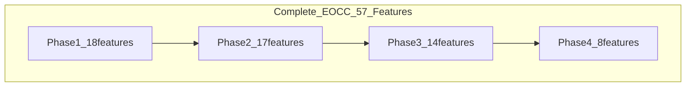
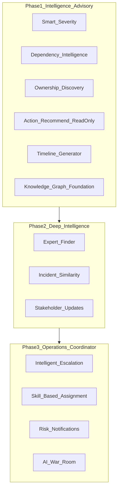
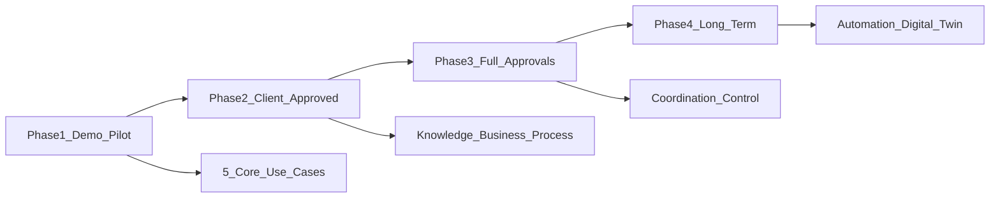

# EOCC — Product Requirements Document (PRD)

**Enterprise Operations Command Center (EOCC)** — AWS Operations Intelligence  
**Organization:** Lilly (internal enterprise product)  
**Audience:** Tech team lead, product owner, pilot stakeholders  
**Technical detail:** See [EOCC_Technical_Design_Document.md](EOCC_Technical_Design_Document.md)

---

## 0. Purpose of This Document

| Item | Detail |
|---|---|
| Type | Product requirements for volunteer AI use case — design review and pilot scoping |
| Goal | Define **what** EOCC delivers in Phase 1 and phased roadmap — seek tech lead validation before client exposure |
| Out of scope here | ECS sizing DDL, IAM policies, OpenAPI specs → **TDD** |
| Approval path | Demo → tech lead validation → pilot → client approval → formal approvals |
| Ask today | Architecture feedback, data model fit, pilot scope — **not** budget, FTE, or timeline |

**Core message:** Operations intelligence on Jira, Splunk, AWS, Confluence, GitHub — structured truth in Aurora, unstructured knowledge via Cortex AI RAG. Phase 1: five use cases, read-only.

---

## 1. Executive Summary

EOCC is Lilly's **operations intelligence layer** that answers: *what is happening, why, who owns it, what is the business impact, and what to do next* — with **cited evidence**.

| Dimension | Phase 1 (now) |
|---|---|
| Mode | Read-only intelligence advisor |
| Core UCs | Health, Investigation, Impact, Ownership, Copilot |
| Stack (summary) | Next.js, FastAPI, LangGraph (4 agents + synthesis), Aurora, Redis, Cortex AI + Pinecone |
| Integrations | AWS, Splunk, Jira, Confluence, GitHub |
| Demo data | Hybrid — live connectors for investigation; seeded Command Center health |

**Evolution:** Phase 1 advisor → Phase 2 institutional memory → Phase 3 AI Operations Coordinator → Phase 4 governed autonomy.

---

## 2. Business Pain Points

*Monitoring shows alerts; it does not answer who owns the service, what business capability is at risk, or what we did last time.*

| Pain | Who feels it | Phase 1 address |
|---|---|---|
| Unknown ownership during outages | On-call engineers | UC 1 / P1-UC04 |
| Manual log/Jira/runbook correlation | SRE, L2 | UC 4 / P1-UC02 |
| Infra alerts without business context | Tech lead, leadership | UC 3 / P1-UC03 |
| No unified ops view ranked by risk | Ops leads | Command Center / P1-UC01 |
| Tribal knowledge for "what to do" | All engineers | Copilot / P1-UC05 |

---

## 3. Proposed Solution

EOCC sits **above** existing tools — it does not replace Jira, Splunk, or AWS consoles.

```text
AWS / Splunk / Jira / Confluence / GitHub
              ↓
    Aurora (facts)  +  Cortex RAG (docs)
              ↓
         LangGraph agents
              ↓
    Command Center · Investigation · Impact · Copilot
```

**Two-brain model:** Aurora = deterministic ownership, dependency, business mapping. Cortex RAG = runbooks, RCAs, similar incidents.

---

## 4. Implementation Approach

| Item | Approach |
|---|---|
| Delivery | Phased — Phase 1 demo/pilot first |
| AI infrastructure | **No new vendors** — Cortex AI + Pinecone (enterprise-approved) |
| Phase 1 writes | **None** — read-only |
| Team model | Volunteer POC → tech lead review → pilot |
| Cost / FTE / duration | Out of scope for this document |

---

## 5. Top 5 Phase 1 Use Cases (P1-UC01–05)

### P1 ↔ Original 20 UC mapping

### 3c-bis. Phase 1 product UCs ↔ Original 20 UC mapping

Two numbering systems — do not conflate:

| P1-UC (product) | Business question | Original UC | Original name | Phase | Demo module |
|---|---|---|---|---|---|
| P1-UC01 | What is happening? How serious? | UC 2 (preview) | Business Process Monitoring | P1 preview / P2 full | Command Center (seeded health tiles) |
| P1-UC02 | Why is it happening? | **UC 4** | AI Incident Investigation | P1 | Investigation Workspace |
| P1-UC03 | What is the business impact? | **UC 3** | Enterprise Dependency Intelligence | P1 | Impact Explorer |
| P1-UC04 | Who owns it? Who responds? | **UC 1** | Enterprise Ownership Intelligence | P1 | Copilot, Command Center |
| P1-UC05 | What should we do next? | Cross-cutting | Copilot + Knowledge (UC 5 tease) | P1 | Copilot |

**Phase 1 demo data (locked):** hybrid — live AWS/Splunk/Jira for investigation chain; seeded Command Center business-process health for UC 2 preview.

### Business examples (all 20 UCs + Command Center)

## 3f. Business Examples — All 20 Use Cases (onsite storytelling)

**Purpose:** Problem → concrete Lilly example → how EOCC solves it. Use for onsite tech lead, ops leads, and PRD Section 2 (pain) + Section 5 (demo scenarios).

**Elevator line:** *"Monitoring tells you something broke. EOCC tells you who owns it, what business capability is at risk, why it happened, and what to do next — with citations, not guesses."*

### Phase 1 — Demo today

#### UC 1 — Enterprise Ownership Intelligence (Phase 1)

| | |
|---|---|
| **Problem** | During an outage, engineers waste 20–40 minutes in Slack and Jira asking *"Who owns this Glue job / Lambda / RDS?"* Tribal knowledge wins; escalation paths are unclear. |
| **Example** | A **clinical trial data ingestion Glue job** (`glue-job-cn3`) fails at 2 AM. The on-call engineer does not know the owning team. |
| **How EOCC solves it** | User asks in Copilot: *"Who owns glue-job-cn3?"* EOCC queries the **Aurora ownership graph** (not AI guesswork) and returns: **Payments Data Platform team**, primary POC, manager, and escalation chain — with source citations. MTTR drops before anyone runs a single kubectl command. |

#### UC 3 — Enterprise Dependency Intelligence (Phase 1)

| | |
|---|---|
| **Problem** | Infra alerts do not speak business language. Leadership asks *"Does this affect patients or revenue?"* while engineers only see *"RDS CPU high."* |
| **Example** | Alert on **`payment-db`** (Aurora PostgreSQL backing **Patient Reimbursement**). Team needs blast radius before failover. |
| **How EOCC solves it** | EOCC runs a **dependency graph** from Aurora: 12 downstream services, 4 applications, **Payments business process** flagged at risk. Impact Explorer shows business-labeled blast radius. Severity is tied to business capability, not just CPU. |

#### UC 4 — AI Incident Investigation (Phase 1)

| | |
|---|---|
| **Problem** | Root-cause analysis requires manually correlating Splunk logs, CloudWatch, Jira tickets, and Confluence runbooks — slow, inconsistent, and depends on senior engineers. |
| **Example** | **Glue ETL failure** for batch submission to regulatory reporting. Alert fires via EventBridge → SQS. |
| **How EOCC solves it** | Four agents run in parallel (15s): Ownership + Dependency + Evidence (Splunk/AWS/Jira) + Knowledge (runbooks via Cortex RAG). One synthesis step produces an **Investigation Package**: Sev2, timeline, owner, similar past incident, runbook §3.2 — all cited. Junior on-call gets senior-level context in one screen. |

#### Command Center — Enterprise Operations Command Center (Phase 1 module)

| | |
|---|---|
| **Problem** | Ops leaders lack a single view ranked by **business risk** — they see tool silos (AWS, Splunk, Jira) instead of *"what matters most right now."* |
| **Example** | Monday standup: 47 open alerts across AWS. Leadership wants *"What should we worry about first?"* |
| **How EOCC solves it** | Command Center rolls up health by **application and business process** — Payments red, internal reporting amber, dev sandbox green. Smart severity weights customer-facing vs internal. Hybrid demo: live alerts drive investigations; business-process tiles seeded for reliable storytelling. |

### Phase 2 — Intelligence depth (after client approval)

#### UC 2 — Business Process Monitoring (Phase 2)

| | |
|---|---|
| **Problem** | Teams monitor servers, not **business capabilities**. *"Is onboarding healthy?"* requires manual checks across a dozen services. |
| **Example** | **Clinical Study Onboarding** spans 8 AWS services. One Lambda degradation should turn the whole capability amber — not hide inside a CloudWatch dashboard. |
| **How EOCC solves it** | Scheduled rollup every 5 minutes: worst-child-wins per `business_process`. Command Center shows **Onboarding: AMBER** with drill-down to failing child service. Business health, not infra health. |

#### UC 5 — Enterprise Knowledge Search (Phase 2)

| | |
|---|---|
| **Problem** | Runbooks live in Confluence, procedures in Jira, tribal knowledge in Slack. Engineers search 4 systems during an incident. |
| **Example** | *"How do we restart the GxP-validated ECS service after memory leak?"* |
| **How EOCC solves it** | Unified semantic search via **Cortex RAG + Pinecone** across Confluence, Jira, GitHub READMEs. Ranked results with links and service context from Aurora. One search bar, cited answers. |

#### UC 6 — Historical Incident Intelligence (Phase 2)

| | |
|---|---|
| **Problem** | Teams repeat investigations for the same failure pattern because past resolutions are buried in closed Jira tickets. |
| **Example** | Current Glue failure looks like **INC-4521** from six months ago — same error signature, same root cause (IAM role drift). |
| **How EOCC solves it** | During investigation, Evidence + Knowledge agents match against **historical incident corpus**: *"87% similar to INC-4521 — resolved by updating IAM trust policy."* Institutional memory at point of need. |

#### UC 9 — Architecture Intelligence (Phase 2)

| | |
|---|---|
| **Problem** | Architecture diagrams in Confluence are stale. Troubleshooting requires asking architects who designed the system years ago. |
| **Example** | *"Show me the architecture for Patient Portal API — what sits in front of Aurora?"* |
| **How EOCC solves it** | Merges **Aurora architecture_component tree** with live Confluence/GitHub docs via RAG. Returns App → API Gateway → ECS → RDS map **with current owners**. Living architecture for troubleshooting. |

#### UC 11 — Operational Risk Detection (Phase 2)

| | |
|---|---|
| **Problem** | Teams are reactive — they learn about risk only when something is already down. |
| **Example** | Splunk shows rising error rate on **SQS dead-letter queue** for a **revenue-critical** service — not yet paging, but trend is bad. |
| **How EOCC solves it** | Governance rules run every 15 minutes on AWS + Splunk signals → `operational_risk_signal` cards in Governance Center. Proactive risk before outage. |

#### UC 12 — Ownership Gap Detection (Phase 2)

| | |
|---|---|
| **Problem** | Hundreds of AWS resources accumulate without owners after reorganizations — orphan resources become incident black holes. |
| **Example** | Nightly scan finds **34 Lambda functions** with no `service_ownership` row and no escalation policy. |
| **How EOCC solves it** | Automated governance scan → remediation list for platform team. Closes the #1 enterprise ops gap: nobody owns it. |

#### UC 13 — Runbook Coverage Analysis (Phase 2)

| | |
|---|---|
| **Problem** | Tier-1 services lack recovery procedures. Teams improvise during Sev1 incidents. |
| **Example** | Weekly analysis: **Payments API** is Tier-1 SLA but has **no linked Confluence runbook**. |
| **How EOCC solves it** | Matches `service_catalog` to `runbook_registry` after Confluence sync. Reports coverage % and missing list for SRE leads. Compliance and recovery readiness. |

#### UC 14 — Documentation Governance (Phase 2)

| | |
|---|---|
| **Problem** | Confluence pages for critical systems are years out of date. Engineers follow wrong procedures. |
| **Example** | Runbook for **batch submission pipeline** last reviewed 18 months ago; architecture changed twice since. |
| **How EOCC solves it** | Flags stale/missing docs as `governance_finding`. Governance Center report for doc owners. GxP-relevant: documentation drift is operational risk. |

#### UC 15 — Organizational Dependency Analysis (Phase 2)

| | |
|---|---|
| **Problem** | Technical dependency maps exist, but **cross-team** dependencies are invisible — blame ping-pong during incidents. |
| **Example** | Data Engineering depends on Security team's KMS rotation schedule; when keys rotate, pipelines fail and teams argue ownership. |
| **How EOCC solves it** | `team_dependency` graph shows **upstream/downstream teams**, not just services. Impact Explorer team view. Ends cross-team finger-pointing. |

#### UC 16 — Critical Expert Detection (Phase 2)

| | |
|---|---|
| **Problem** | One engineer solved 25 Aurora incidents; if they leave, the organization loses critical expertise (key-person risk). |
| **Example** | *"Who actually knows Aurora replication for the clinical data store?"* |
| **How EOCC solves it** | Ranks `engineer_service_experience` from Jira + GitHub history. Surfaces top experts and flags key-person concentration. Succession planning and faster routing. |

#### UC 18 — Enterprise Operational Search (Phase 2)

| | |
|---|---|
| **Problem** | Search is fragmented — Confluence search misses Jira; Jira search misses Splunk-linked context. |
| **Example** | Engineer searches *"Aurora failover procedure payments"* — needs docs, tickets, and service metadata in one result set. |
| **How EOCC solves it** | Parallel **semantic search (Pinecone)** + **structured entity search (Aurora)** → merged, deduped, grouped results. Google for your operations estate. |

### Phase 3 — AI Operations Coordinator (full approvals)

#### UC 7 — Autonomous Incident Coordination (Phase 3)

| | |
|---|---|
| **Problem** | After diagnosis, someone still manually creates Jira tickets, finds who's on-call, and notifies stakeholders — slow and inconsistent. |
| **Example** | Investigation completes with **risk score 85%** on a **patient-facing API** degradation. |
| **How EOCC solves it** | Coordination agent auto-assigns Jira ticket to the right engineer (skill + availability), notifies team via Teams, optionally opens war room. Human approves; system coordinates. *(Requires Teams + Jira write.)* |

#### UC 10 — Change Risk Intelligence (Phase 3)

| | |
|---|---|
| **Problem** | Deployments go out without understanding blast radius on active incidents or dependent business processes. |
| **Example** | GitHub deploy webhook fires for **Payment API v2.3** while **payment-db** is already amber from a memory issue. |
| **How EOCC solves it** | Change request synced → dependency blast radius + active risk cross-check → synthesis recommends **DELAY deploy** with cited rationale. Prevents making a bad situation worse. |

#### UC 20 — Controlled Operational Execution (Phase 3)

| | |
|---|---|
| **Problem** | Recovery actions (restart ECS, scale service, rollback) are manual, untracked, and risky without approval. |
| **Example** | Investigation recommends **restart ECS service** for memory-leaking API. Engineer wants one-click execute with audit trail. |
| **How EOCC solves it** | Action enters **approval queue** (2–6 senior approvers for production). On quorum, Control agent runs AWS API, logs to `action_execution_log`, comments on Jira. Speed with governance — not cowboy ops. |

### Phase 4 — Strategic

#### UC 8 — AI Executive Briefings (Phase 4)

| | |
|---|---|
| **Problem** | Leadership gets either too-technical war-room updates or vague *"we're working on it"* — no business-impact summary. |
| **Example** | Sev1 on **clinical data submission** during business hours. VP needs a 1-page brief in 10 minutes. |
| **How EOCC solves it** | Synthesis generates executive brief from `active_incident` + `service_criticality` + business process context → PDF in S3. Technical truth translated to business language. |

#### UC 17 — Service Consumption Intelligence (Phase 4)

| | |
|---|---|
| **Problem** | Platform teams do not know who consumes their APIs — chargeback, governance, and blast-radius planning suffer. |
| **Example** | *"Who calls Payment API — and which teams would break if we deprecate v1?"* |
| **How EOCC solves it** | AWS sync builds `service_consumption` map. Executive dashboard shows consumers and reverse dependencies. Platform economics and retirement planning. |

#### UC 19 — Operational Digital Twin (Phase 4)

| | |
|---|---|
| **Problem** | No single point-in-time picture of the entire operational estate for audits, drills, or post-incident review. |
| **Example** | Quarterly **operational resilience review** needs a snapshot of all services, dependencies, health, and open risks as-of Friday 5 PM. |
| **How EOCC solves it** | Hourly full connector sync → `digital_twin_snapshot` exported to S3. Auditable operational model of the enterprise. |

### Onsite quick reference

| Show today (Phase 1) | Mention as roadmap |
|---|---|
| UC 1 Ownership | UC 12 Ownership gaps |
| UC 3 Impact / blast radius | UC 2 Business process monitoring |
| UC 4 Investigation | UC 5–6 Knowledge + history |
| Command Center | UC 7 Coordination, UC 20 Execute |
| Copilot (UC 5 tease) | UC 8–11, 13–19 governance & exec |

### 5-minute onsite story (Phase 1 chain)

1. **Glue job fails** (UC 4) → auto investigation with timeline + runbook
2. **Who owns it?** (UC 1) → Payments Data Platform, Jane Doe, escalation chain
3. **What breaks?** (UC 3) → Patient Reimbursement process at risk
4. **Command Center** → Payments red, ranked above internal tools
5. **Copilot** → *"What should we do next?"* → cited recommendation, no auto-execute

**PRD mapping:** Section 2 = Problem column; Section 5 = Example + How EOCC solves it per P1-UC01–05 and roadmap UCs.

---

---

## 6. Complete Phased Feature Catalog (57 features)

## 2b. COMPLETE Phased Feature Catalog (all features — PRD must list every row)

**Rule for PRD:** Section 5 = Phase 1 features in **full detail**. Section 6 = **entire catalog below** as master phased table (nothing omitted). Section 15 = Phase 2–4 highlights with complexity and business value.

### Phase 1 — Demo and Pilot (read-only intelligence)

| ID | Feature | Category | Business value | Mode |
|---|---|---|---|---|
| P1-UC01 | Operational Health and Risk Monitoring | Core use case | Real-time health ranked by business risk | Read |
| P1-UC02 | Automated Investigation | Core use case | Auto-gather evidence; reduce manual correlation | Read |
| P1-UC03 | Impact Analysis | Core use case | Business capability impact, not just infra alerts | Read |
| P1-UC04 | Intelligent Ownership and Coordination | Core use case | Owner, team, lead, escalation path | Read |
| P1-UC05 | AI Operations Copilot | Core use case | NL Q&A with cited evidence | Read |
| P1-F01 | Enterprise Operations Command Center | Module | Unified view — apps, health, risks, incidents | Read |
| P1-F02 | Investigation Workspace | Module | AI investigations, timelines, recommendations | Read |
| P1-F03 | Dependency and Impact Explorer | Module | Interactive blast-radius (read-only) | Read |
| P1-F04 | Smart Severity Calculation | Coordination | Business-weighted Sev1–4 (payments vs internal) | Read |
| P1-F05 | Service Dependency Intelligence | Intelligence | Upstream/downstream if resource fails | Read |
| P1-F06 | Ownership Discovery | Intelligence | Primary/secondary owner, team, manager | Read |
| P1-F07 | Incident Timeline Generator | Investigation | Correlated timeline for RCA | Read |
| P1-F08 | Incident Similarity Search (basic) | Investigation | Match to prior incidents from Jira/history | Read |
| P1-F09 | Action Recommendation Engine | Intelligence | Suggested fixes with confidence — no execute | Advisory |
| P1-F10 | Organizational Knowledge Graph (foundation) | Platform | App → AWS → team → business process in Aurora | Read |
| P1-F11 | Enterprise Ownership Intelligence | Top-20 UC | Instant ownership and escalation | Read |
| P1-F12 | Enterprise Dependency Intelligence (basic) | Top-20 UC | Impact propagation across apps | Read |
| P1-F13 | AI Incident Investigation | Top-20 UC | Automated failure investigation reports | Read |

**Phase 1 count: 18 features** (5 core UC + 3 modules + 10 capabilities)

**Phase 1 data sources:** AWS, Splunk, Jira, Confluence, GitHub, Aurora, Cortex AI RAG

---

### Phase 2 — After client approval (deeper intelligence and governance)

| ID | Feature | Category | Business value | Mode |
|---|---|---|---|---|
| P2-F01 | Enterprise Knowledge Search | Top-20 UC | Unified search across Confluence, Jira, runbooks | Read |
| P2-F02 | Historical Incident Intelligence | Top-20 UC | Prior resolutions; prevent repeat investigations | Read |
| P2-F03 | Business Process Monitoring | Top-20 UC | Monitor onboarding, payments — not just CPU | Read |
| P2-F04 | Enterprise Dependency Intelligence (enhanced) | Top-20 UC | Cross-app and cross-team impact | Read |
| P2-F05 | Architecture Intelligence | Top-20 UC | On-demand architecture for troubleshooting | Read |
| P2-F06 | Operational Risk Detection | Top-20 UC | Proactive risk before outages | Read |
| P2-F07 | Ownership Gap Detection | Governance | Services/apps without clear owner | Read |
| P2-F08 | Runbook Coverage Analysis | Governance | Critical services missing recovery procedures | Read |
| P2-F09 | Documentation Governance | Governance | Outdated or missing documentation flagged | Read |
| P2-F10 | Organizational Dependency Analysis | Intelligence | Cross-team dependency visibility | Read |
| P2-F11 | Expert Finder / Critical Expert Detection | Coordination | Who solved most Aurora incidents; key-person risk | Read |
| P2-F12 | Enterprise Operational Search | Top-20 UC | Single search across enterprise systems | Read |
| P2-F13 | Incident Similarity Search (enhanced) | Coordination | % similarity + suggested fix from history | Read |
| P2-F14 | Automated Stakeholder Updates | Coordination | Technical update vs business update tiers | Draft |
| P2-F15 | Automated RCA Generation | Investigation | Draft post-incident report from timeline | Draft |
| P2-F16 | Business Process Dashboard | Module | Capability health view for leadership | Read |
| P2-F17 | Governance Center | Module | Ownership, doc, runbook coverage dashboards | Read |

**Phase 2 count: 17 features**

**New data:** Enhanced Jira/GitHub skill aggregates in Aurora; optional ServiceNow read-only

---

### Phase 3 — After full approvals (AI Operations Coordinator)

| ID | Feature | Category | Business value | Mode |
|---|---|---|---|---|
| P3-F01 | Intelligent Escalation Engine | Coordination | POC → lead → manager — not email everyone | Notify |
| P3-F02 | Knowledge-Based Assignment | Coordination | Route to engineer with most relevant incident history | Assign |
| P3-F03 | Availability and OOO-Aware Routing | Coordination | Respect leave, holidays, working hours | Route |
| P3-F04 | Shift-Aware Assignment | Coordination | Timezone and onshore/offshore active engineers | Route |
| P3-F05 | Skill-Based Routing | Coordination | Match issue domain to engineer experience | Route |
| P3-F06 | Dynamic Risk-Based Notification Strategy | Coordination | 20% → team; 95% → war room stakeholders | Notify |
| P3-F07 | AI War Room Creation | Coordination | Auto Teams channel, invites, summary, actions | Execute |
| P3-F08 | Autonomous Incident Coordination | Top-20 UC | Auto Jira ticket, notify owners, share runbooks | Execute |
| P3-F09 | Controlled Operational Execution | Top-20 UC | Restart ECS, scale, rollback — approved only | Execute |
| P3-F10 | Change Risk Intelligence | Top-20 UC | Pre-deployment impact assessment | Read |
| P3-F11 | Action Recommendation Engine (execute) | Intelligence | Run approved recovery workflows | Execute |
| P3-F12 | Operations Control Center | Module | Approval queue and controlled actions UI | Execute |
| P3-F13 | Senior Approval Workflow | Governance | 2–6 leaders approve production actions | Approve |
| P3-F14 | AI Incident Commander | Coordination | End-to-end incident loop coordination | Coordinate |

**Phase 3 count: 14 features**

**New integration:** Microsoft Teams; Jira/ServiceNow write actions; AWS control plane

---

### Phase 4 — Long-term (strategic and governed autonomy)

| ID | Feature | Category | Business value | Mode |
|---|---|---|---|---|
| P4-F01 | AI Executive Briefings | Top-20 UC | Leadership-ready business impact summaries | Read |
| P4-F02 | Operational Digital Twin | Top-20 UC | Live enterprise operational model | Read |
| P4-F03 | Service Consumption Intelligence | Top-20 UC | AWS consumer and governance visibility | Read |
| P4-F04 | Organizational Knowledge Graph (full traversal) | Platform | Multi-hop why analysis across all entities | Read |
| P4-F05 | Tiered Autonomous Operations | Autonomy | Green auto-fix; red requires senior approval | Autonomous |
| P4-F06 | Executive Dashboard | Module | Business risk, maturity, organizational risk | Read |
| P4-F07 | Predictive Operational Risk Analytics | Advanced | Outage prevention from patterns | Read |
| P4-F08 | Governed Near-Full Automation | Autonomy | Platform runs routine incidents; thin senior layer | Autonomous |

**Phase 4 count: 8 features**

**Optional tech:** Neo4j if graph traversal exceeds Aurora relational limits

---

### Master summary

| Phase | Feature count | Product mode | Approval gate |
|---|---|---|---|
| Phase 1 | 18 | Intelligence advisor | Volunteer demo → tech lead |
| Phase 2 | 17 | Institutional memory + governance | Client approval |
| Phase 3 | 14 | AI Operations Coordinator | Full formal approvals |
| Phase 4 | 8 | Governed autonomy | Strategic rollout |
| **Total** | **57** | Full EOCC vision | Phased |



---

### Coordination features cross-reference

## 2c. Enterprise Coordination Features — cross-reference to catalog

Positioning: these features reduce **MTTR**, **tribal knowledge dependency**, and make incident response **consistent**. Map to PRD Section 6 (Future Use Cases) and Section 15 (Advanced Improvements).

### Phase 1 — Demo/Pilot (advisory only, read-only)

Features that **support the 5 use cases** without automated notifications or war rooms:

| # | Feature | Maps to Phase 1 use case | Business value | Data / store |
|---|---|---|---|---|
| 3 | **Smart Severity Calculation** | UC1 Health, UC3 Impact | Correct prioritization; business-weighted severity | Aurora criticality + AWS/Splunk signals |
| 8 | **Incident Similarity Search** | UC2 Investigation | Faster resolution; avoid repeat work | Jira history + Cortex RAG |
| 10 | **Service Dependency Intelligence** | UC3 Impact | Blast radius; "what breaks if DB fails?" | Aurora dependency + AWS |
| 11 | **Ownership Discovery** | UC4 Ownership | #1 enterprise pain — who owns this Lambda? | Aurora ownership registry |
| 12 | **Action Recommendation Engine** | UC5 Copilot | Suggests fix with **confidence score** — no auto-execute | Cortex runbooks + Aurora context |
| 13 | **Incident Timeline Generator** | UC2 Investigation | RCA-ready timeline from correlated events | Splunk + Jira + AWS events |
| 14 | **Organizational Knowledge Graph** (foundation) | All UC | Difficult-to-replace asset; traverse app→service→team | Aurora config tables |

**Phase 1 demo highlights for leadership narrative:** Ownership Discovery (#11), Dependency Impact (#10), Smart Severity (#3), Timeline (#13) — all with **citations**, no auto-paging.

### Phase 2 — After client approval

| # | Feature | Business value | New data needs |
|---|---|---|---|
| 6 | **Expert Finder** | "Who knows Aurora replication?" — reduces key-person risk | Jira + GitHub commit/incident history |
| 8 | **Incident Similarity Search** (enhanced) | % match to prior incident + suggested fix | Historical incident corpus in Cortex |
| 9 | **Automated Stakeholder Updates** | Technical vs business update tiers — not one blob | Templates + impact from Aurora |
| — | **Automated RCA Generation** | Draft post-incident report | Timeline + investigation agent |

### Phase 3 — AI Operations Coordinator (post full approval)

| # | Feature | Business value | New integration |
|---|---|---|---|
| 1 | **Intelligent Escalation Engine** | Right person, not everyone — POC/lead/manager chain | Aurora ownership + availability |
| 2 | **Knowledge-Based Assignment** | Route to engineer who solved 25 Aurora incidents vs 2 | Jira/GitHub skill history |
| 1b | **Availability & OOO / shift routing** | 2 AM India — find onshore/active engineer | Calendar, shift, timezone (future HR/calendar source) |
| 4 | **Dynamic Notification Strategy** | Risk 20% → team only; 95% → war room stakeholders | Risk score from severity engine |
| 5 | **AI War Room Creation** | Auto Teams channel, invites, summary, action tracking | **Microsoft Teams** (new integration) |
| 12 | **Action Recommendation** (execute) | Restart ECS, scale, rollback — after senior approval | AWS control plane + approval workflow |

### Phase 4 — Strategic

Full graph traversal (Payment API → Aurora → change request → owner → similar incident), digital twin, tiered autonomy.



### Leadership "wow" list — when to show in demo

| Feature | Show in Phase 1 demo? | How |
|---|---|---|
| Ownership Discovery | **Yes** | "Who owns Glue CN3?" — Aurora answer with escalation |
| Dependency Impact | **Yes** | "If this DB fails, what breaks?" — graph from Aurora |
| Smart Severity | **Yes** | Internal reporting = Sev3; payments = Sev1 — business context |
| Incident Timeline | **Yes** | Auto-built timeline in Investigation Workspace |
| Action Recommend + confidence | **Yes** | Suggest restart; show score; **no execute** |
| Expert Finder | Tease / Phase 2 | "We can add Jira+GitHub skill ranking next" |
| Intelligent Escalation | **No** — Phase 3 | Mention as coordinator evolution if she asks |
| War Room / auto-notify | **No** — Phase 3 | Requires Teams + approval path |

### Aurora schema extensions for coordination features (future)

Add to plan for Phase 2–3 config tables:

| Table domain | Supports features |
|---|---|
| `engineer_skills` / incident history aggregates | Expert Finder, Knowledge-Based Assignment |
| `availability` / shift / OOO | Shift-aware routing, Escalation Engine |
| `escalation_policy` | Risk-tiered notification, Escalation Engine |
| `notification_rules` | Dynamic notification strategy |

Phase 1 Aurora stays lean: ownership, dependency, business_process, service_catalog, criticality, integration_sync.

### PRD narrative: Chatbot vs Coordinator

| Stage | Product mode | What changes |
|---|---|---|
| Phase 1 | **Intelligence advisor** | Answers questions, investigates, recommends — human acts |
| Phase 2 | **Institutional memory** | Experts, similarity, stakeholder comms |
| Phase 3 | **Operations coordinator** | Escalates, assigns, notifies, war room — human **approves** actions |
| Phase 4 | **Governed autonomy** | Routine loop automated; 2–6 seniors approve high-impact |

---

---

## 7. Product Scope — Phase 1

### In scope

| Area | Included |
|---|---|
| Use cases | P1-UC01–05; Original UC 1, 3, 4; Command Center |
| Features | 18 Phase 1 features (Section 6) |
| Mode | Read-only / advisory |
| Data sources | AWS, Splunk, Jira, Confluence, GitHub, Aurora, Cortex RAG |
| UI modules | Command Center, Investigation Workspace, Impact Explorer, Copilot |
| Agents | 4 parallel gather + 1 synthesis |

### Out of scope (Phase 1)

| Area | Deferred |
|---|---|
| Production writes | Jira assign, AWS restart, Teams → Phase 3 |
| Teams / ServiceNow | Phase 2–3 |
| Governance Center | Phase 2 |
| Executive briefings | Phase 4 |
| Autonomous execution | Phase 3+ with approval |

### Pilot scope (open)

Select **1–2 business processes** (e.g. Payments, Clinical Study Onboarding) and representative AWS services for demo seed data.

---

## 8. User Roles and Responsibilities

| Role | ID | Primary goals | Phase 1 permissions | Key interactions |
|---|---|---|---|---|
| **Tech Team Lead** | `ROLE-LEAD` | Validate architecture, approve pilot, client path | Full read; config review; demo approval | Command Center, Investigation, Copilot |
| **Operations Engineer** | `ROLE-OPS` | Triage incidents, investigations | Read; investigate; copilot | Investigation Workspace, Impact Explorer, Copilot |
| **Platform / SRE Engineer** | `ROLE-SRE` | Ownership graph, connectors, Aurora | Read; admin config (pilot) | Connector status, ownership registry |
| **Service Owner** | `ROLE-OWNER` | Confirm ownership, escalation, criticality | Read own services | Command Center, ownership cards |
| **Volunteer Builder** | `ROLE-BUILDER` | Implement POC, demo | Admin (dev env only) | All modules — non-prod |
| **Client Stakeholder** | `ROLE-CLIENT` | Approve expansion (future) | None in Phase 1 demo | Post-pilot |

### Role → module matrix (Phase 1)

| Module | LEAD | OPS | SRE | OWNER | BUILDER |
|---|---|---|---|---|---|
| Command Center | View + approve | View | View + sync | View own | Full |
| Investigation Workspace | View + validate | **Primary** | View | View | Full |
| Impact Explorer | View | **Primary** | View | View | Full |
| Copilot | View + demo | **Primary** | Query | Query | Full |
| Admin / connectors | Review | — | **Primary** | — | Full |

---

## 9. Functional Requirements — Phase 1 (FR-P1-*)

### 9.1 Copilot and ownership

| ID | Requirement | Acceptance criteria |
|---|---|---|
| FR-P1-CP-001 | Copilot accepts natural-language queries | `POST /api/copilot/query` returns JSON with citations within 5s (single-agent) |
| FR-P1-CP-002 | Ownership queries use Aurora only | No LLM for owner name; SQL source refs required |
| FR-P1-CP-003 | Ownership card shows team, POC, manager, escalation | Matches `service_ownership` + `escalation_step` |

### 9.2 Investigation

| ID | Requirement | Acceptance criteria |
|---|---|---|
| FR-P1-INV-001 | Alert via EventBridge → SQS triggers investigation | InvestigationPackage created async |
| FR-P1-INV-002 | Max 4 agents parallel; 15s timeout per agent | Wall-clock ≤ slowest agent + synthesis |
| FR-P1-INV-003 | Investigation Workspace shows timeline, severity, recommendations | All fields cite source |
| FR-P1-INV-004 | Partial agent failure returns `gaps[]` | Never silent empty synthesis |

### 9.3 Impact and dependency

| ID | Requirement | Acceptance criteria |
|---|---|---|
| FR-P1-IMP-001 | Blast-radius from service ID | Recursive CTE + business_process labels |
| FR-P1-IMP-002 | Impact Explorer read-only | No write actions from UI |

### 9.4 Command Center

| ID | Requirement | Acceptance criteria |
|---|---|---|
| FR-P1-CC-001 | Dashboard ranks by business risk | Customer-facing processes above internal |
| FR-P1-CC-002 | Smart severity uses `service_criticality` | Business-weighted Sev1–4 |

### 9.5 Agents

| ID | Requirement | Acceptance criteria |
|---|---|---|
| FR-P1-AG-001 | Cap 4 parallel gather agents | Router enforces max fan-out |
| FR-P1-AG-002 | Single synthesis after join | One investigation = one synthesis call |
| FR-P1-AG-003 | Partial failure handling | `gaps[]` populated |
| FR-P1-AG-004 | Ownership/Dependency SQL-only | Zero LLM in these gather agents |

### 9.6 Integrations

| ID | Requirement | Acceptance criteria |
|---|---|---|
| FR-P1-INT-001 | AWS connector sync | Metadata → Aurora |
| FR-P1-INT-002 | Splunk evidence fetch | Cited log excerpts in Evidence agent |
| FR-P1-INT-003 | Jira read | Incidents in investigation |
| FR-P1-INT-004 | Confluence → Cortex RAG | Runbook chunks with source URL |
| FR-P1-INT-005 | GitHub read | Repo metadata |

### 9.7 Evidence citation

| ID | Requirement | Acceptance criteria |
|---|---|---|
| FR-P1-EV-001 | Every claim includes source ref | Aurora ID, Splunk, Jira key, or RAG chunk |
| FR-P1-EV-002 | No match → "not found" | No invented owners or runbooks |

---

## 10. Non-Functional Requirements

| ID | Category | Requirement |
|---|---|---|
| NFR-P1-SEC-001 | Security | SSO + RBAC; no API keys in browser |
| NFR-P1-SEC-002 | Security | agents-ecs private — not on public ALB |
| NFR-P1-SEC-003 | Security | Lilly enterprise standards |
| NFR-P1-ACC-001 | Accuracy | Ownership/deps from Aurora ACID |
| NFR-P1-ACC-002 | Accuracy | RAG for docs only; synthesis cannot invent owners |
| NFR-P1-PERF-001 | Performance | Copilot p95 < 5s; investigation async < 30s |
| NFR-P1-AVAIL-001 | Reliability | Aurora Multi-AZ when production approved |
| NFR-P1-AVAIL-002 | Reliability | SQS at-least-once + idempotency keys |
| NFR-P1-OBS-001 | Observability | Connector sync in `/health` |
| NFR-P1-SCALE-001 | Scalability | Independent ECS scale per service |

---

## 11. Architecture Summary

Phase 1: **3× ECS Fargate** + Aurora + Redis + EventBridge/SQS + Cortex + Pinecone.

**Full design:** [EOCC_Technical_Design_Document.md](EOCC_Technical_Design_Document.md)

### 20 UC fulfillment

## 3c. Original 20 Use Cases — Architecture Fulfillment Matrix

**Honest status for submission:** All 20 are **phase-mapped**, have **data model coverage**, and have **realistic working flows** (Section 3e). Phase 1 Original UCs (1, 3, 4) are **demo-ready**; Phases 2–4 flows are architecturally defined — FRs and sequence diagrams at PRD/TDD generation.

**Legend**
- **Full** = data + agents + UI + flow defined; demo-ready in Phase 1
- **Planned** = flow defined in §3e; phase, tables, integrations assigned — FR + sequence diagram at PRD/TDD generation
- **Gap** = missing integration or component — must document before client submission

| # | Original use case | Phase | Plan ID | Aurora tables | Cortex RAG | Agents | Data sources | UI module | Arch status | Gap to close for submission |
|---|---|---|---|---|---|---|---|---|---|---|
| 1 | Enterprise Ownership Intelligence | 1 | P1-F11 | `service_ownership`, `team`, `person`, `escalation_*` | Optional context | Ownership | Jira, GitHub, Aurora | Command Center, Copilot | **Full** | None for Phase 1 demo |
| 2 | Business Process Monitoring | 2 | P2-F03 | `business_process`, `application`, `service_criticality` | — | Dependency + Incident | AWS, Splunk, Aurora | Business Process Dashboard | Planned | Health rollup logic + metric definitions |
| 3 | Enterprise Dependency Intelligence | 1–2 | P1-F12, P2-F04 | `dependency`, `team_dependency`, `service_catalog` | — | Dependency | AWS, Aurora | Impact Explorer | **Full** (basic) / Planned (enhanced) | Recursive blast-radius API spec |
| 4 | AI Incident Investigation | 1 | P1-F13, P1-UC02 | `external_reference` + investigation cache (Redis) | Runbooks, Jira | All 4 + Synthesis | Splunk, Jira, AWS, Cortex | Investigation Workspace | **Full** | None — flow in Section 3e |
| 5 | Enterprise Knowledge Search | 2 | P2-F01 | `external_reference`, `runbook_registry` | Primary | Knowledge | Confluence, Jira, Cortex | Copilot / Search | Planned | Cortex indexing scope document |
| 6 | Historical Incident Intelligence | 2 | P2-F02 | `incident_record`, `incident_service_link` | Incident corpus | Incident + Knowledge | Jira, Cortex | Investigation Workspace | Planned | Jira sync job + similarity scoring |
| 7 | Autonomous Incident Coordination | 3 | P3-F08 | `active_incident`, `action_recommendation` | Runbooks | Incident + Control | Jira write, Teams | Control Center | Planned | **Teams connector** + Jira write API |
| 8 | AI Executive Briefings | 4 | P4-F01 | `executive_briefing`, `service_criticality` | — | Incident | Aurora, active incident | Executive Dashboard | Planned | Briefing template + generation flow |
| 9 | Architecture Intelligence | 2 | P2-F05 | `architecture_component`, `application` | Arch docs | Knowledge | Confluence, GitHub, Cortex | Copilot | Planned | Architecture ingest + component map rules |
| 10 | Change Risk Intelligence | 3 | P3-F10 | `change_request`, `dependency` | — | Dependency | GitHub, Jira, Aurora | Control Center | Planned | GitHub deploy event → change_request sync |
| 11 | Operational Risk Detection | 2 | P2-F06 | `operational_risk_signal`, `governance_finding` | — | Governance | AWS, Splunk, Aurora | Governance Center | Planned | Risk detection rules catalog |
| 12 | Ownership Gap Detection | 2 | P2-F07 | `governance_finding` | — | Governance | Aurora | Governance Center | Planned | Scheduled gap scan job spec |
| 13 | Runbook Coverage Analysis | 2 | P2-F08 | `runbook_registry`, `governance_finding` | Confluence | Governance | Confluence, Aurora | Governance Center | Planned | Runbook ↔ service matching rules |
| 14 | Documentation Governance | 2 | P2-F09 | `governance_finding`, `external_reference` | Confluence | Governance | Confluence, Cortex | Governance Center | Planned | Stale-doc threshold + last_reviewed sync |
| 15 | Organizational Dependency Analysis | 2 | P2-F10 | `team_dependency`, `dependency` | — | Dependency | Aurora | Impact Explorer | Planned | Team-level graph views |
| 16 | Critical Expert Detection | 2 | P2-F11 | `engineer_service_experience` | — | Knowledge | Jira, GitHub, Aurora | Governance Center, Copilot | Planned | Aggregate job from Jira/GitHub |
| 17 | Service Consumption Intelligence | 4 | P4-F03 | `service_consumption` | — | Dependency | AWS, Aurora | Executive Dashboard | Planned | AWS tag/API consumer mapping logic |
| 18 | Enterprise Operational Search | 2 | P2-F12 | `external_reference` | Primary | Knowledge | All sources + Cortex | Copilot | Planned | Unified search API across Cortex + graph |
| 19 | Operational Digital Twin | 4 | P4-F02 | `digital_twin_snapshot` + full graph | — | All agents | All sources | Executive Dashboard | Planned | Snapshot refresh cadence + graph export |
| 20 | Controlled Operational Execution | 3 | P3-F09 | `action_recommendation`, `approval_*`, `action_execution_log` | Runbooks | Control | AWS API, Jira | Operations Control Center | Planned | **Approval workflow** + AWS action IAM model |
| — | Enterprise Operations Command Center | 1 | P1-F01 | All Phase 1 graph tables | — | All Phase 1 | All Phase 1 sources | Command Center | **Full** | Dashboard widget data contracts |

### Fulfillment summary

| Status | Count | Use cases |
|---|---|---|
| **Full architecture (Phase 1 demo)** | **8** | UC 1, 3 (basic), 4, Command Center; plus core UC 1–5 via P1-UC01–05 |
| **Flow defined (Phases 2–4)** | **12** | UC 2, 5–20 — flows in Section 3e; FRs at PRD/TDD generation |
| **Integration gaps** | **2** | UC 7 (Teams), UC 20 (AWS write + approval) — Phase 3 only |

### 3c-bis. Phase 1 product UCs ↔ Original 20 UC mapping

Two numbering systems — do not conflate:

| P1-UC (product) | Business question | Original UC | Original name | Phase | Demo module |
|---|---|---|---|---|---|
| P1-UC01 | What is happening? How serious? | UC 2 (preview) | Business Process Monitoring | P1 preview / P2 full | Command Center (seeded health tiles) |
| P1-UC02 | Why is it happening? | **UC 4** | AI Incident Investigation | P1 | Investigation Workspace |
| P1-UC03 | What is the business impact? | **UC 3** | Enterprise Dependency Intelligence | P1 | Impact Explorer |
| P1-UC04 | Who owns it? Who responds? | **UC 1** | Enterprise Ownership Intelligence | P1 | Copilot, Command Center |
| P1-UC05 | What should we do next? | Cross-cutting | Copilot + Knowledge (UC 5 tease) | P1 | Copilot |

**Phase 1 demo data (locked):** hybrid — live AWS/Splunk/Jira for investigation chain; seeded Command Center business-process health for UC 2 preview.

### What you CAN submit today (volunteer demo to tech lead)

| Submit as | Content |
|---|---|
| **Working architecture** | P1-UC01–05 + Original UC 1, 3, 4 + Command Center (P1-F01) — full stack diagram, Aurora Phase 1 schema, 4 agents, 5 connectors, Cortex RAG |
| **Roadmap architecture** | UC 2, 5–10, 12–19 — phase, tables, integration additions per phase |
| **Not yet** | OpenAPI, DDL scripts, IAM policies — add in PRD execution (20 UC flows done in Section 3e) |

---

## 12. Implementation Roadmap

| Stage | Deliverable | Status |
|---|---|---|
| Design | Master + PRD + TDD | **Complete** |
| Phase 1 POC | Demo to tech lead | Next |
| Pilot | 1–2 business processes | After lead approval |
| Phase 2–4 | Per feature catalog | Roadmap |

---

## 13. Risks and Mitigation

| Risk | Mitigation |
|---|---|
| Stale ownership metadata | Connector sync + Aurora source of truth |
| RAG hallucination | Citations required; synthesis from joined JSON only |
| Low adoption | Tech lead co-design; Phase 1 read-only |
| Scope creep to writes | Hard Phase 1 boundary |

---

## 14. KPIs and Success Criteria

| KPI | Target |
|---|---|
| Tech lead validation | *"We can show the client"* |
| Business helpfulness | >70% pilot scenarios useful |
| Ownership accuracy | 100% from Aurora for seeded services |
| Citation rate | 100% claims have source |

### Demo walkthrough

## 7. Demo Walkthrough (embed in PRD)

**Full business narratives:** §3f (all 20 UCs + Command Center + 5-minute chain).

1. Glue job fails — who owns it, what's impacted, where's the runbook? *(§3f UC 4)*
2. Command Center — health ranked by business risk *(§3f Command Center)*
3. Investigation Workspace — auto-gathered evidence *(§3f UC 4)*
4. Impact — business capability affected *(§3f UC 3)*
5. Ownership — team, lead, escalation *(§3f UC 1)*
6. Copilot — cited natural-language answers *(§3f UC 5 tease)*
7. Phase 2+ only if she asks — use §3f Phase 2–4 examples

---

---

## 15. Future Advanced Improvements

## 2. Product Phases (locked design)



### Phase 1 — Demo and Pilot (NOW)

| # | Use Case | Business question |
|---|---|---|
| 1 | Operational Health and Risk Monitoring | What is happening? How serious? |
| 2 | Automated Investigation | Why is it happening? |
| 3 | Impact Analysis | What is the business impact? |
| 4 | Intelligent Ownership and Coordination | Who owns it? Who responds? |
| 5 | AI Operations Copilot | What should we do next? |

- **Mode:** Read-only / advisory intelligence
- **Modules:** Command Center, Investigation Workspace, Impact Explorer, Copilot
- **Goal:** Team lead confirms — *"this helps my team; we can show the client"*
- **Excluded:** Production writes, automation, staff reduction narrative, senior approver workflow

### Phase 2 — After client approval (intelligence depth)

Knowledge search, historical incidents, business process monitoring, governance insights, **Expert Finder**, **Incident Similarity Search** (enhanced), **Automated Stakeholder Updates** (technical + business tiers), **Automated RCA** draft.

### Phase 3 — After full approvals (AI Operations Coordinator)

**Intelligent Escalation Engine**, **Knowledge-Based Assignment**, **Shift-Aware / OOO Routing**, **Dynamic Risk-Based Notifications**, **AI War Room** (requires Teams), **Action Recommendation + controlled execution**, senior approval model (2–6 leaders). This is where the product becomes coordinator, not just advisor.

### Phase 4 — Long-term

Executive briefings at scale, operational digital twin, tiered autonomous operations, full organizational knowledge graph traversal.

---

---

## 16. Anticipated Q&A

## 9. Anticipated Q&A (embed in PRD — for onsite lead)

**Why Aurora AND Cortex RAG?**
- Aurora = exact facts (who owns, what depends on what, business mapping). Cortex = semantic docs (runbooks, RCAs, procedures). Incident needs both.

**Why not documentation-only RAG?**
- Ownership/dependency must be deterministic for production; RAG alone is probabilistic. Phase 1 uses Aurora for facts; Cortex for narrative. Curated docs can supplement but not replace structured store.

**Is this just a chatbot?**
- Phase 1 is intelligence advisor (read-only). Phases 2–3 evolve to **AI Operations Coordinator** — escalation, assignment, notifications, war rooms — after client approval. Monitoring tools show data; EOCC makes **operational decisions**.

---

---

*Source: eocc_demo_prd_design_7feb39f9.plan.md*
