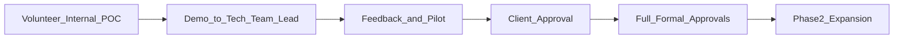
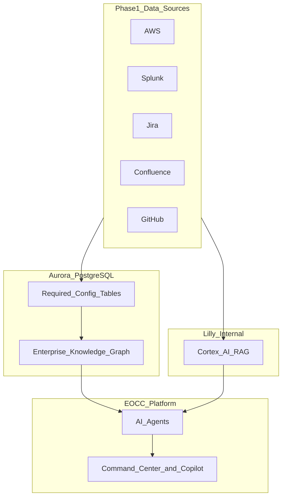

# AWS Operations Intelligence EOCC — Demo PRD Plan (Internal Use Case)

## Context and Primary Audience

| Item | Detail |
|---|---|
| **Who we are presenting to** | Onsite tech team lead — **12+ years** building enterprise solutions |
| **Her profile** | Senior practitioner; has shipped integrations, data platforms, and ops tooling at scale. Will evaluate architecture, data model, and failure modes — not slide-deck promises |
| **What this is** | Internal voluntary AI use case — technical demo + design review |
| **What this is NOT** | Formal procurement, budget request, vendor pitch, or basics tutorial |
| **Approval path** | Technical validation → pilot → **client approval** → full formal approvals |
| **Ask today** | Architecture feedback, data model review, pilot scope — **not** budget or headcount |

**Core message (peer-level, not sales):**
> "We've prototyped an operations intelligence layer on top of Jira, Splunk, AWS, Confluence, and GitHub — structured relationships in Aurora config tables, unstructured retrieval via Cortex AI RAG. Phase 1 covers five use cases: health, investigation, impact, ownership, copilot. We want your technical review before this goes anywhere near the client."

**Presentation stance:** Treat her as a **design reviewer and champion**, not an audience to convince with buzzwords. Assume she has seen failed "single pane of glass" and AIOps initiatives — address why this approach is different and honestly scoped.

---

## Deliverable

Single Markdown file: `test/aws_operations_intelligence/AWS_Operations_Intelligence_EOCC_PRD.md`

**Document framing:**
- Title: **Internal Demo — Volunteer AI Use Case** (Technical Design Review)
- Opening: purpose, audience, approval path — concise, no fluff
- Tone: **peer technical** — precise, honest about limitations, architecture-forward
- Structure: all 15 PRD sections; architecture and data model get **substance**, not appendix hand-waving
- Balance: business value for client story + technical depth she expects from 12+ years in enterprise

---

## What a 12+ Year Enterprise Tech Lead Will Evaluate

| What she will scrutinize | How the PRD must respond |
|---|---|
| **Architecture soundness** | Event-driven ingestion, connector isolation, clear split: Aurora (structured graph) vs Cortex RAG (unstructured) |
| **Data model honesty** | Config table domains defined; acknowledge metadata drift and sync lag as first-class problems |
| **Integration realism** | Per-source connector responsibilities; what each system actually provides vs what config tables must fill |
| **AI trust model** | Evidence chains, source citations, confidence boundaries — when the system should say "I don't know" |
| **Agent boundaries** | Why Ownership / Dependency / Incident / Knowledge agents are separated; LangGraph orchestration rationale |
| **Phase 1 scope discipline** | Read-only, no write actions — scoped so it can actually work in a pilot |
| **Failure modes** | Stale ownership, wrong dependency, RAG hallucination, connector outage — with mitigations |
| **Client defensibility** | Can she stand behind this in a client conversation? Business impact language + technical credibility |
| **Her team's workflow** | Does investigation flow match how her engineers actually work during Sev1/Sev2? |
| **Not another dashboard** | Positioning: intelligence layer, not metric aggregation she could get from existing tools |

| What she does NOT need explained | Skip or one-line only |
|---|---|
| What Jira, Splunk, or Confluence are | Assume fluency |
| Generic "digital transformation" language | Cut |
| Basic cloud concepts | Cut |
| Headcount reduction or L1 elimination in Phase 1 | Defer to Phase 3+ vision if asked |

---

## What the Team Lead Cares About (write the PRD for her)

| Priority | How the PRD should address it |
|---|---|
| **Technical credibility** | Architecture section with diagrams, data flow, design decisions and trade-offs |
| **Operational truth** | Config tables as curated operational model — her team helps validate, not magic auto-discovery |
| **Evidence over AI hype** | Every copilot/investigation output traces to Jira ticket, Splunk query, Confluence page, or config row |
| **Honest Phase 1 boundary** | Read-only intelligence; no production writes; no over-promise on automation |
| **Pilot feasibility** | 1–2 services/processes; clear ingestion path; measurable demo success criteria |
| **Client readiness** | Business-impact framing (>70% business helpful) she can articulate to client leadership |
| **Her team empowered** | Tool multiplies senior engineers' reach — does not bypass their judgment in Phase 1 |

---

## Demo Presentation Flow (embed as short section in PRD)

Suggested **"Demo Walkthrough"** section near the top (after Executive Summary):

1. **Problem she knows** — "Glue job fails, who owns it, what's impacted, where's the runbook?"
2. **Use Case 1** — Command Center: health and risk in business terms
3. **Use Case 2** — Investigation Workspace: auto-gathered evidence
4. **Use Case 3** — Impact: which business capability is affected
5. **Use Case 4** — Ownership: team, lead, escalation path
6. **Use Case 5** — Copilot: ask in plain English, get cited answer
7. **What's next** — Phase 2+ vision only if she asks; client path if demo lands

---

## Messaging Principles (senior technical audience)

| Do | Avoid |
|---|---|
| Lead with architecture and data model — then business value | Marketing superlatives ("game changer", "revolutionary") |
| State design decisions and trade-offs explicitly | Hand-waving "AI will figure it out" |
| Acknowledge known enterprise failure patterns (stale CMDB, siloed search) | Pretending integrations are plug-and-play |
| Show evidence chain for every intelligence output | Black-box AI recommendations |
| Scope Phase 1 as read-only pilot with clear success criteria | 20 use cases or automation in v1 |
| Position Cortex AI RAG as deliberate reuse of Lilly investment | Building parallel search infrastructure |
| Aurora config tables as operational source of truth she co-owns | Implying ownership auto-materializes from Jira |
| Ask for technical design review and pilot validation | Budget, FTE, timeline, procurement language |
| Brief future phases as architectural evolution | Org restructuring or headcount narratives |

---

## Phased Product Strategy

### Phase 1 — Demo and Pilot (5 Core Use Cases)

Source: `New Product Requirements Document.pdf`

| # | Use Case | Demo moment for team lead |
|---|---|---|
| 1 | Operational Health & Risk Monitoring | "Here's what's unhealthy right now, ranked by business risk" |
| 2 | Automated Investigation | "Here's the investigation your engineer would spend 45 min building" |
| 3 | Impact Analysis | "Customer Onboarding is affected — not just Lambda errors" |
| 4 | Intelligent Ownership & Coordination | "CNS Team owns Glue Job CN3 — here's escalation" |
| 5 | AI Operations Copilot | "Ask anything — answers with sources" |

**Phase 1 for demo:**
- Read-only / advisory intelligence
- No production actions, no workflow changes, no staff reduction narrative
- Goal: team lead says *"yes, this would help my team — let's show the client"*

**Demo modules to highlight:**
- Enterprise Command Center
- Investigation Workspace
- Impact / Dependency Explorer (read-only)
- Operations Copilot

---

## Confirmed Data Sources and Knowledge Layer (Phase 1)

Phase 1 uses **only** the following integrations plus internal stores — ServiceNow, Teams, and other sources are out of scope until post-client approval.

### Enterprise Integrations

| Source | Purpose in EOCC |
|---|---|
| **AWS** | Operational signals — CloudWatch, ECS, Lambda, Glue, Step Functions, RDS, DynamoDB, SQS, SNS, resource tags |
| **Splunk** | Logs, operational events, incident signals, historical operational data |
| **Jira** | Incident history, bugs, change requests, ownership metadata |
| **Confluence** | Documentation, SOPs, knowledge articles, runbooks |
| **GitHub** | Repository metadata, deployment information, ownership metadata, engineering context |

### Aurora PostgreSQL — Required Config Tables

| Config domain | Purpose |
|---|---|
| Business process mapping | Business capability → application → AWS resource |
| Ownership registry | Service/app → team → tech lead → manager → escalation |
| Dependency relationships | Service-to-service, app-to-app, team-to-team |
| Service catalog | Normalized names linking AWS, Jira, GitHub, Splunk |
| Impact / criticality | Business priority, SLA tier, customer-facing flags |
| Integration metadata | Connector status, last sync, source record references |

### Cortex AI RAG — Lilly Internal Knowledge Base

| Item | Detail |
|---|---|
| **System** | Cortex AI RAG — Lilly-provided internal RAG platform |
| **Purpose** | Semantic search over runbooks, Confluence, Jira, architecture docs, incident write-ups |
| **Split** | Aurora config tables = structured relationships; Cortex AI RAG = unstructured knowledge |

---

### Phase 2 — After Client Approval

Enterprise Knowledge Search, Historical Incident Intelligence, Business Process Monitoring, Governance insights (read-only).

### Phase 3 — After Full Approvals

Autonomous Incident Coordination, Controlled Operational Execution, Senior approval model (2–6 leaders) — future vision only.

### Phase 4 — Long-term

Executive briefings, digital twin, tiered autonomy — appendix only.

---

## PRD Section Plan (15 sections)

| # | Section | Notes |
|---|---|---|
| 0 | Purpose of This Document | Volunteer POC, team lead audience, approval path |
| 1 | Executive Summary | Architecture in one breath + Phase 1 value |
| 2 | Business Pain Points | Her team's daily reality |
| 3 | Proposed Solution | Intelligence layer, confirmed data sources |
| 4 | Implementation Approach | **Not** cost/timeline/FTE |
| 5 | Top 5 Initial Use Cases | Full detail + demo scenarios |
| 6 | Future Use Cases | Phases 2–4 table |
| 7 | Product Scope | In/out for Phase 1 |
| 8 | User Roles | Tech team lead primary (12+ years) |
| 9 | Functional Requirements | FR-P1-* with acceptance criteria |
| 10 | Non-Functional Requirements | Enterprise depth, plain security language |
| 11 | Architecture Plan | Peer review quality — Aurora, Cortex RAG, agents |
| 12 | Implementation Roadmap | Deliverables only, no dates |
| 13 | Risks and Mitigation | Technical + adoption risks |
| 14 | KPIs and Success Metrics | >70% business helpful |
| 15 | Future Advanced Improvements | Post-client approval |

---

## What We Are NOT / ARE Asking Her Today

**Not asking:** budget, headcount, production writes, client presentation without her comfort.

**Asking:** architecture review, data model feedback, pilot scope, failure modes, client narrative credibility, champion path.

---

## Technology Stack

| Component | Choice |
|---|---|
| Data sources | AWS, Splunk, Jira, Confluence, GitHub |
| Structured store | Aurora PostgreSQL (config tables + knowledge graph) |
| Unstructured knowledge | Cortex AI RAG (Lilly internal) |
| Event backbone | EventBridge + SQS |
| Connectors | ECS Fargate per source |
| Agent orchestration | LangGraph |
| UI | Next.js |
| Graph DB (future) | Neo4j — Phase 2+ if needed |

---

## Key Assumptions

1. Volunteer internal POC — no formal funding ask
2. Team lead gatekeeps client conversation
3. Phase 1 = 5 use cases, read-only intelligence
4. Cortex AI RAG + Aurora config tables — existing-path choices
5. Config accuracy needs her team's validation
6. Automation + senior approvers = Phase 3+
7. Audience: 12+ years enterprise experience
8. Voice: peer design review, not sales deck

---

## When You Return

Say **"execute the plan"** or **"generate the PRD"** to produce:

`test/aws_operations_intelligence/AWS_Operations_Intelligence_EOCC_PRD.md`
