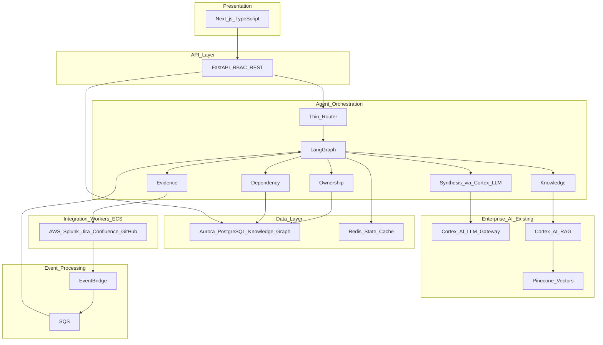
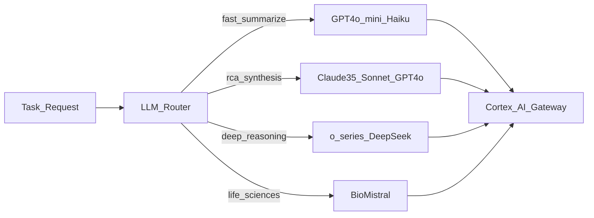
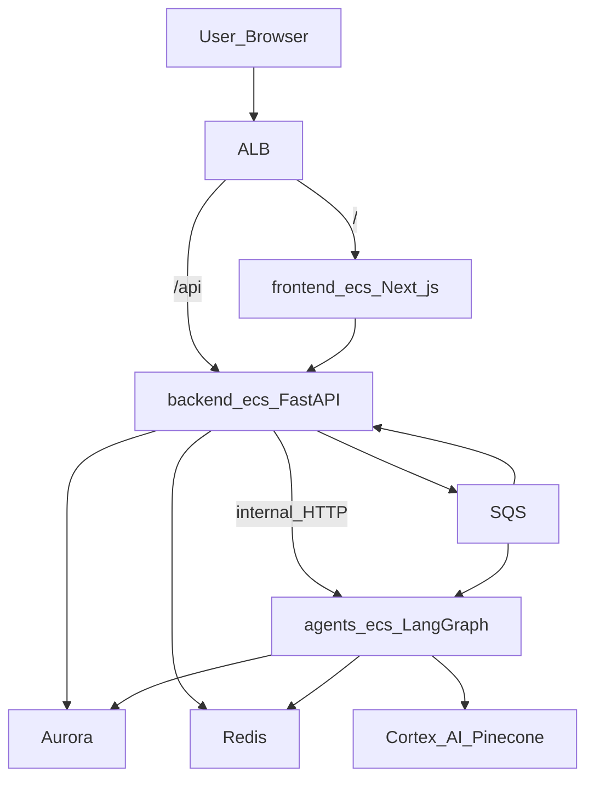

# EOCC Technical System Plan (Active)

**Related plans:**
- Demo PRD design: [eocc_demo_prd_design_7feb39f9.plan.md](c:\Users\madup\.cursor\plans\eocc_demo_prd_design_7feb39f9.plan.md)
- Consolidated master: [EOCC_Master_Plan.md](test/aws_operations_intelligence/EOCC_Master_Plan.md)
- 20 UC workflows: [EOCC_20_Use_Case_Workflows.md](test/aws_operations_intelligence/EOCC_20_Use_Case_Workflows.md)

---

## 4. Technical System Architecture (best plan — locked)

**Pitch to tech lead:** *"No new AI infrastructure. We reuse Cortex AI + Pinecone (enterprise-approved), Aurora for the knowledge graph, and build an Operations Intelligence layer on top."*

### System diagram



---

### Layer-by-layer (10 components)

| # | Layer | Technology | Phase 1 role |
|---|---|---|---|
| 1 | **Frontend** | Next.js + TypeScript | Chat/Copilot, Incident Dashboard, Command Center, Ownership Explorer |
| 2 | **API** | FastAPI | Auth, RBAC, REST, agent invoke, graph CRUD |
| 3 | **Agents** | LangGraph | 4 gather agents + synthesis; thin router |
| 4 | **Knowledge graph** | Aurora PostgreSQL | Ownership, dependency, teams, incidents, audit — **not replaced by Pinecone** |
| 5 | **Cache / state** | Redis | LangGraph state, session, agent result TTL, rate limits |
| 6 | **RAG** | Cortex AI RAG → Pinecone | Runbooks, Confluence, Jira text, RCA docs, similar incidents |
| 7 | **LLM** | Cortex AI gateway + **LLM Router** | Task-based model selection — synthesis, summaries, reasoning |
| 8 | **Events** | EventBridge + SQS | Alerts, connector events, async agent triggers |
| 9 | **Connectors** | backend-ecs (sync workers) | Sync + fetch; optional workers-ecs Phase 2+ |
| 10 | **Object storage** | S3 | Investigation exports, audit attachments (optional P1) |

**Eliminated:** pgvector, Weaviate, self-hosted vectors, direct OpenAI/Anthropic APIs.

---

### Service selection rationale — architect pillars

Every infrastructure choice is evaluated on **five pillars**: **Scalable · Secure · Accurate · Fast · Reliable**.

Use this table in PRD Section 11 when the tech lead asks *"why this service for this job?"*

#### Frontend → Next.js on **frontend-ecs** (ECS Fargate)

| Pillar | Why this choice |
|---|---|
| **Scalable** | Dedicated ECS service — add tasks for UI traffic without scaling API or agents |
| **Secure** | Zero secrets in browser; all data via authenticated backend APIs only |
| **Accurate** | Server-rendered dashboards show consistent investigation state from backend truth |
| **Fast** | SSR/ISR for Command Center — first meaningful paint before heavy client hydration |
| **Reliable** | ALB health checks + rolling deploys; bad tasks drain without user-visible outage |

#### Backend API → **FastAPI** on **backend-ecs** (ECS Fargate)

| Pillar | Why this choice |
|---|---|
| **Scalable** | Stateless horizontal scale behind ALB; connector sync colocated until workers-ecs needed |
| **Secure** | Single auth/RBAC/audit gate; Cortex keys and agent endpoints never exposed to clients |
| **Accurate** | Validates and normalizes inputs before agent invoke; persists canonical investigation records to Aurora |
| **Fast** | Async I/O fans out parallel connector calls (AWS, Splunk, Jira) without blocking threads |
| **Reliable** | Stateless tasks — failure of one container does not corrupt state; Aurora + SQS hold durability |

#### AI agents → **LangGraph** on **agents-ecs** (ECS Fargate)

| Pillar | Why this choice |
|---|---|
| **Scalable** | Independent ECS service scales on SQS queue depth and investigation concurrency |
| **Secure** | Private subnet only — not on public ALB; reachable only from backend-ecs |
| **Accurate** | Deterministic gather agents (Aurora/Splunk) first; **one** Cortex synthesis after join; every claim cites source |
| **Fast** | Parallel fan-out (max 4 agents) with 15s timeout — wall-clock = slowest agent, not sum of all |
| **Reliable** | Redis checkpointing resumes workflows; partial results + `gaps[]` on agent failure — no silent empty answers |

#### Knowledge graph → **Aurora PostgreSQL**

| Pillar | Why this choice |
|---|---|
| **Scalable** | Vertical scale + read replicas when ownership/dependency query load grows |
| **Secure** | VPC-private, IAM database auth, encryption at rest, full audit log tables |
| **Accurate** | ACID + deterministic SQL — ownership and dependency answers never hallucinate |
| **Fast** | Indexed relational joins beat vector search for "who owns X" and "what depends on Y" |
| **Reliable** | Multi-AZ failover, automated backups, point-in-time recovery for operational truth |

#### Cache / agent state → **Redis** (ElastiCache)

| Pillar | Why this choice |
|---|---|
| **Scalable** | ElastiCache cluster mode when investigation cache volume exceeds single node |
| **Secure** | VPC-only, AUTH token, TTL expiry — no long-lived sensitive data in cache |
| **Accurate** | Cache-aside with invalidation on connector sync; Aurora remains source of truth |
| **Fast** | Sub-millisecond hits for repeat copilot queries and LangGraph step transitions |
| **Reliable** | Replication option for HA; ephemeral by design — rebuild from Aurora on cache miss |

#### Semantic search → **Cortex AI RAG → Pinecone**

| Pillar | Why this choice |
|---|---|
| **Scalable** | Managed Pinecone index scales with document corpus — no self-hosted vector ops |
| **Secure** | Enterprise-approved data path; docs indexed through governed Cortex ingest |
| **Accurate** | Returns cited chunks only — used for runbooks/RCAs, never for ownership facts |
| **Fast** | Approximate nearest-neighbor search across millions of tokens vs full-text scan |
| **Reliable** | Managed SLA; scheduled re-index on connector sync keeps knowledge current |

#### LLM reasoning → **Cortex AI** (gateway)

| Pillar | Why this choice |
|---|---|
| **Scalable** | Gateway handles model routing and provider load — app does not manage LLM infra |
| **Secure** | Central audit of prompts/responses; no API keys in application code |
| **Accurate** | Task-based model selection — reasoning models for RCA, fast models for summaries |
| **Fast** | Haiku/mini for evidence compression; Sonnet/GPT-4o only when complexity warrants |
| **Reliable** | Per-task fallback chain across Cortex catalog; gateway failover between providers |

#### Events → **EventBridge + SQS**

| Pillar | Why this choice |
|---|---|
| **Scalable** | Queue absorbs alert storms; agents-ecs consumer count scales with backlog |
| **Secure** | IAM-scoped producers/consumers; no direct webhook-to-agent exposure |
| **Accurate** | Idempotency keys prevent duplicate investigations from retried events |
| **Fast** | API returns immediately; heavy agent work runs asynchronously off the request path |
| **Reliable** | At-least-once delivery, exponential retry, DLQ for poison messages |

#### Load balancing → **ALB**

| Pillar | Why this choice |
|---|---|
| **Scalable** | Distributes traffic across N ECS tasks per service with automatic target registration |
| **Secure** | TLS termination; path routing keeps agents-ecs off public surface; WAF-ready |
| **Accurate** | Sticky sessions optional; health checks route only to tasks passing `/health` |
| **Fast** | Persistent connections to warm backend containers; low add-on latency |
| **Reliable** | Automatic unhealthy target removal; supports zero-downtime rolling deployments |

#### Object storage → **S3**

| Pillar | Why this choice |
|---|---|
| **Scalable** | Unlimited storage for investigation exports and connector staging blobs |
| **Secure** | IAM per-service policies, SSE encryption, no public buckets |
| **Accurate** | Immutable export snapshots — point-in-time evidence package for audit |
| **Fast** | Offloads large attachments from Aurora and API response payloads |
| **Reliable** | 11-nines durability; versioning for investigation artifact retention |

#### ECS Fargate — shared rationale (all three compute services)

| Pillar | Why Fargate |
|---|---|
| **Scalable** | Per-service task count and CPU/memory — frontend, backend, agents scale independently |
| **Secure** | Task IAM roles, private subnets, no SSH/EC2 attack surface |
| **Accurate** | Immutable container images — same artifact from POC to production |
| **Fast** | No cold-start penalty like Lambda; warm containers serve steady investigation load |
| **Reliable** | ECS rolling updates, circuit breaker, CloudWatch integration |

**Not chosen (architect view):**

| Alternative | Weak pillar |
|---|---|
| Lambda for agents | **Reliable/Fast** — timeouts, cold starts break parallel LangGraph |
| EKS | **Scalable** yes, but **Reliable** ops burden on volunteer team |
| EC2 | **Secure/Reliable** — patching and AMI drift |
| pgvector | **Accurate/Secure** — duplicates governed Pinecone; new data boundary |
| LLM at every agent step | **Accurate/Fast** — use task-based model selector, not open-ended LLM per gather agent |

---

### Multi-LLM selector — Cortex model routing (locked)

Cortex provides centrally managed access to LLMs and **embedding models** from multiple providers (OpenAI, Anthropic, Google Vertex, Amazon Bedrock, Meta, specialized). Model availability is governed via **Cortex Landing Zone** — our app never calls providers directly.

**Design principle:** One **LLM Router** in `agents-ecs` selects the best Cortex model **per task type**, not per agent instance. Gather agents (Ownership, Dependency) stay **SQL-only**. LLM is invoked only where language reasoning adds value — with the **right model for that job**.



#### Cortex model catalog (reference — verify in Landing Zone)

| Provider | Models (examples) | Typical EOCC use |
|---|---|---|
| OpenAI | GPT-4o, GPT-4o mini, GPT-4 Turbo, o-series | Synthesis, summarization, deep reasoning |
| Anthropic | Claude 3.5 Sonnet, Claude 3 Sonnet, Claude 3 Haiku | RCA synthesis, fast summaries |
| Google Vertex | Gemini 2 Pro, Gemini variants | Alternative synthesis fallback |
| Amazon Bedrock | Amazon Nova, Amazon Titan | Enterprise fallback / cost tier |
| Meta | Llama 3.2, Llama 3 | On-premise-style fallback if enabled |
| Specialized | BioMistral, DeepSeek, Mistral 7B, Falcon 7B | Life-sciences docs, reasoning, edge cases |

**Embeddings:** See **Embedding Model Selector** below — separate from LLM routing; configured at Cortex RAG ingest time.

#### Embedding Model Selector — Cortex catalog (locked)

Company policy: **Cortex AI usage is free and encouraged** → select **highest-quality** models, not cost-optimized tiers.

**Rule:** One embedding model per Pinecone index. Ingest and query **must use the same model** (dimension mismatch breaks retrieval).

##### Available models (Cortex)

| Model | Provider | Dimensions | Tier |
|---|---|---|---|
| text-embedding-3-large | Azure/OpenAI | **3072** | **Best accuracy** |
| text-embedding-3-small | Azure/OpenAI | 1536 | Cost-effective (skip — free usage) |
| text-embedding-ada-002 | Azure/OpenAI | 1536 | Legacy (skip) |
| cohere.embed-english-v3 | Bedrock | 1024 | English-optimized |
| cohere.embed-multilingual-v3 | Bedrock | 1024 | Multilingual |
| text-embedding-004 | Vertex | 768 | Google ecosystem |
| amazon.titan-embed-text-v1 | Bedrock | 1536 | AWS ecosystem |

##### Selected models for EOCC

| Role | Model | Why (architect pillars) |
|---|---|---|
| **Primary — all Phase 1 RAG** | **text-embedding-3-large** | **Accurate:** highest retrieval precision for runbooks, RCAs, Jira/Confluence; **Fast:** better recall = fewer missed docs = less LLM rework; **Reliable:** current OpenAI embedding generation |
| **Fallback index** | **cohere.embed-english-v3** | **Reliable:** Bedrock path if OpenAI embedding unavailable in Landing Zone; **Accurate:** English-optimized for ops docs; **Secure:** stays in AWS Bedrock ecosystem |
| **Phase 2+ — multilingual index** | **cohere.embed-multilingual-v3** | **Accurate:** non-English Confluence/SharePoint spaces; separate Pinecone namespace — do not mix with primary index |

**Not selected:**

| Model | Why not |
|---|---|
| text-embedding-3-small | Cost tier — unnecessary when Cortex is free; 3-large is strictly better for retrieval |
| text-embedding-ada-002 | Superseded by embedding-3 family |
| text-embedding-004 | 768 dims — lower fidelity than 3-large for ops doc similarity |
| amazon.titan-embed-text-v1 | Acceptable AWS fallback but lower benchmark than 3-large; use only if Bedrock-only policy blocks OpenAI embeddings |

##### Content → index mapping

| Content source | Index | Embedding model |
|---|---|---|
| Confluence runbooks | `eocc-primary` | text-embedding-3-large |
| Jira incident descriptions + comments | `eocc-primary` | text-embedding-3-large |
| RCA documents | `eocc-primary` | text-embedding-3-large |
| GitHub README / runbooks | `eocc-primary` | text-embedding-3-large |
| Historical incident exports | `eocc-primary` | text-embedding-3-large |
| Non-English docs (Phase 2) | `eocc-multilingual` | cohere.embed-multilingual-v3 |

##### Knowledge agent behavior

- Query embedding: **text-embedding-3-large** (same as ingest)
- Top-k retrieval from Pinecone → cited chunks to synthesis
- Re-index trigger: connector sync job after Confluence/Jira delta sync
- Chunk strategy: 512–1024 tokens, metadata = `source`, `service_id`, `doc_type`, `updated_at`

##### Five pillars — embedding choice

| Pillar | text-embedding-3-large |
|---|---|
| **Scalable** | Pinecone handles 3072-dim vectors at enterprise scale; namespace per doc type if needed |
| **Secure** | Embeddings generated via Cortex — no local API keys; vectors contain no raw credentials |
| **Accurate** | Best benchmark in Cortex catalog for semantic similarity on technical prose |
| **Fast** | Higher recall reduces false "no runbook found" and avoids expensive re-query loops |
| **Reliable** | cohere.embed-english-v3 standby index; re-index job idempotent on sync failure |

**Tech lead line:** *"We index all ops knowledge with text-embedding-3-large through Cortex RAG into Pinecone — best retrieval accuracy in the catalog. English fallback index on Cohere Bedrock. Multilingual index in Phase 2 if needed."*

#### Task → model routing table (Phase 1+)

| Task type | When | Primary model | Fallback | Pillar emphasis |
|---|---|---|---|---|
| `evidence_summarize` | Evidence agent compresses Splunk/CloudWatch logs | **GPT-4o** or **Claude 3.5 Sonnet** | Claude Haiku | **Accurate** (Cortex free — prefer quality over mini) |
| `copilot_simple` | Short FAQ, single-source answer already in context | **GPT-4o** | Claude 3 Haiku | **Fast**, Accurate |
| `investigation_synthesis` | RCA + business severity after 4-agent join | **Claude 3.5 Sonnet** | GPT-4o | **Accurate** |
| `deep_rca` | Multi-service blast radius, ambiguous root cause | **o-series** or **DeepSeek** | Claude 3.5 Sonnet | **Accurate** |
| `copilot_complex` | Multi-hop question needing joined context | **Claude 3.5 Sonnet** | GPT-4 Turbo | **Accurate**, Fast |
| `life_sciences_rag` | Biomedical runbooks, GxP procedures (Lilly context) | **BioMistral** | Claude 3.5 Sonnet | **Accurate** |
| `governance_rank` | Phase 2 expert-finder scoring | **GPT-4o mini** | Claude Haiku | **Fast** |
| `escalation_draft` | Phase 3 notification/escalation message | **Claude 3 Haiku** | GPT-4o mini | **Fast**, Reliable |
| `none` | Ownership, Dependency agents | **No LLM** | — | **Accurate** |

#### LLM Router logic (in agents-ecs)

```text
Input:  task_type, complexity_score (1-5), domain_tag, latency_budget_ms
Config: llm_routing_config (Aurora table or Cortex Landing Zone policy)
Output: cortex_model_id, temperature, max_tokens
On failure: fallback chain → next model in tier → return gaps[] if all fail
```

**Complexity score** (auto-derived):
- 1–2: single service, known owner → fast model
- 3: standard investigation synthesis → Sonnet / GPT-4o
- 4–5: multi-service, no clear RCA, large evidence payload → o-series / DeepSeek

**Still one synthesis LLM call per investigation** — router picks **which** model, not **how many** chained calls.

#### Five pillars — Multi-LLM selector

| Pillar | How router delivers |
|---|---|
| **Scalable** | Config-driven routing; new Cortex models enabled in Landing Zone without code deploy |
| **Secure** | All models via Cortex gateway — audited, no provider API keys in app |
| **Accurate** | Right model for task — reasoning models for RCA, fast models for summaries; SQL agents unchanged |
| **Fast** | Haiku/mini for log summarization; heavy models only when complexity_score ≥ 3 |
| **Reliable** | Per-task fallback chain; degrade to simpler model before failing investigation |

#### What we do NOT do

- Do **not** run a different LLM inside each of the 4 gather agents (Ownership/Dependency stay SQL)
- Do **not** hardcode OpenAI/Anthropic URLs — Cortex model IDs only
- Do **not** let the LLM pick its own model — router is deterministic from task metadata
- Do **not** bypass citations — synthesis prompt requires source refs from agent JSON regardless of model

#### PRD / demo note for tech lead

> "We use Cortex's multi-provider catalog through a task-based LLM Router — fast models for evidence compression, Claude 3.5 Sonnet or GPT-4o for investigation synthesis, reasoning models for complex RCA, BioMistral when life-sciences docs are in scope. One gateway, zero new AI vendors, best model per job."

---

### Agent map — your names vs our simplified phased model

| Your agent name | Our design | Phase | LLM? |
|---|---|---|---|
| Ownership Agent | **Ownership** — Aurora SQL | 1 | No |
| — | **Dependency** — Aurora SQL | 1 | No |
| Incident Agent | **Evidence** — AWS/Splunk/Jira | 1 | Summarize only |
| RCA Agent | **Synthesis** step via Cortex LLM | 1 | Yes — after join |
| — | **Knowledge** — Cortex RAG/Pinecone | 1 | Retrieval only |
| Expert Finder Agent | Part of **Governance** + `engineer_service_experience` | 2 | Optional rank |
| Escalation Agent | **Coordination** agent | 3 | Rules + LLM for messages |
| Notification Agent | **Coordination** agent (notify tier) | 3 | Templates |

**Phase 1 brain = 4 parallel gather + 1 synthesis.** Do not deploy 6 separate LLM agents in POC — accuracy and simplicity.

---

### Cortex AI + Pinecone vs Aurora (critical split)

| Question type | System | Example |
|---|---|---|
| Who owns Payment API? | **Aurora** | SQL → John, Payments Team |
| What breaks if Aurora fails? | **Aurora** | Dependency graph query |
| How did we fix this before? | **Cortex RAG / Pinecone** | Similar incident chunks |
| What does the runbook say? | **Cortex RAG / Pinecone** | Confluence/runbook retrieval |
| What is business severity? | **Cortex LLM synthesis** | Joined JSON from all four agents |

```text
Confluence / Jira / Runbooks / RCA docs
              |
         Cortex AI RAG
              |
           Pinecone          (semantic / similar / docs)

Aurora PostgreSQL            (structured graph / ownership / deps)
              |
         FastAPI + Agents
              |
         Cortex AI LLM         (LLM Router → best model per task)
```

---

### Integration layer — phased (do not over-build V1)

| Source | Phase 1 | Phase 2 | Phase 3 |
|---|---|---|---|
| AWS | Yes | Yes | Yes + write actions |
| **Splunk** | **Yes** | Yes | Yes |
| Jira | Read | Read + history | Write tickets |
| Confluence | Read → RAG index | Yes | Yes |
| GitHub | Read | Yes | Yes |
| SharePoint | — | RAG index | Yes |
| ServiceNow | — | Read optional | Write optional |
| Teams | — | — | Notify + war room |

**Splunk is mandatory** for Evidence agent — keep in all phases.

**Scheduled sync jobs (ECS/cron):** ownership → Aurora; team → Aurora; incident → Aurora + RAG re-index; documentation → Cortex RAG ingest.

---

### FastAPI responsibilities

| Module | Endpoints (conceptual) |
|---|---|
| Auth | SSO integration, session, RBAC |
| Graph | `/services`, `/ownership`, `/dependencies`, `/business-processes` |
| Incidents | `/investigations`, `/investigation-package/{id}` |
| Agents | `POST /agents/investigate`, `POST /copilot/query` |
| Admin | Config table CRUD, connector status |
| Health | `/health`, integration sync status |

Next.js **never** calls LangGraph or Cortex directly — always through FastAPI.

---

### Redis usage

| Key pattern | Purpose | TTL |
|---|---|---|
| `investigation:{id}` | InvestigationPackage cache | 15–60 min |
| `langgraph:{thread_id}` | Agent workflow state | Session |
| `agent:{incident}:{agent}` | Per-agent result reuse | 5–15 min |
| `ratelimit:{user}` | API throttling | 1 min |

---

### ECS Fargate — three-service model (locked)

**One ECS service per concern** — scales independently, deploys independently, future-proof:

| ECS service | Contains | Exposes |
|---|---|---|
| **frontend-ecs** | Next.js | Public via ALB (`/`) |
| **backend-ecs** | FastAPI + connector sync workers | Public via ALB (`/api/*`) |
| **agents-ecs** | LangGraph orchestration + 4 agents + synthesis | **Private only** — internal service discovery |

**Why this is best for future:**

- Frontend scales on UI traffic without touching agent CPU
- Backend scales on API/auth/CRUD without LangGraph memory pressure
- Agents scale on investigation load independently (heaviest workloads)
- Clean blast radius — agent deploy does not restart API or UI
- Phase 3 Coordination agents add to **agents-ecs** only

**Connector sync jobs** live in **backend-ecs** (second task definition or background worker in same service) — not a fourth Fargate service until connector volume forces it (Phase 2+).



**Request flow:**

1. User → ALB → frontend-ecs (pages)
2. UI calls → ALB → backend-ecs (auth, RBAC, graph CRUD)
3. Investigation/copilot → backend-ecs validates → **internal call** → agents-ecs
4. agents-ecs runs parallel gather + synthesis → returns JSON to backend → backend persists audit → UI

**agents-ecs is never on the public ALB.**

---

### Infrastructure sizing

**Volunteer POC (1 task per ECS service):**

| ECS service | POC size | Notes |
|---|---|---|
| frontend-ecs | 1 × 1 vCPU / 2 GB | Single task |
| backend-ecs | 1 × 1 vCPU / 2 GB | API + connector sync in same service |
| agents-ecs | 1 × 2 vCPU / 4 GB | LangGraph + agent fan-out |
| Aurora PostgreSQL | 2 vCPU / 8 GB | Multi-AZ when client approves |
| Redis | 1 GB | ElastiCache |
| ALB | 1 | Routes `/` and `/api/*` only |
| S3 / SQS / EventBridge | Managed | Minimal use |

**Production V1 (after client approval — scale tasks per service):**

| ECS service | Resources |
|---|---|
| frontend-ecs | 2 × 1 vCPU / 2 GB |
| backend-ecs | 2 × 2 vCPU / 4 GB |
| agents-ecs | 2 × 4 vCPU / 8 GB |
| Aurora | 2–4 vCPU / 16 GB |
| Redis | 2–4 GB |
| Cortex AI + Pinecone | **Existing enterprise** — no new procurement |

Optional **Phase 2+ fourth service** (`workers-ecs`): dedicated connector fleet if sync volume outgrows backend-ecs — not needed for demo.

**PRD for tech lead demo:** show 3-service ECS model + POC sizing; production table in appendix.

---

### Deployment topology (AWS)

```text
Internet / Corp VPN
        |
       ALB  (/  → frontend-ecs)  (/api → backend-ecs)
        |
   +----+----+
   |         |
frontend   backend-ecs  ----internal---->  agents-ecs (private)
   |         |                                    |
   |    Aurora, Redis, SQS                   Aurora, Redis
   |         |                                    |
   +---------+------------------------------------+
             |
      EventBridge → SQS
             |
      Cortex AI (LLM + RAG) → Pinecone
```

All ECS tasks in **private subnets**; agents-ecs reachable only via Cloud Map / internal ALB; Cortex AI via enterprise network path.

---

### What makes this the best plan for your product

| Decision | Why best |
|---|---|
| Cortex AI + Pinecone | Zero new AI governance; leadership approves faster |
| Aurora knowledge graph | Accurate ownership/deps; Pinecone cannot replace this |
| 4 agents + synthesis | Simple, accurate, testable — not agent sprawl |
| 3 ECS Fargate services | frontend / backend / agents — independent scale and deploy |
| FastAPI middle tier | Clean separation; RBAC; no LLM keys in frontend |
| Redis | Faster repeat queries; LangGraph checkpointing |
| EventBridge + SQS | Async incidents; decoupled connectors |
| Phased integrations | Phase 1 proves value without Teams/ServiceNow complexity |
| Splunk in Evidence | Real operational signals — not optional |

---

### Tech lead talking points

1. **No new AI stack** — Cortex + Pinecone already approved  
2. **Two-brain model** — Aurora (facts) + RAG (knowledge) + Cortex (reasoning)  
3. **Parallel gather, single synthesis** — LLM Router picks best Cortex model per task  
4. **We build the business layer** — escalation, ownership, RCA, deps — not another vector DB  
5. **Phase 1 is read-only** — no production writes until Phase 3 approval  

---

---

## Flow summary matrix

| UC | Trigger type | Agents | Primary store | Output |
|---|---|---|---|---|
| 1 | User query | Ownership | Aurora | Ownership card |
| 2 | Schedule | Metrics rollup | Aurora/Redis | Process health dashboard |
| 3 | User/alert | Dependency | Aurora | Blast radius graph |
| 4 | Alert/SQS | All 4 + Synthesis | Aurora+Redis | Investigation package |
| 5 | User search | Knowledge | Pinecone | Ranked doc results |
| 6 | Investigation | Evidence+Knowledge | Pinecone+Aurora | Similar incidents |
| 7 | Post-investigation | Coordination | Aurora+Jira+Teams | Ticket, assign, notify |
| 8 | Sev1/schedule | Synthesis | Aurora | Executive brief |
| 9 | User query | Knowledge+Aurora | Aurora+Pinecone | Architecture map |
| 10 | Deploy webhook | Dependency | Aurora | Change risk score |
| 11 | Schedule | Governance rules | Aurora | Risk signals |
| 12 | Nightly cron | Governance SQL | Aurora | Ownership gaps |
| 13 | Weekly cron | Governance | Aurora+Confluence | Runbook coverage |
| 14 | Weekly cron | Governance | Aurora+Confluence | Stale doc report |
| 15 | User query | Dependency | Aurora | Team dependency graph |
| 16 | User query | Knowledge/Aurora | Aurora | Expert list |
| 17 | Dashboard | Dependency | Aurora+AWS | Consumption map |
| 18 | User search | Knowledge+SQL | Pinecone+Aurora | Unified search results |
| 19 | Hourly cron | Connectors | Aurora+S3 | Digital twin snapshot |
| 20 | User approve | Control | AWS API+Aurora | Executed action + audit |

---
